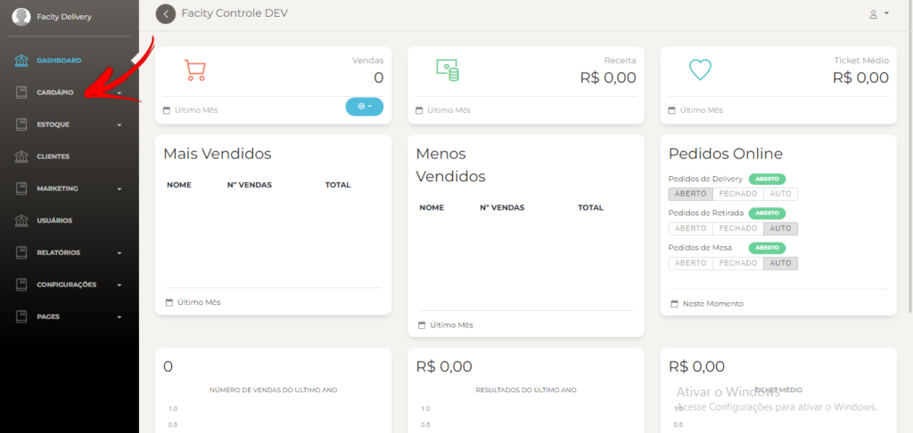
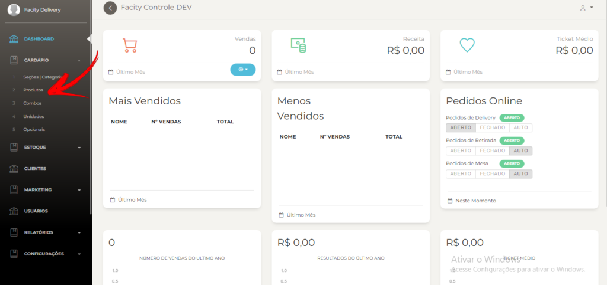
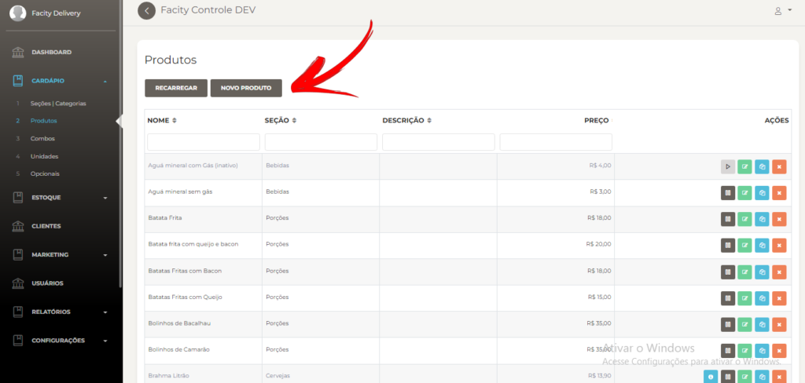
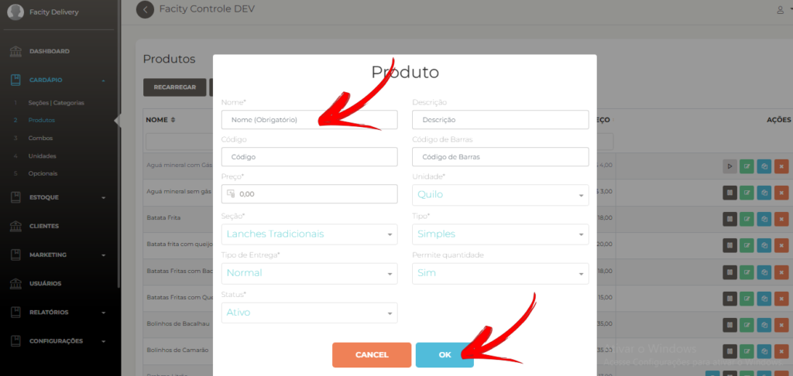
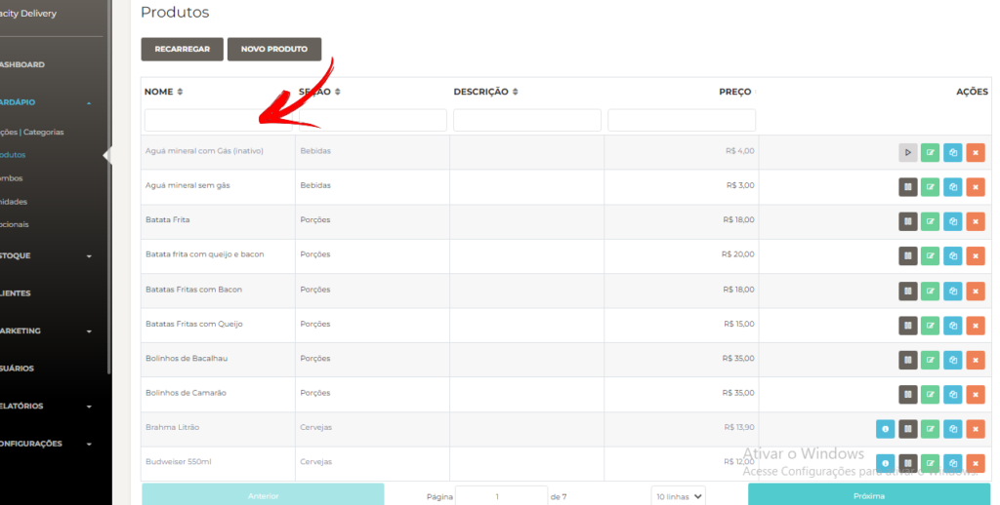
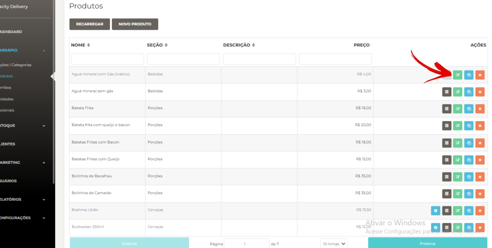
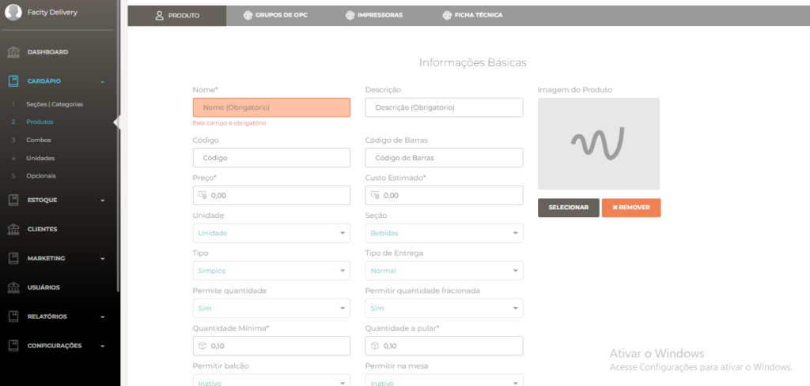

Passo a passo para cadastrar produtos:

**1** \- Abra o **Facity Controle** em seu computador e faça o **login com a sua empresa, login e senha.** (_tudo em letras minúsculas_)

**2** \- Clique no menu lateral à esquerda e selecione **"Cardápio"**.

**3** \- Clique no menu lateral à esquerda e selecione **"Produtos".**

**4** \- Clique no botão **"Novo produto"** para começar o cadastramento.

**5** \- Preencha as informações do produto, como **nome**, **descrição**, **valor** e **seção** (_ex: bebidas, lanches, pizzas e etc_…).

**6** - Para encontrar o produto, clique novamente em **"Produtos"** no menu lateral e use o campo de busca **"Nome"** para procurar pelo nome do produto cadastrado.

**7** \- Para editar um produto já cadastrado, clique no **ícone verde** correspondente ao produto que deseja editar na listagem.

**8** \- Faça as alterações necessárias nas informações do produto, como **nome**, **descrição**, **valor**, **foto**, **unidade** e **código de barra**, e clique em **"OK"** para salvar as alterações.

Pronto! Agora você já sabe como cadastrar produtos no **Facity Controle**. Lembre-se de manter as informações atualizadas e precisas para ter um controle eficiente do seu estoque.
