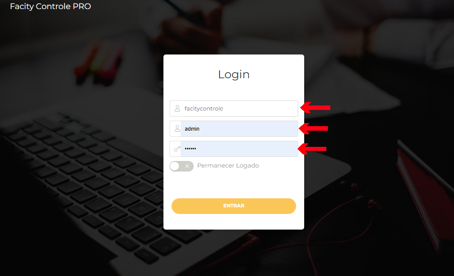
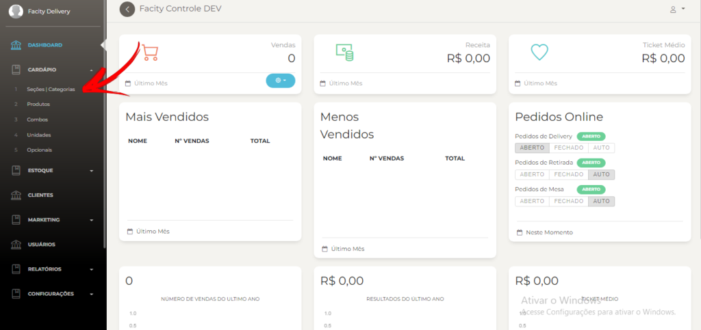
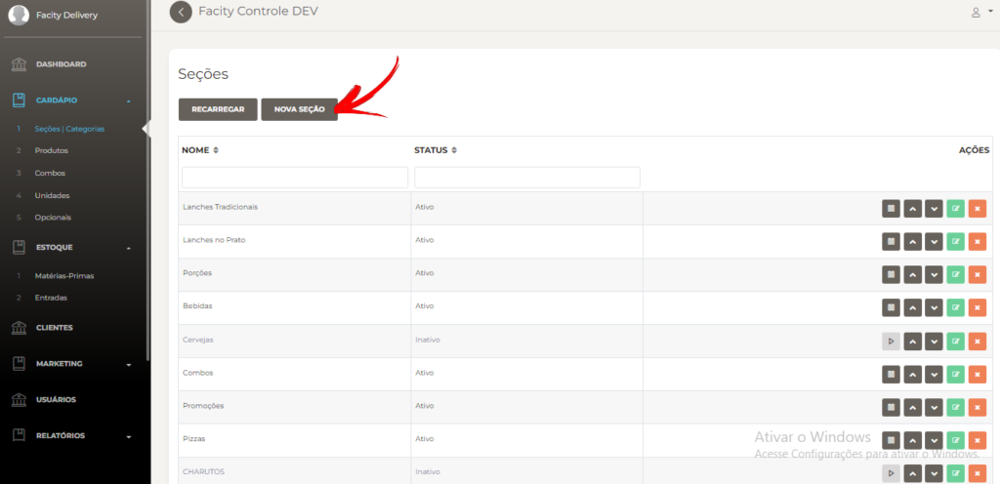
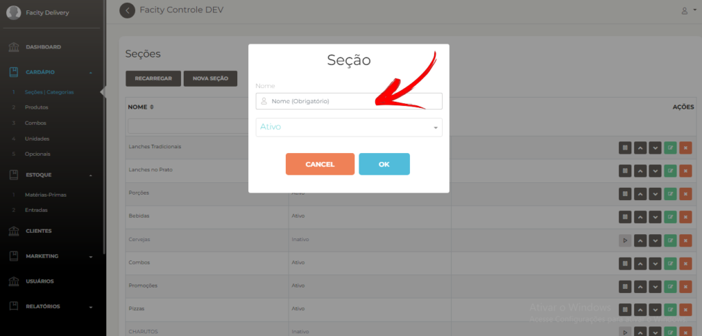
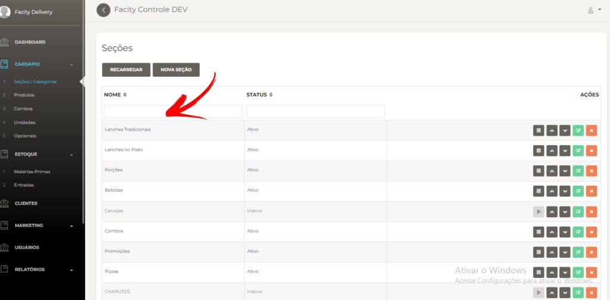
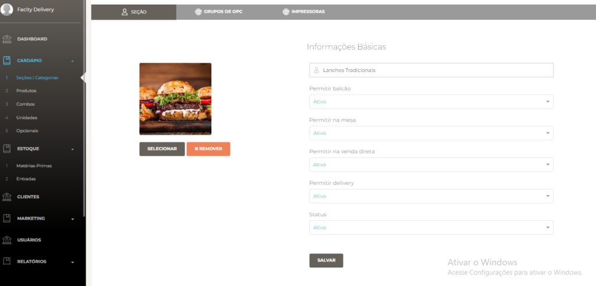

O que é uma **seção/categorias**?

**Seções/categorias** é uma maneira de organizar os produtos para que sejam facilmente encontrados no sistema de vendas **Facity Pos** e no **cardápio digital.**

**Passo 1:** Acesse o **Facity Controle**

- Abra o **Facity Controle** em seu computador e insira o **nome da empresa**, **login** e **senha**. Lembre-se de que tudo deve ser digitado em _letras minúsculas._

**Passo 2:** Acesse o menu de cadastro de **seções/categorias**

- No menu lateral esquerdo, clique em **"cardápio"**.

- Em seguida, selecione **"seções/categorias"**.

**Passo 3:** Crie uma nova **seção/categoria**

- Para criar uma nova seção, clique em **"nova seção"** na página de cadastro de **seções/categorias**.

**Passo 4:** Insira o nome da **seção/categoria**

- Digite o nome da **seção/categoria** que deseja criar no campo indicado na página.

**Passo 5:** Salve a **seção/categoria**

Clique em **"salvar"** para finalizar o cadastro da nova seção/categoria.

**Passo 6:** Localize a seção/categoria criada

Volte para o menu de seções/categorias e busque o nome da **seção/categoria** que você acabou de criar na lista que aparecerá na tela.

- Para achar a seção que você criou, volte no menu e clique em **seções/categorias** e busque o nome na lista que vai aparecer no sistema

**Passo 7:** Edite a seção/categoria

- Se quiser editar a **seção/categoria**, basta clicar no ícone verde **"editar"** ao lado da seção/categoria desejada. Na página de edição, você poderá ajustar o nome, a foto da seção/categoria ou outras informações.

Com esses passos simples, você pode cadastrar seções/categorias no **Facity Controle** e organizar seus produtos para facilitar a busca no sistema de vendas e no cardápio digital.
