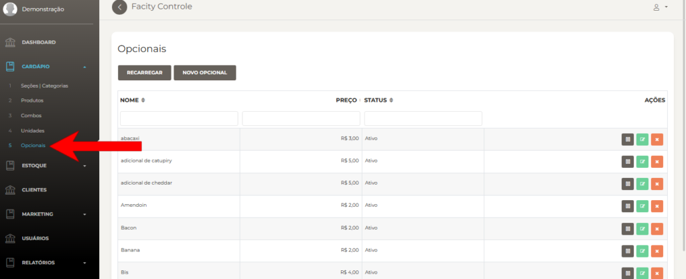
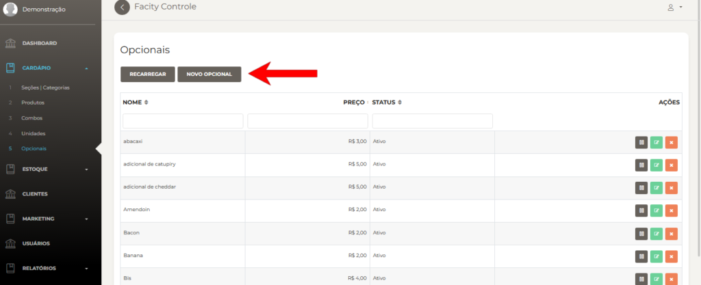
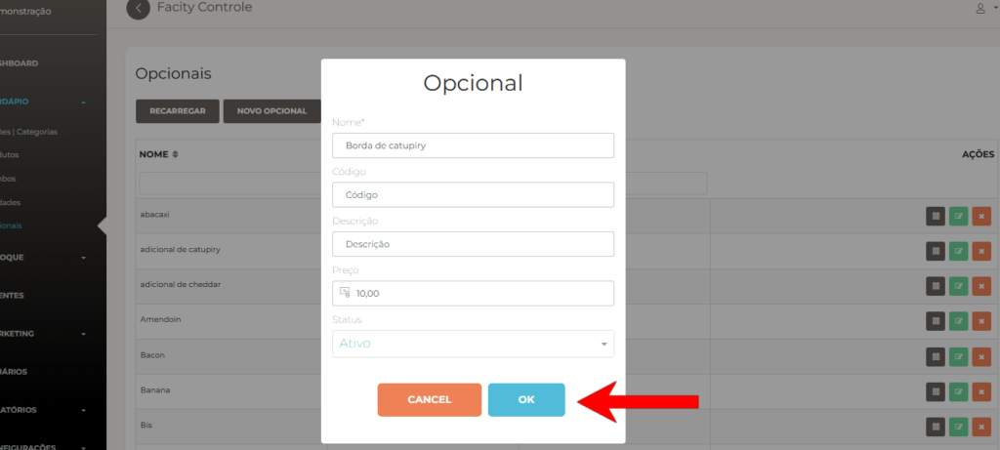
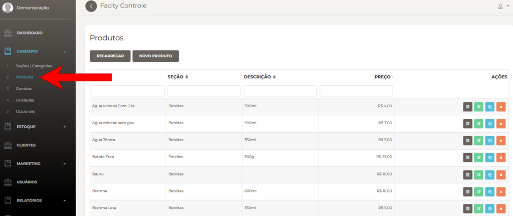
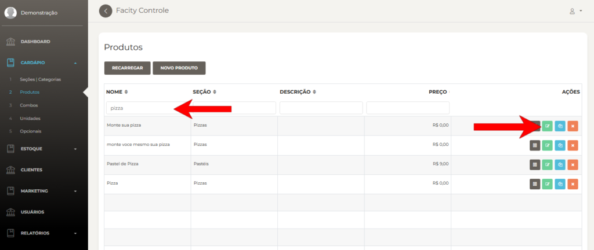
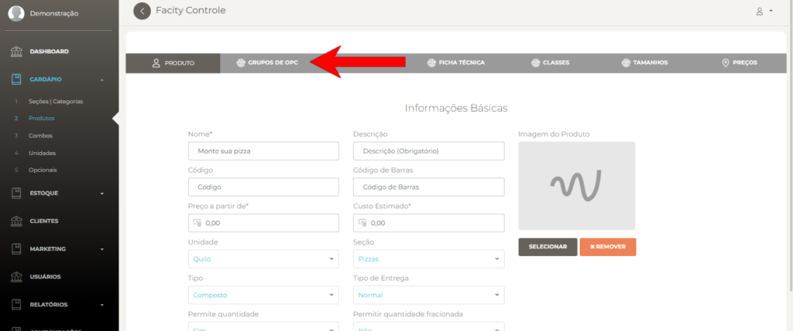
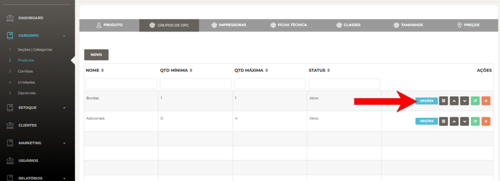
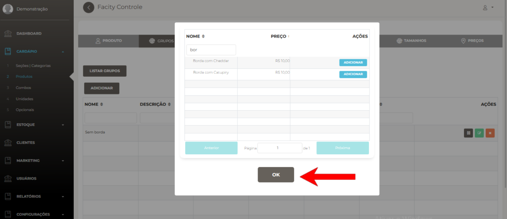
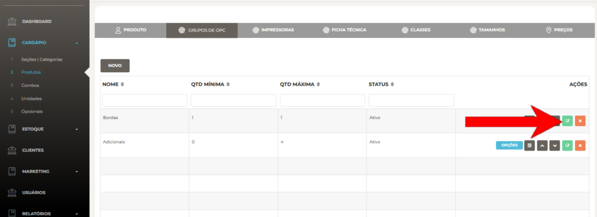
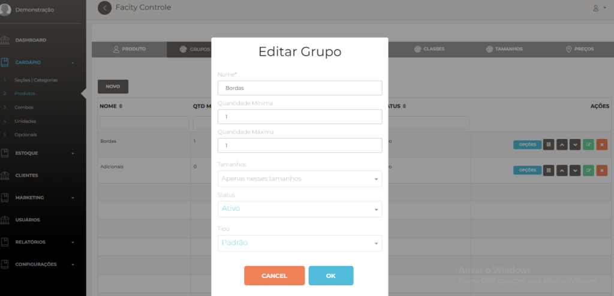

**Passo 1:** Abra o **Facity Controle** em seu computador

Digite o **nome da empresa**, **login** e **senha**, lembrando que tudo deve ser em _letras minúsculas_.

**Passo 2:** Abra o menu

No menu, clique em **"cardápio"** e, em seguida, clique em **"Opicionais"**.

**Passo 3:** Clique em **"Novo Opcional"** para começar a criar os opcionais

Comece a criar os **opcionais** de borda um por um, como :

**Borda de Cheddar**, **Borda de Catupiry**, **Sem borda**, **etc.**

Clique em **"OK"** para salvar.

**Passo 4:** Adicione os opcionais nas bordas dos produtos

Acesse novamente o **"Cardápio"** e clique em **"produtos"**. Busque na barra de pesquisa o nome pizza ou monte sua pizza para começar a adicionar as bordas.

Clique no ícone verde para editar e depois em **"Grupos de Opc"**.

Clique em **"Opções"** que está em azul para começar a adicionar opcionais nas bordas

Clique em **"adicionar"** para incluir opcionais nos grupos. Busque na barra de pesquisa pelo nome do opcional e clique em **"adicionar"**.

Salve clicando em **"ok"**.

**Passo 5:** Edite a quantidade **mínima** e **máxima** do grupo criado

Próximo passo é editar a quantidade mínima e quantidade máxima do grupo criado.

Ao criar o grupo de adicionais, defina a quantidade **mínima** e **máxima** que os clientes podem escolher.

- _A **quantidade mínima** é o menor número de ingredientes que você pode escolher. Se a quantidade mínima é 0, você pode escolher nenhum ingrediente extra. Se a quantidade mínima é 1, você precisa escolher pelo menos um ingrediente extra. Se a quantidade mínima é maior que 1, você precisa escolher pelo menos essa quantidade de ingredientes extras._
- _A **quantidade máxima** é o maior número de ingredientes que você pode escolher. Se a quantidade máxima é 0, você não pode escolher nenhum ingrediente extra. Se a quantidade máxima é 1, você pode escolher apenas um ingrediente extra. Se a quantidade máxima é maior que 1, você pode escolher até essa quantidade de ingredientes extras._

Volte nos grupos de opc e clique no ícone verde para editar. Ajuste a quantidade mínima e máxima do grupo, lembrando que essa regra equivale para todos os opcionais adicionados nesse grupo.

Com esses passos simples, você pode adicionar bordas recheadas em suas pizzas e melhorar ainda mais o seu cardápio.
