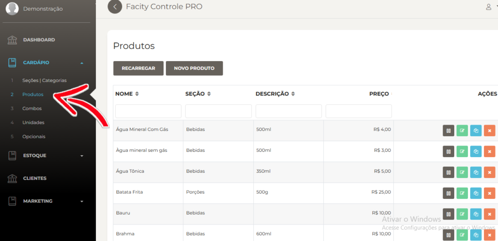
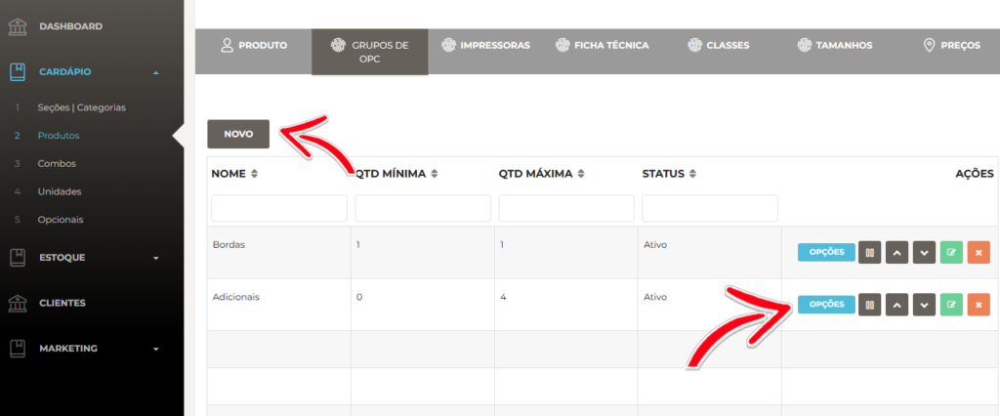
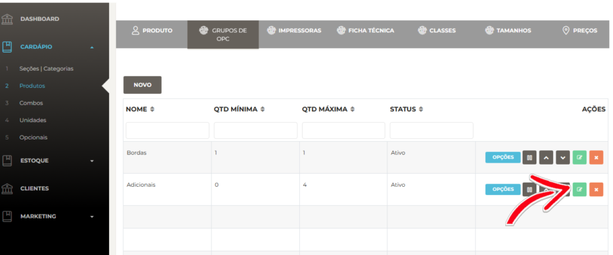
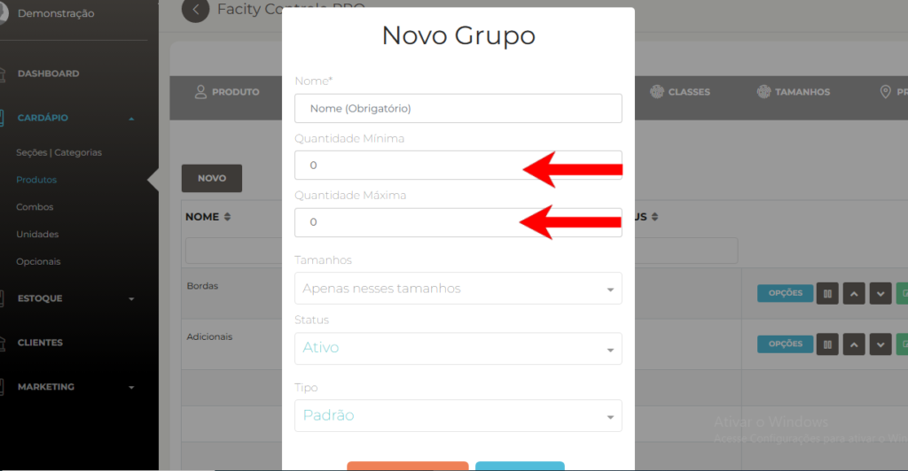
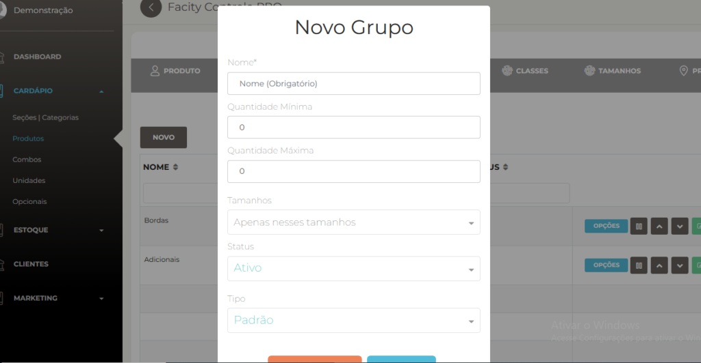
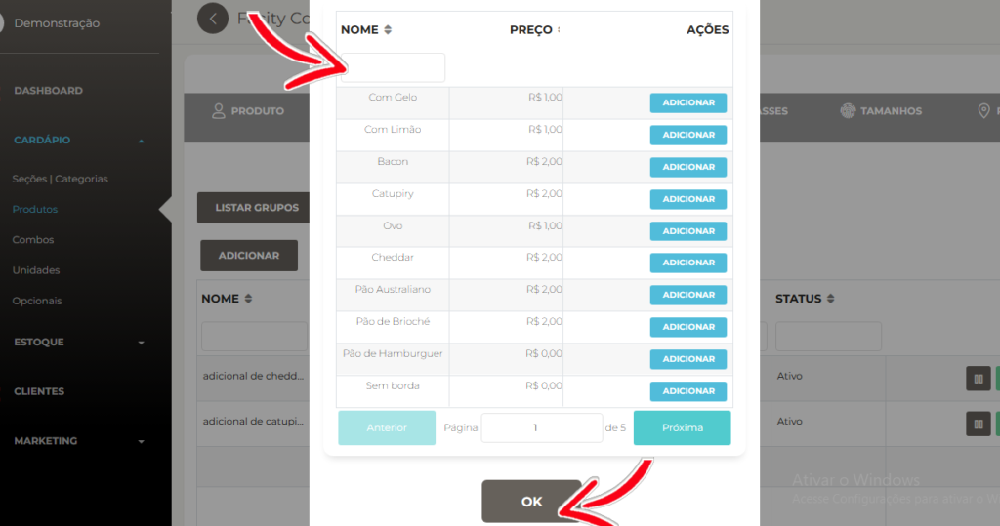

Adicionar opcionais ao sabor em uma pizza é uma ótima maneira de oferecer mais opções aos seus clientes. Aqui está um passo a passo simples para fazê-lo:

**1** \- Acesse o sistema de **controle de cardápio** em seu computador.

**2** \- Procure a opção **"Adicionais"** e clique em "**Novo adicional"** para criar um novo opcional.

**3** \- Insira o nome e o valor do adicional na tela de criação do opcional e clique em **"Salvar"** para concluir.

**4** \- Clique em **"Cardápio"** e depois em **"Produtos"** para adicionar o grupo de adicionais ao produto.

**5** \- Encontre o produto desejado e clique no ícone verde. Em seguida, clique em **"Grupos de adicionais"** e crie um novo grupo ou adicione o adicional a um grupo existente.

**6** \- Ao criar o grupo de adicionais, defina a quantidade **mínima** e **máxima** que os clientes podem escolher.

- _A **quantidade mínima** é o menor número de ingredientes que você pode escolher. Se a quantidade mínima é 0, você pode escolher nenhum ingrediente extra. Se a quantidade mínima é 1, você precisa escolher pelo menos um ingrediente extra. Se a quantidade mínima é maior que 1, você precisa escolher pelo menos essa quantidade de ingredientes extras._
- _A **quantidade máxima** é o maior número de ingredientes que você pode escolher. Se a quantidade máxima é 0, você não pode escolher nenhum ingrediente extra. Se a quantidade máxima é 1, você pode escolher apenas um ingrediente extra. Se a quantidade máxima é maior que 1, você pode escolher até essa quantidade de ingredientes extras._

**7** \- Volte para a tela de grupos de adicionais dentro do produto e clique em **"Novo"** para adicionar o adicional ao grupo. Insira o nome do grupo e a quantidade, clique em **"Salvar"** e depois em **"Opções"** em azul.

**8** \- Encontre o adicional pelo nome ou clique em **"Seguinte"** para visualizar a lista completa de opcionais. Clique em **"Adicionar"** para incluí-lo no grupo e depois em **"OK"** para salvar.

**9** - Visualize os opcionais no **sistema** e no **app.**

Agora, seus clientes terão mais opções de adicionar ingredientes extras em suas pizzas, sem complicações.
