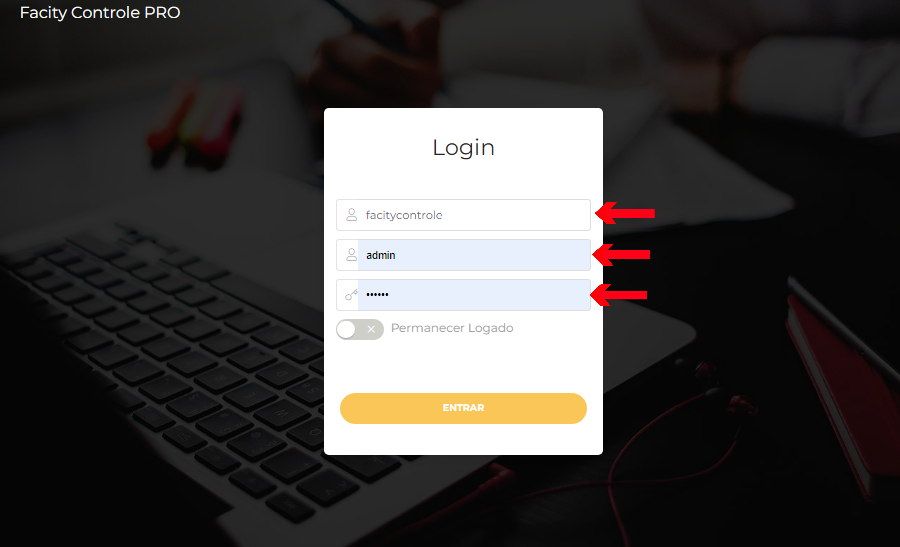
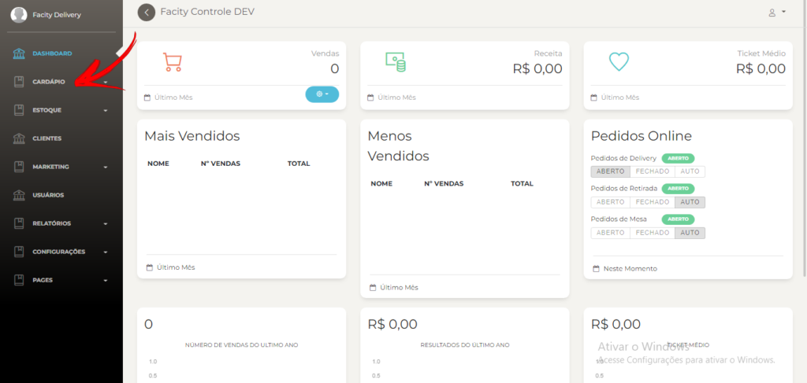
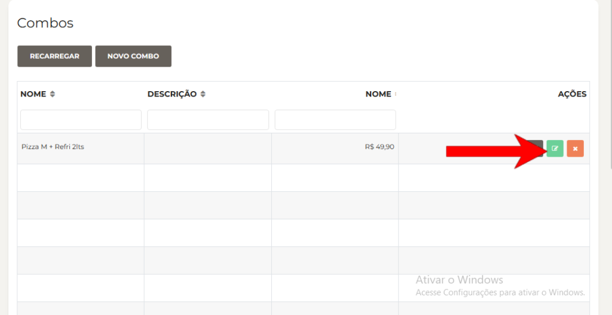
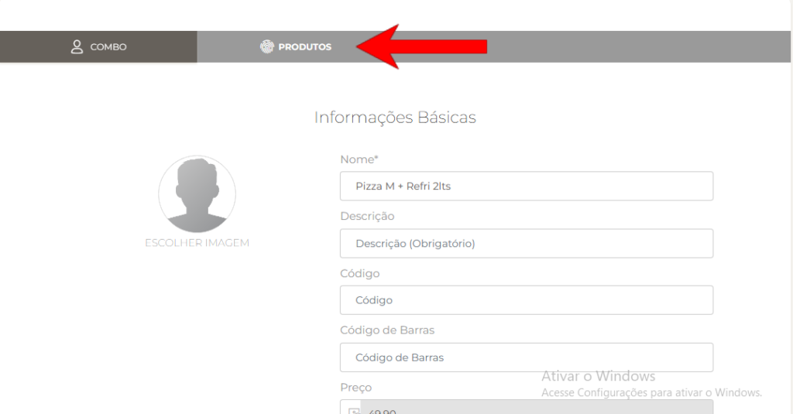
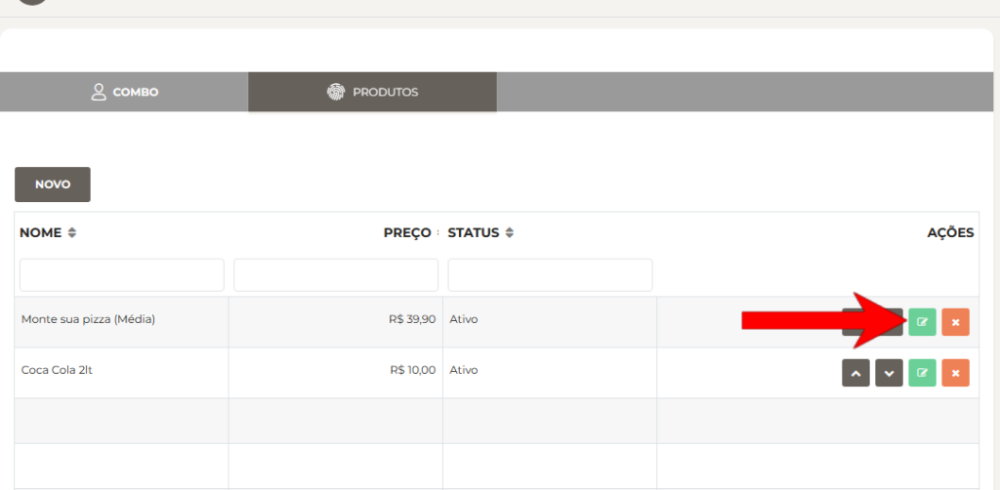
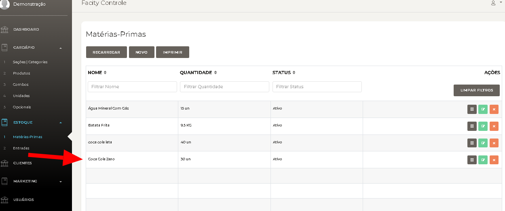

**Passo 1:** Acesse o Facity Controle no seu computador e faça o login na sua conta.

**Passo 2:** No menu lateral esquerdo, clique na opção “Cardápio”.

**Passo 3:** Na próxima tela, clique em “Combos”.

**Passo 4:** Agora você verá a lista de combos disponíveis. Escolha o combo que deseja editar e clique no ícone verde associado a ele para começar a edição.

**Passo 5:** Ao entrar na página de edição do combo, clique em “Produtos”.

**Passo 6:** Nesta seção, você verá a lista de produtos que fazem parte do combo. Escolha o produto cujo valor você deseja editar e clique no ícone verde ao lado desse produto para iniciar a edição.

**Passo 7:** Na janela de edição do produto, você pode agora modificar o valor do produto de acordo com as suas necessidades.

**Passo 8:** Após alterar o valor do produto, clique em “Ok” para confirmar as alterações e salvar as atualizações feitas.

Com esses passos simples, você conseguiu adicionar ou alterar os valores em um combo no Facity Controle. Lembre-se de verificar todas as alterações antes de finalizar e garantir que seu cardápio esteja sempre atualizado para oferecer aos seus clientes a melhor experiência possível.
