**Passo 1:** Abra o **Facity Controle** em seu computador e faça **login** com o **nome da empresa**, **login** e **senha**, lembrando que tudo tem que ser em _letras minúsculas_.

**Passo 2:** Clique em **"Cardápio"** no menu lateral esquerdo e selecione **"Produtos"** como indicado pela seta na imagem.

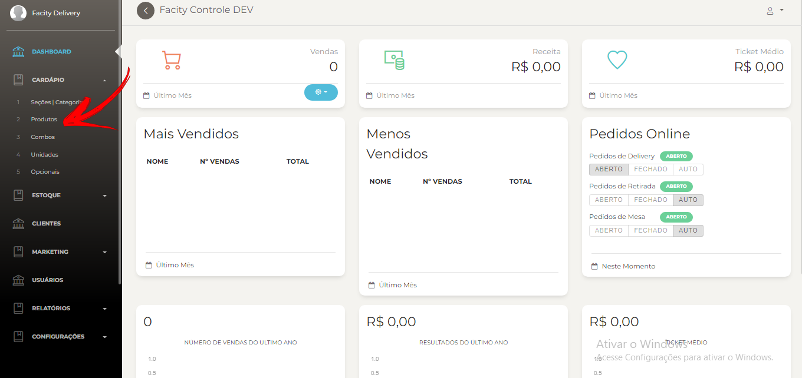

**Passo 3:** Clique em **"Novo Produto"** para começar o cadastramento.

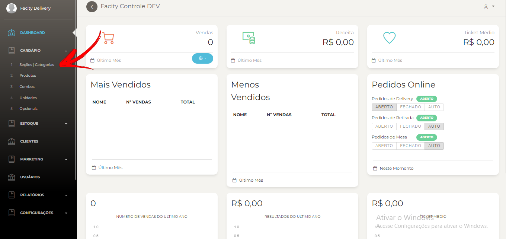

**Passo 4:** Na caixa de cadastramento, coloque o nome **"PIZZA"** e mude a opção de **"Tipo"** de **"Produto Simples"** para **"Produto Composto"**. Mude também a seção do produto para **"Pizzas"** e clique em **"OK"** para salvar.

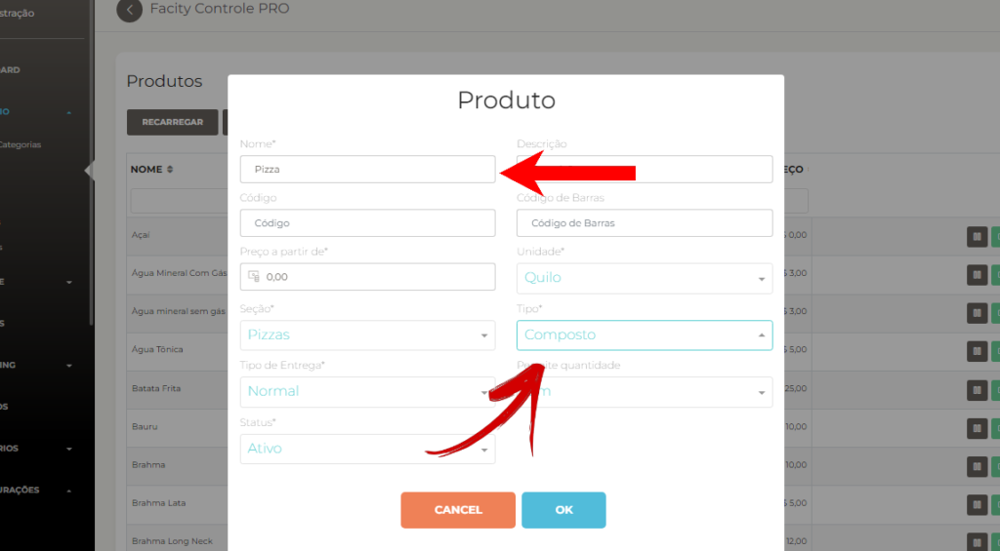

**Passo 5:** Busque o produto **"Pizza"** na lista e clique em **"Editar"** no ícone verde.

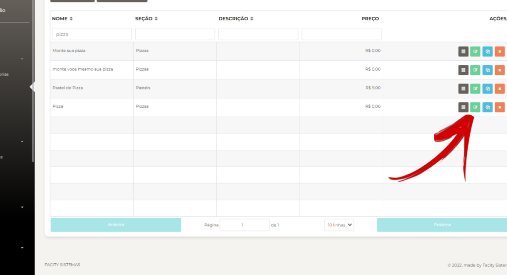

**Passo 6:** Adicione as Classes (**Especial**, **Tradicional** e **Doce**) clicando em **"Novo"**.

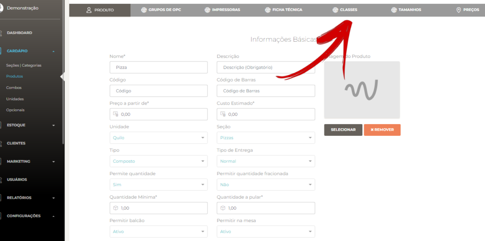

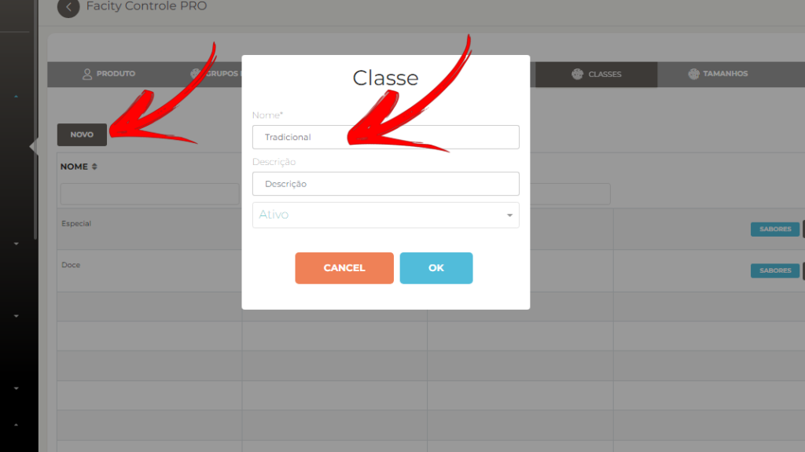

**Passo 7:** Salve o produto e clique em **"Sabores"** (ícone azul). Selecione **"Novo"** e comece a adicionar os sabores de pizza para cada classe criada.

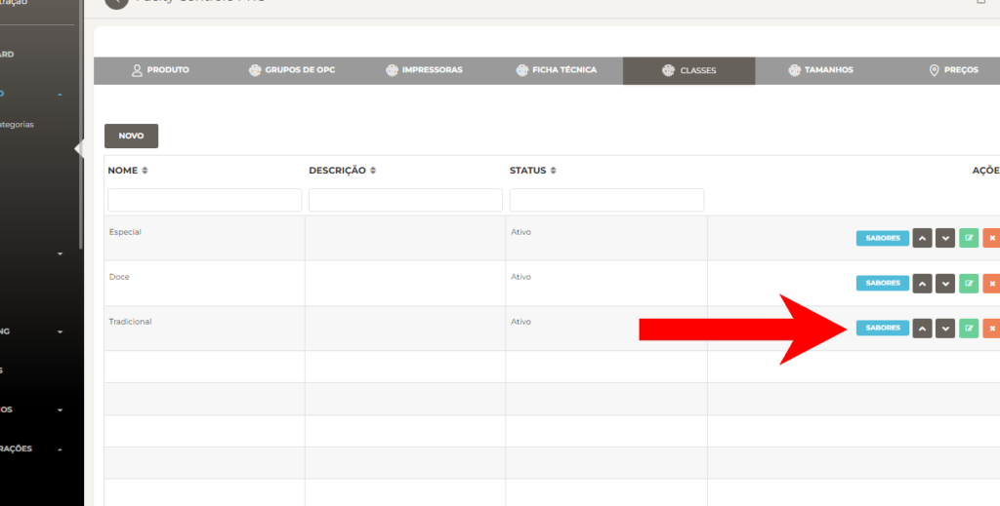

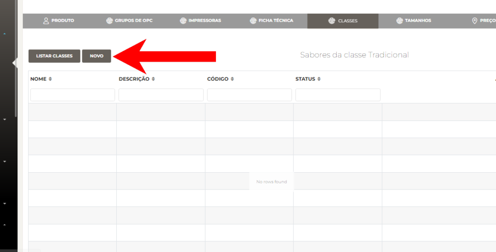

- Adicione **sabores** que vai estar nessa **classe**
- Clique em **OK** para salvar

<figure>

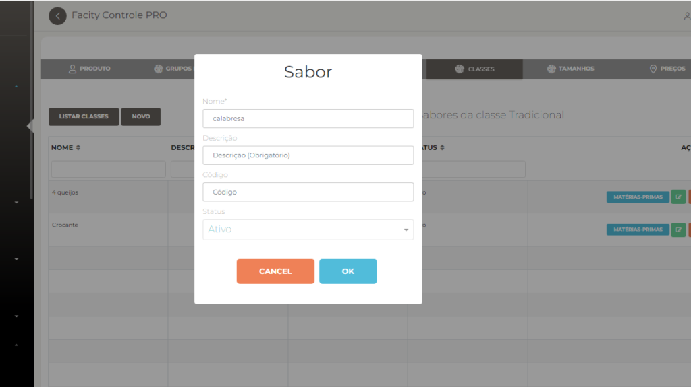

<figcaption>

Crie cada sabor um por vez, se quiser adicionar em outra classe criada é só voltar e fazer o mesmo processo.

</figcaption>

</figure>

_Com a classe criada e sabores definidos, a próxima etapa é começar adicionar os tamanhos das pizzas_

**Passo 8:** Adicione os tamanhos das pizzas selecionando **"Tamanhos"** e depois **"Novo"**. Adicione os tamanhos das pizzas um de cada vez e coloque a quantidade de fatias e quantidade de sabores.

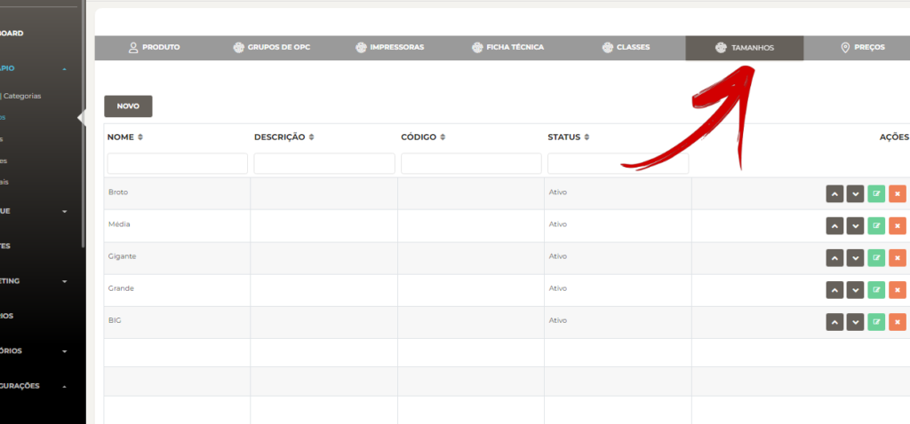

- Selecione **NOVO**
- Adicione os tamanhos das pizzas um de cada vez
- Coloque a **quantidade de fatias** e **quantidade de sabores**
- Salve em **OK**

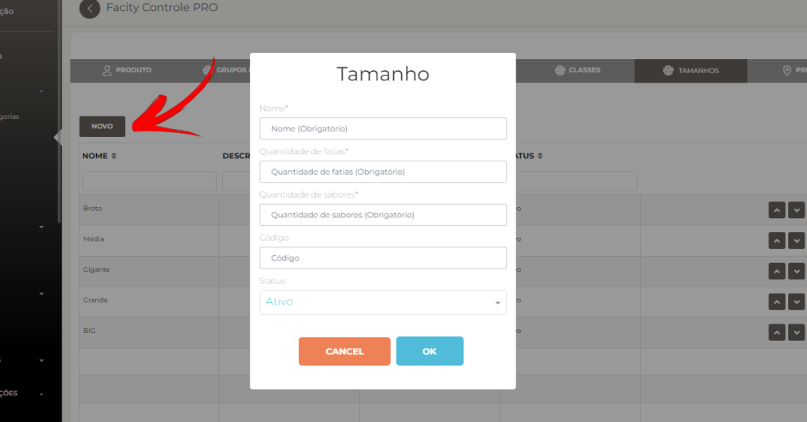

**Passo 9:** Com a parte de classes e tamanhos prontos, coloque os **valores** nos tamanhos das **tradicionais**, **especial**, **doce** e clique em **salvar** para finalizar essa parte.

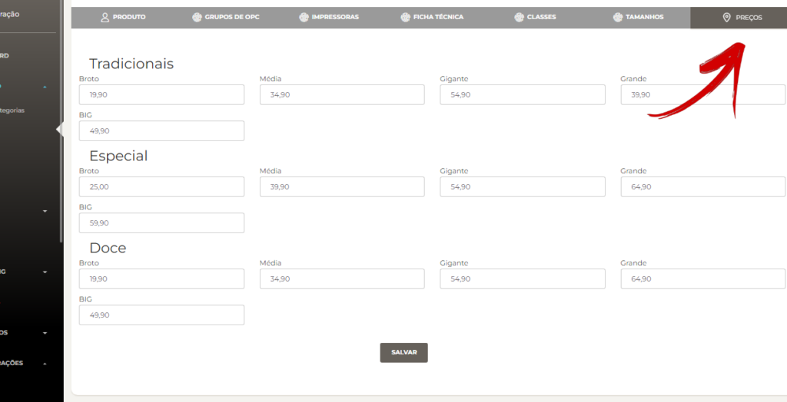

**Passo 10:** Clique em **"Grupo de Opc"** para começar a criar os opcionais e coloque o nome do grupo (por exemplo, **"Bordas** e **Adicionais"**) e a quantidade mínima e máxima.

- Clique em **grupo de opc** para começar criar os **opcionais**
- Coloque o **nome do grupo (_ex; bordas e adicionais_)**
- Coloque a **quantidade mínima** e **quantidade máxima**

<figure>

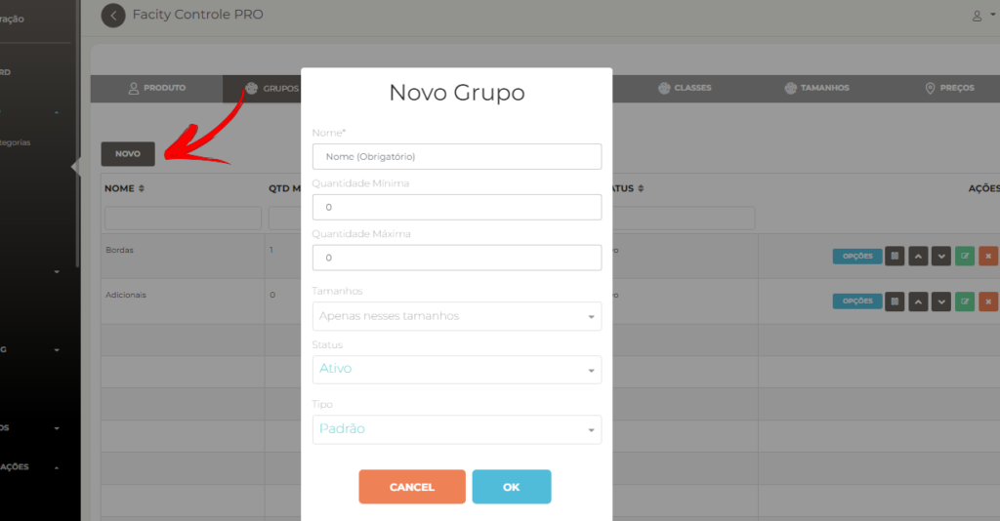

<figcaption>

Se colocar a quantidade igual 0 você não vai ter um limite quando for adicionar opcionais nesse grupo

</figcaption>

</figure>

**Passo 11:** Volte ao menu administrativo e crie os opcionais que vão dentro do grupo de opc, buscando **"Opcionais"** e criando um **"Novo Opcional"**.

- Busque **opcionais** abrindo o **cardápio**
- Crie um **NOVO OPCIONAL**
- Comece a adicionar os opcionais colocando os nomes

_**Exemplos**:_

- Borda de Cheddar
- Borda de Catupiry
- Sem borda
- Adicional de Cheddar ou Catupiry

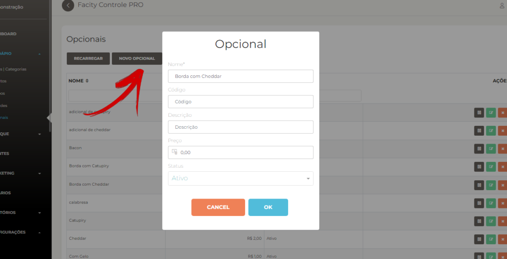

**Passo 12:** Volte em **"Produtos"**, busque o produto **"Pizza"** e vá em **"Editar"** no ícone verde. Clique em **"Grupo de Opc"** e adicione os opcionais que criou.

- Volte em **PRODUTOS** e ache o seu produto **PIZZA** e vá em editar no ícone verde
- Clique em **grupo de opc**
- **NOVO OPCIONAL**
- Busque o nome dos **opcionais** que criou e adicione.

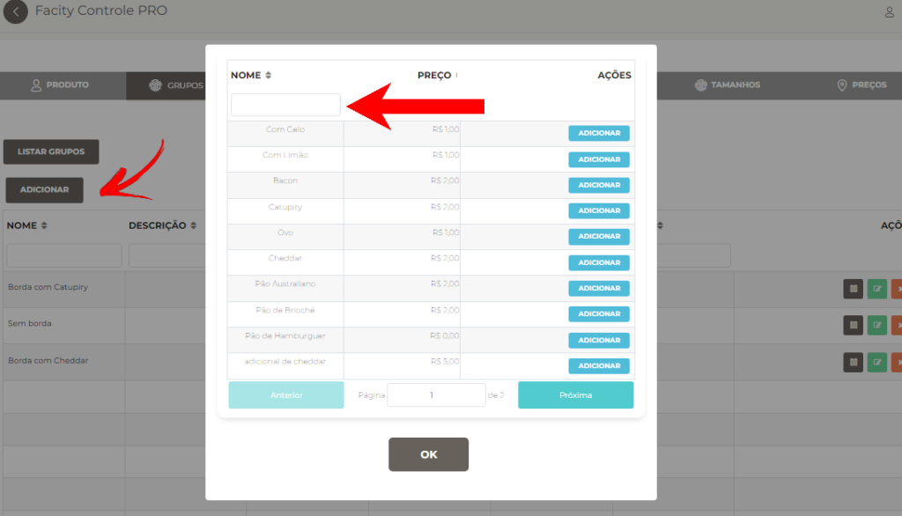

**Passo 13:** Clique em **"Salvar"** para finalizar.

Espero que este tutorial tenha sido útil para adicionar produtos tipo pizza com borda e sabores em seu cardápio.
