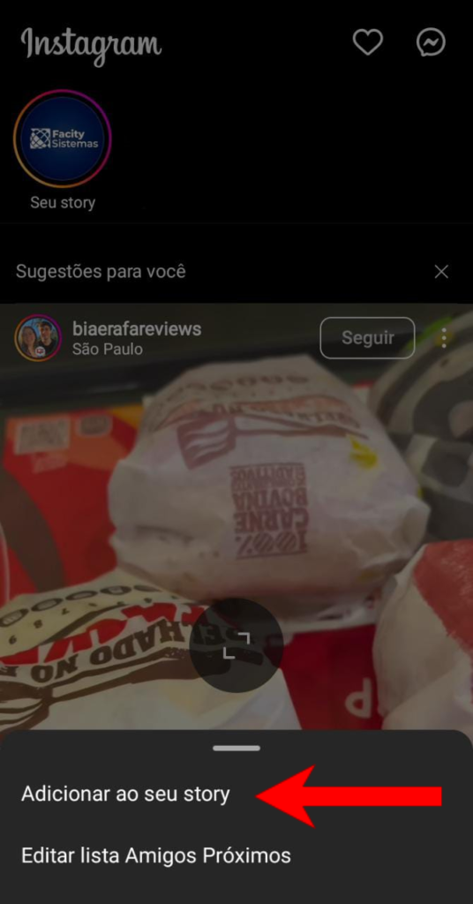
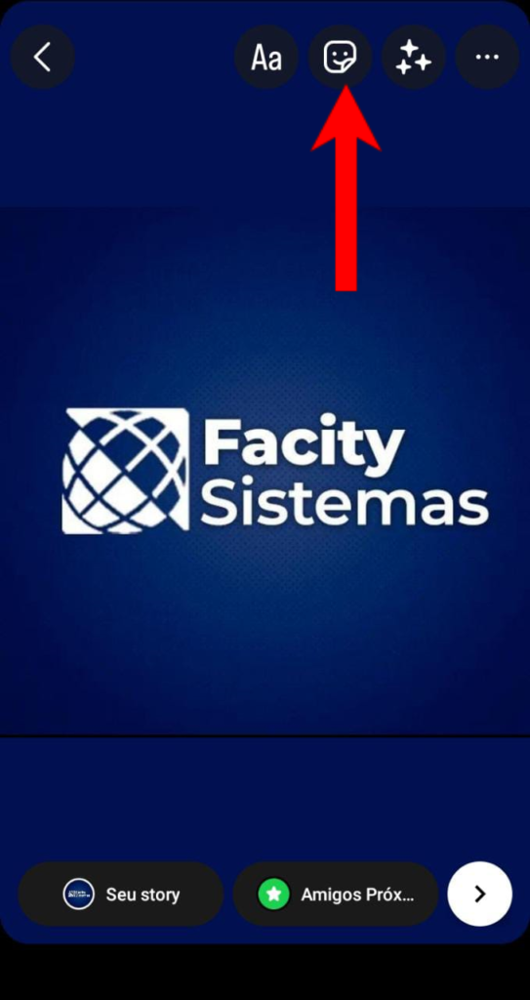
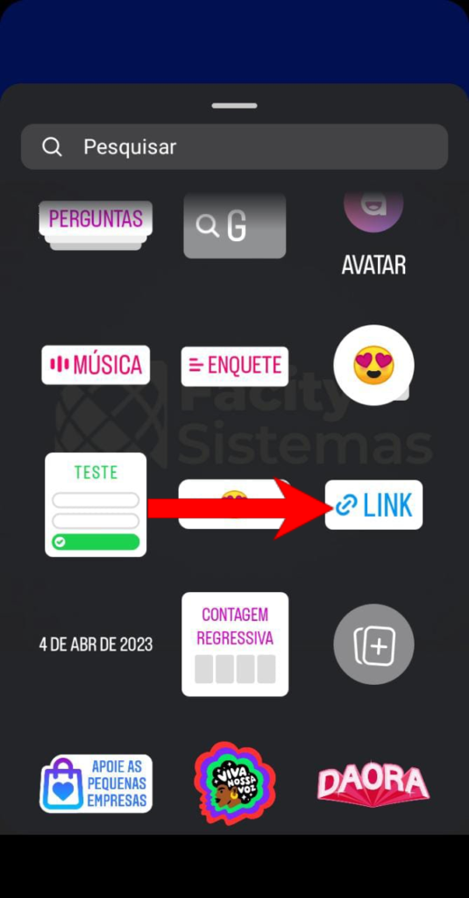
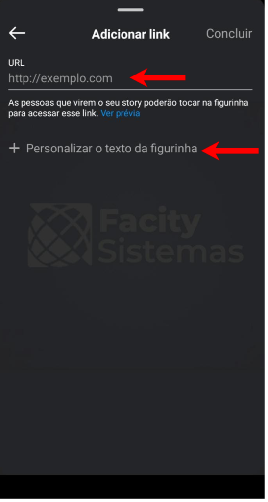

Hoje eu vou ensinar como adicionar um link ao seu cardápio digital no seu stories do Instagram. É muito fácil, siga os passos abaixo:

**Passo 1:** Abra o **Instagram** e vá até **adicionar ao Stories**;

**Passo 2:** Após gravar ou escolher a imagem que quer postar, clique no **ícone de stickers (o quadradinho com um rosto)**;

**Passo 3:** Toque em **"Link"**

**Passo 4:** Após clicar no link e adicione o endereço do seu cardápio digital;

**Passo 5:** Clique em **"Concluir"** para finalizar

**Exemplo:**

Outro **exemplo** de como fica com o **"link"** já pronto:

Clicando no **"Link"** imediatamente o cliente vai acessar o **cardápio digital**, segue uma imagem de exemplo abaixo;

Imediatamente! Agora seus seguidores podem acessar o seu **cardápio digital** clicando no link que você adicionou ao seu stories!

Fácil, né? Lembre-se que adicionar links ao seu stories é uma ótima maneira de fornecer aos seus seguidores uma experiência mais interativa e completa com seu conteúdo.
