**Passo 1:** Abra o **Facity Controle** em seu computador

Para começar, abra o **Facity Controle** em seu computador. Certifique-se de digitar o nome da **empresa**, **login** e **senha**, lembrando que tudo deve ser escrito em **letras minúsculas**.

**Passo 2:** Acesse o cardápio no menu lateral esquerdo

Dentro do painel administrativo, clique em **"Cardápio"** no menu lateral esquerdo.

**Passo 3:** Selecione a opção **"Produtos"**

Na página do cardápio, localize e clique em **"Produtos".** Você pode identificá-lo pela seta indicativa na imagem.

**Passo 4:** Crie um novo produto

Para adicionar um novo produto, clique em **"Novo Produto"**.

**Passo 5:** Preencha as informações do produto

Ao clicar em **"Novo Produto"**, uma caixa de cadastramento será aberta. Nela, preencha as informações necessárias sobre o produto:

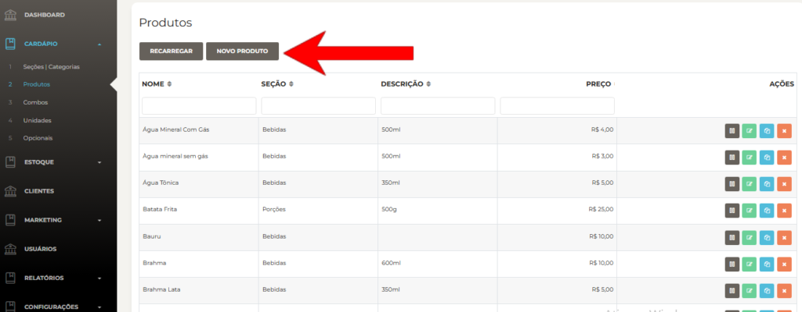

- Nome do produto
- Preço
- Descrição do produto
- Seção do produto

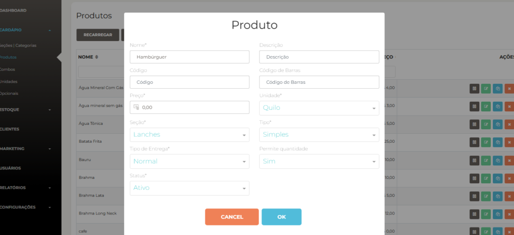

Após inserir os dados, clique em **"Salvar"**.

**Observação:** Se você não possui uma seção para esse produto, é necessário criar uma nova.

Siga o **passo a passo** abaixo:

- Volte ao menu e clique em "**Seções / Categorias"**

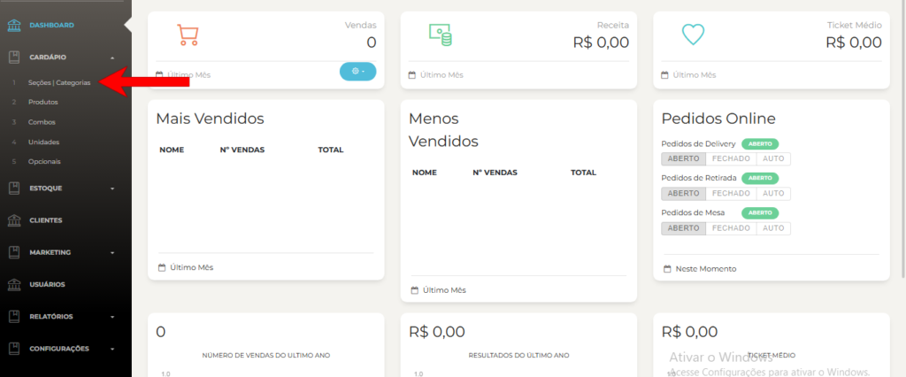

- Em seguida, clique em **"Nova Seção"**

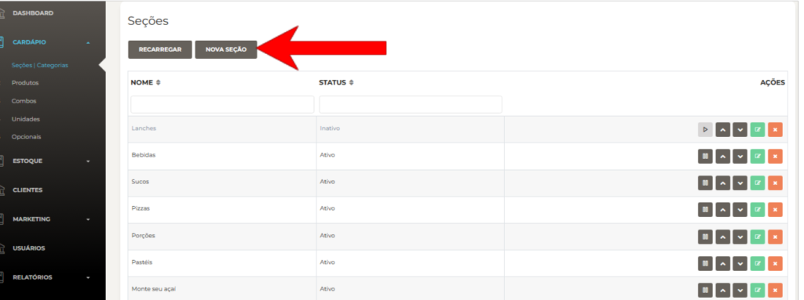

- Insira um nome para a seção e clique em **"OK"** para salvar

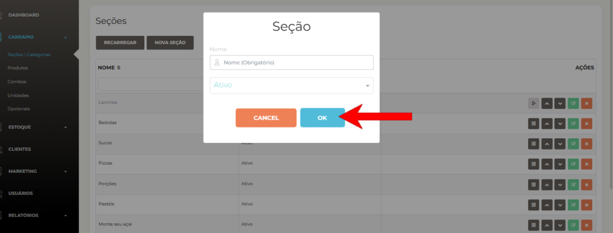

Agora, vamos adicionar uma foto ao **produto** e à **seção**:

- Volte ao menu e clique em **"Produtos"**
- Utilize a barra de pesquisa para encontrar o produto desejado

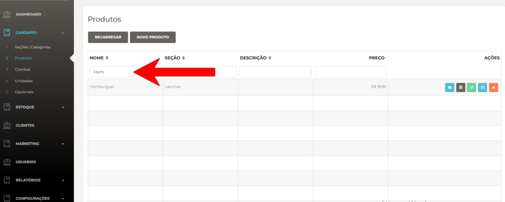

- Clique no **ícone verde** para editar e acessar a página do produto

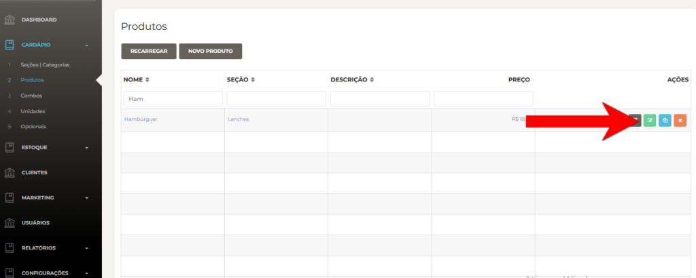

- Localize a opção **"Selecionar"**, conforme indicado pela seta
- Clique em **"Selecionar imagem"** para abrir a janela de seleção de fotos

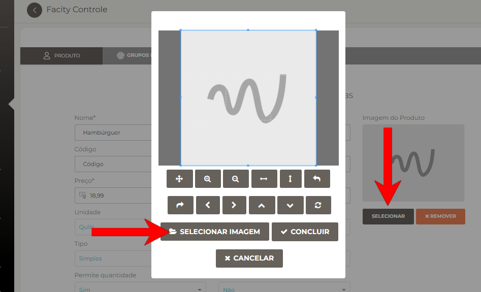

- Procure e selecione a imagem desejada
- Clique em **"Abrir"**
- Ajuste a imagem de acordo com sua preferência
- Clique em **"Concluir"** para adicionar a imagem
- No final da página, clique em **"Salvar"**

<figure>

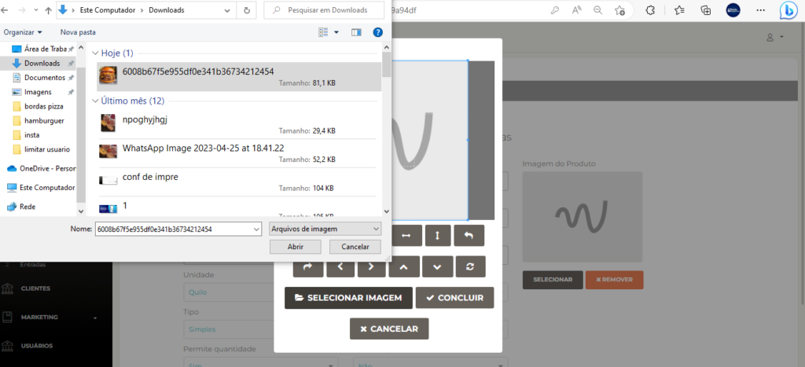

<figcaption>

\[

</figcaption>

</figure>

Agora, vamos adicionar uma foto à seção:

- Clique em **"Seções / Categorias**"
- Encontre a **seção** à qual deseja adicionar a foto
- Clique no **ícone verde**

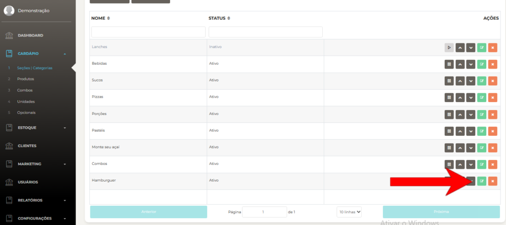

- Clique em **"Selecionar"**

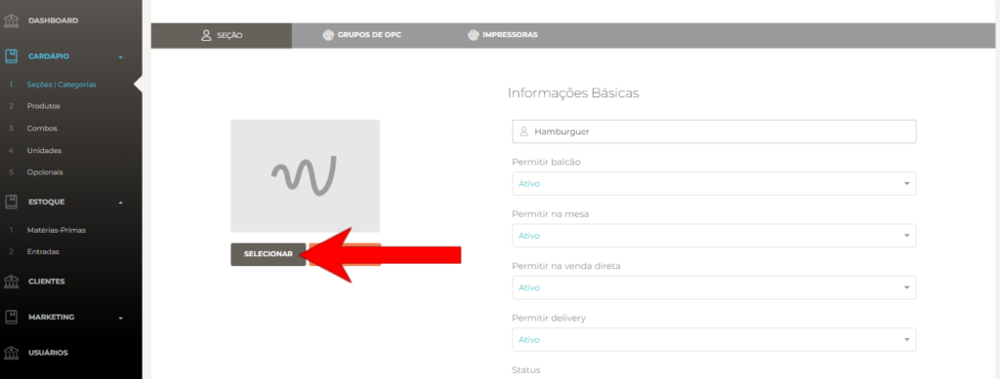

- Selecione a imagem salva anteriormente e clique em **"Abrir"**
- Ajuste a imagem conforme sua preferência
- Clique em **"Concluir"**

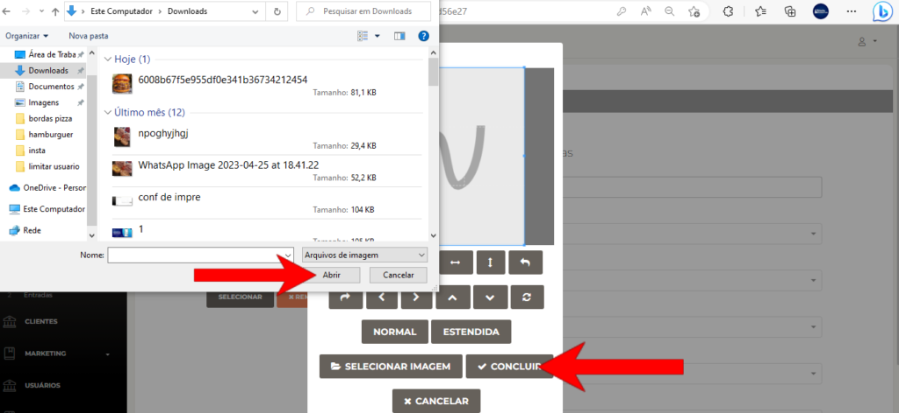

- Para finalizar, clique em **"Salvar"**

Seguindo esses passos, você conseguirá adicionar um produto tipo hambúrguer ao seu cardápio no **Facity Controle**. Experimente e aproveite!
