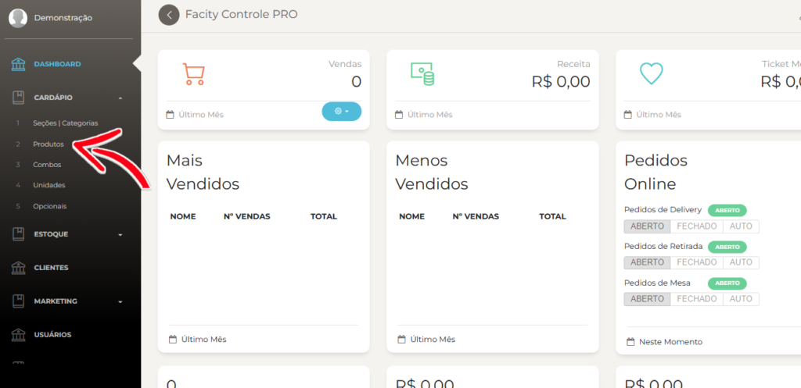
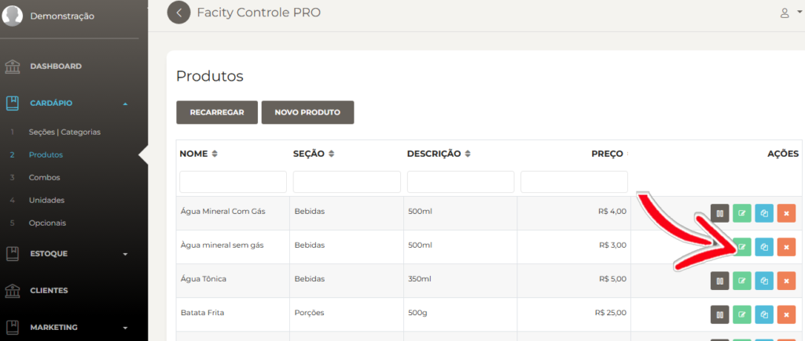
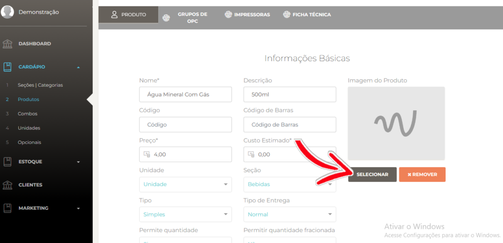
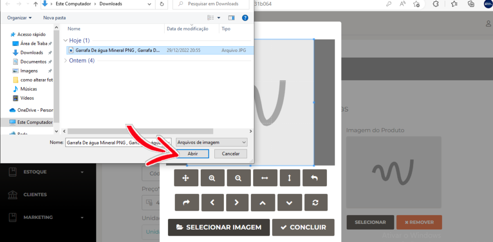
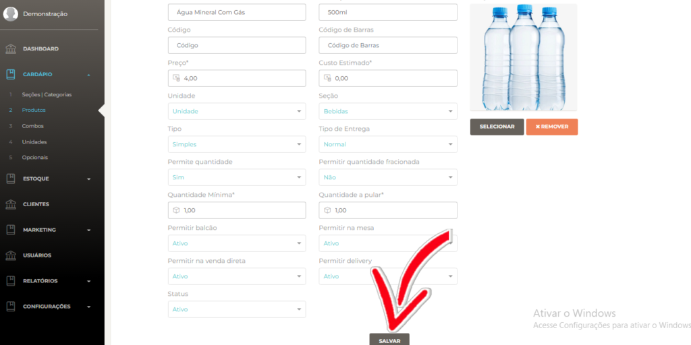
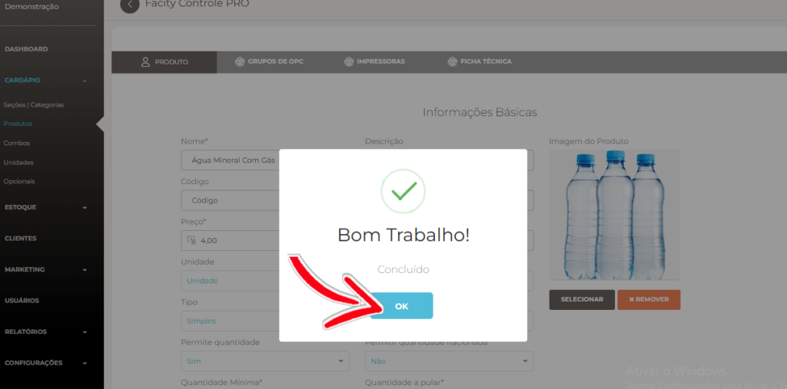

Se você precisa alterar a foto de um produto no **Facity Controle**, siga esses passos simples:

**Passo 1:** Abra o Facity Controle em seu computador.

**Passo 2:** Insira o nome da empresa, o login e a senha - _tudo em letras minúsculas._

**Passo 3:** Abra o menu e clique em **"Cardápio"**.

**Passo 4:** Selecione a opção **"Produtos".**

**Passo 5:** Escolha o produto que deseja alterar a foto e clique no ícone verde de **"Editar"**.

**Passo 6:** Clique em **"Selecionar".**

**Passo 7:** Busque a foto que deseja adicionar e selecione-a.

Ajuste a imagem do jeito que preferir e clique em **"Concluir"**

**Passo 8:** Salve as alterações clicando em **"Salvar"**.

**Passo 9:** Confirme a ação clicando em **"OK"**.

Pronto! A foto do produto foi adicionada ou alterada com sucesso. Para mudá-la novamente, basta repetir esses mesmos passos.
