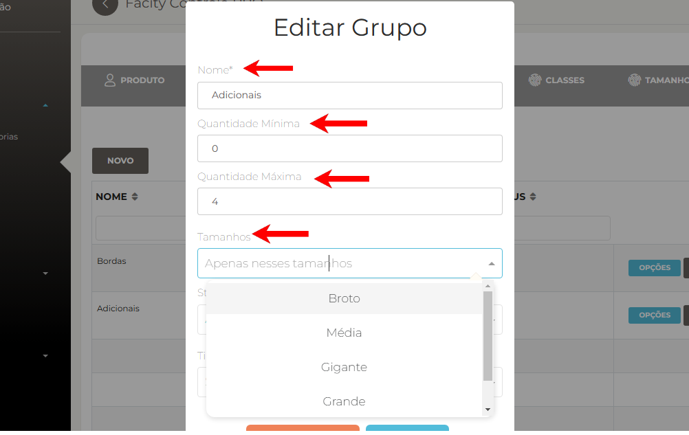
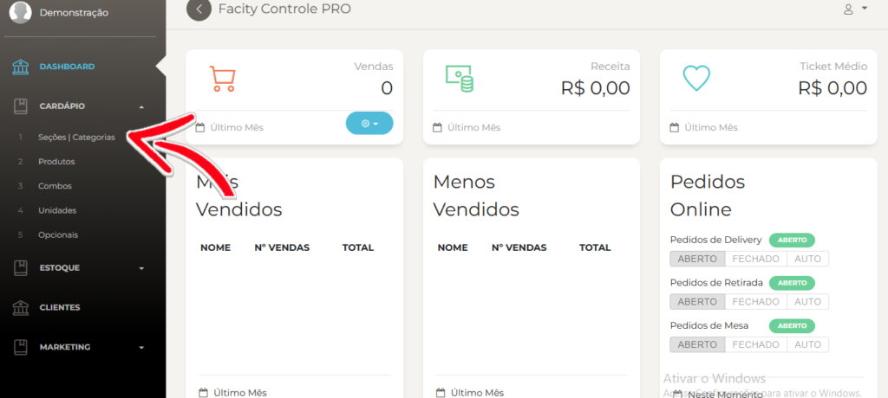
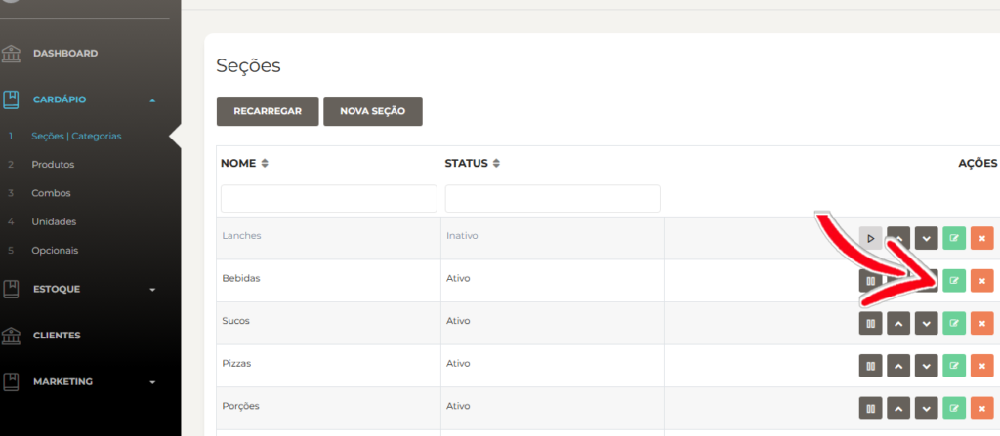
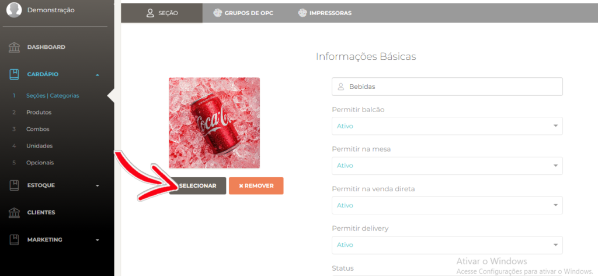
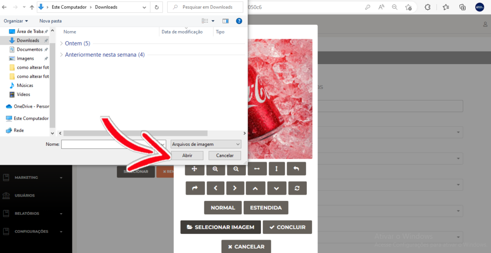
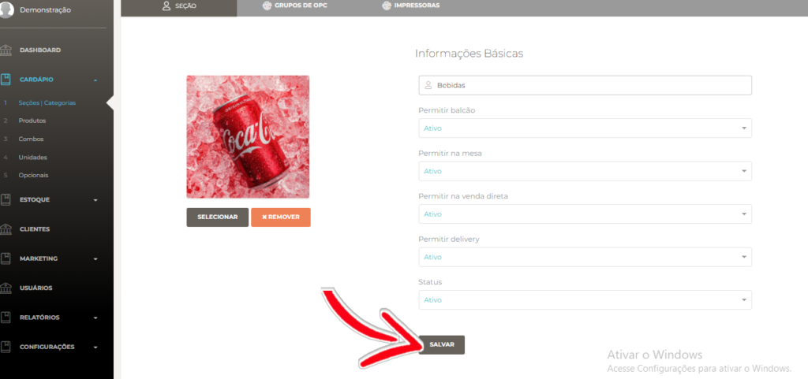
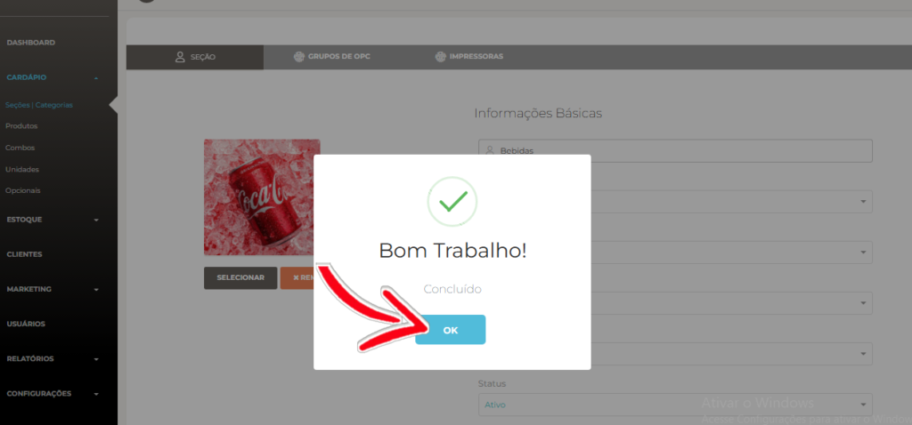

Neste post, vamos ensinar como alterar a foto de uma **seção** em sua página do **Facity Controle**. Siga o passo a passo abaixo:

**Passo 1:** Abra o **Facity Controle** em seu computador e faça login com o **nome da empresa**, **login** e **senha**. Lembre-se de que tudo deve ser escrito em _letras minúsculas._

**Passo 2:** Abra o menu e clique em **"Cardápio"**.

**Passo 3:** Em seguida, clique em **"Seções/Categorias"**.

**Passo 4:** Selecione a seção que deseja alterar a foto e clique em **"Editar"** no ícone verde.

**Passo 5:** Clique em **"Selecionar"** e, em seguida, em **"Selecionar a imagem"**.

Busque pela foto que salvou para colocar na seção e selecione-a. Clique em **"Abrir"**.

**Passo 6:** Ajuste a imagem do jeito que preferir e clique em **"Concluir"**.

**Passo 7:** Clique em **"Salvar"** e, em seguida, em **"OK"**.

Pronto! A foto da **seção** foi adicionada ou alterada e, se quiser mudá-la novamente, basta repetir o mesmo processo. Esperamos que este tutorial tenha sido útil e fácil de seguir. Se tiver alguma dúvida, deixe um comentário abaixo.
