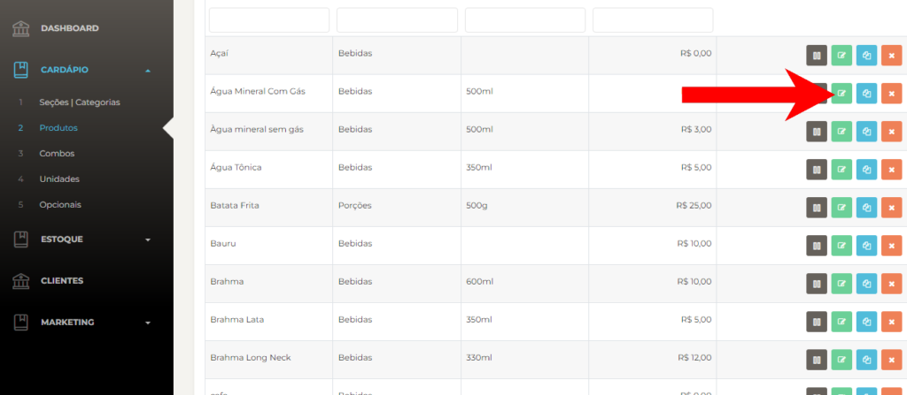
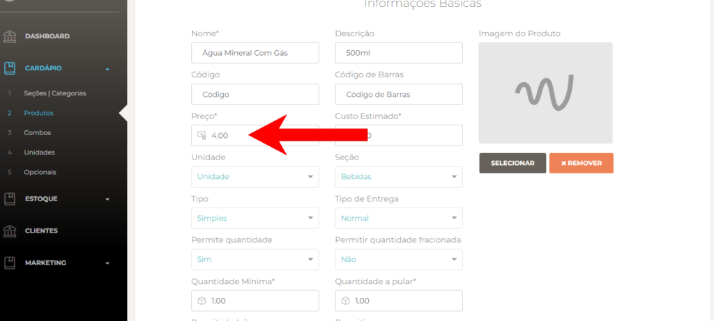
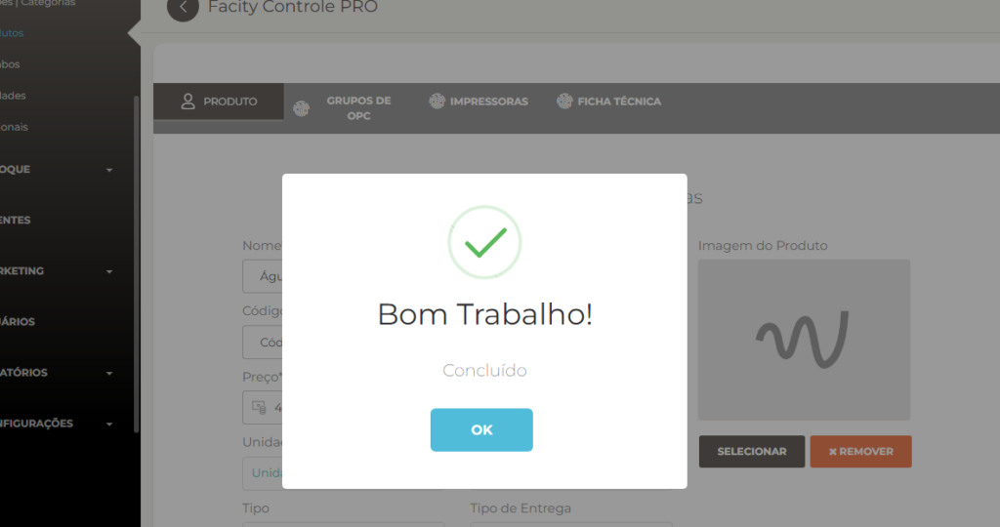

Passo a passo de como alterar o preço de um produto no Facity Controle:

**Passo 1:** Abra o **Facity Controle** em seu computador.

**Passo 2:** Insira o **nome da empresa**, **login** e **senha**. Verifique se todos os caracteres estão em letras minúsculas.

**Passo 3:** Acesse o **MENU** e procure pela opção **PRODUTOS**. Clique nessa opção para acessar a lista de produtos cadastrados.

**Passo 4:** Selecione o produto que deseja editar. Você pode usar a barra de rolagem ou a barra de busca para encontrar o produto.

**Passo 5:** Clique no ícone verde para editar o produto. Esse ícone está localizado à direita do nome do produto.

**Passo 6:** Altere o valor do produto no campo onde está escrito **PREÇO**. Digite o novo valor do produto e verifique se está correto.

**Passo 7:** Clique em **SALVAR** para salvar as alterações que você fez no produto.

**Passo 8:** Após clicar em salvar, uma mensagem de confirmação aparecerá na tela informando que as alterações foram salvas com sucesso. Clique em **OK** para finalizar a edição do produto.

Pronto! Agora você sabe como alterar o preço de um produto no **Facity Controle**.
