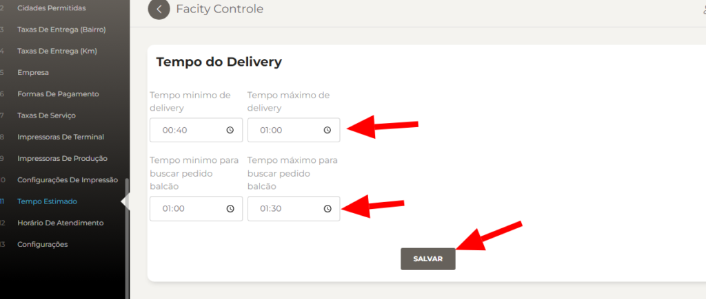

**Passo 1:** Abra o **Facity Controle** em seu computador

Para começar, abra o **Facity Controle** em seu computador. Certifique-se de que tem o **login** e **senha corretos da sua empresa**. Lembre-se de que tudo tem que ser digitado em _letras minúsculas_.

**Passo 2:** Clique em **“Configurações”**

No menu lateral à esquerda, clique em **“Configurações”**.

**Passo 3:** Clique em **“Tempo Estimado”**

Dentro de **“Configurações”**, clique em **“Tempo Estimado”**.

**Passo 4:** Agora, para alterar o tempo estimado:

- Selecione um dos relógios pré-definidos clicando neles;
- Digite manualmente os horários desejados nos campos fornecidos;

**Passo 5:** Certifique-se de salvar as alterações, clicando em **"Salvar"** na parte inferior página.

Se tiver alguma dúvida ou precisar de assistência adicional, não hesite em entrar em contato com o suporte técnico do **Facity Controle** ou deixe um comentário abaixo.
