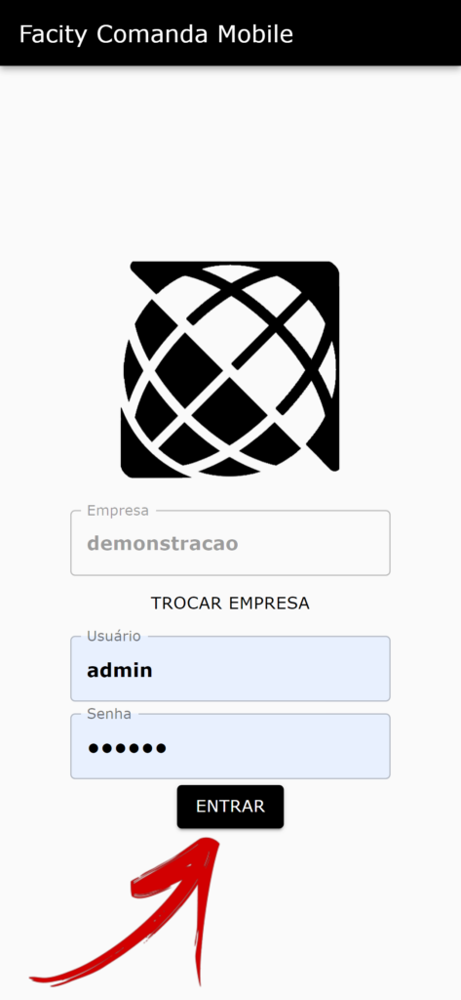

Neste post, vou te ensinar como baixar e instalar o aplicativo **Facity Garçom**, que é a versão online para os garçons das empresas que utilizam a plataforma **Facity**. É super fácil, confira o passo a passo abaixo:

**Passo 1**: Acesse o link do Facity Garçom na **PlayStore**

_Link do **Facity Garçom** na **PlayStore**_:

**[Clique aqui](https://play.google.com/store/apps/details?id=br.com.facity.facitygarcom)**

_Link do **Facity Garçom** para abrir no navegador:_

**[Clique aqui](https://garcom.facity.com.br/nomedaempresa/login)**

**Passo 2:** Aguarde o aplicativo ser baixado e instalado no seu celular.

**Passo 3:** Abra o **Facity Garçom** em seu celular.

**Passo 4:** Insira o **nome da empresa**, **login** e **senha**. Lembre-se de digitar tudo em _letras minúsculas._

Pronto! Agora você já pode usar o aplicativo **Facity Garçom**.

Caso você queira saber como usar o aplicativo, confira o post com todas as explicações detalhadas neste link: [https://blog.facity.com.br/como-usar-o-app-dos-garcons/](https://blog.facity.com.br/como-usar-o-app-dos-garcons/).

Espero que tenha ajudado! Se tiver alguma dúvida, deixe um comentário abaixo que eu te ajudo.
