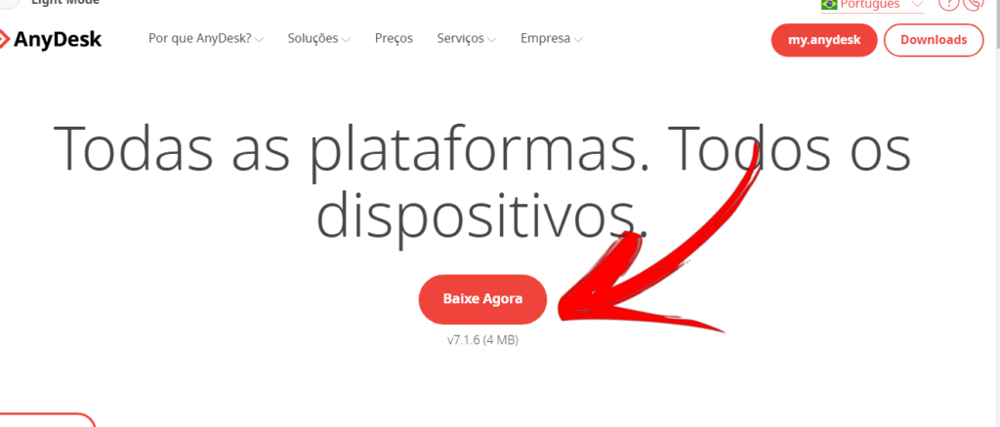
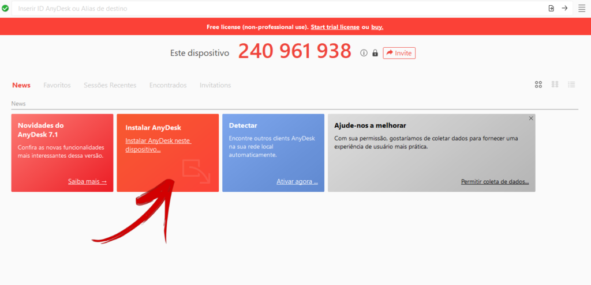
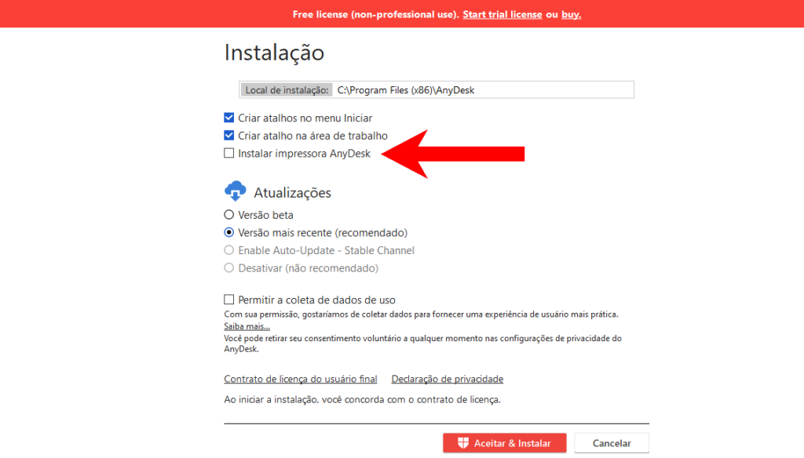
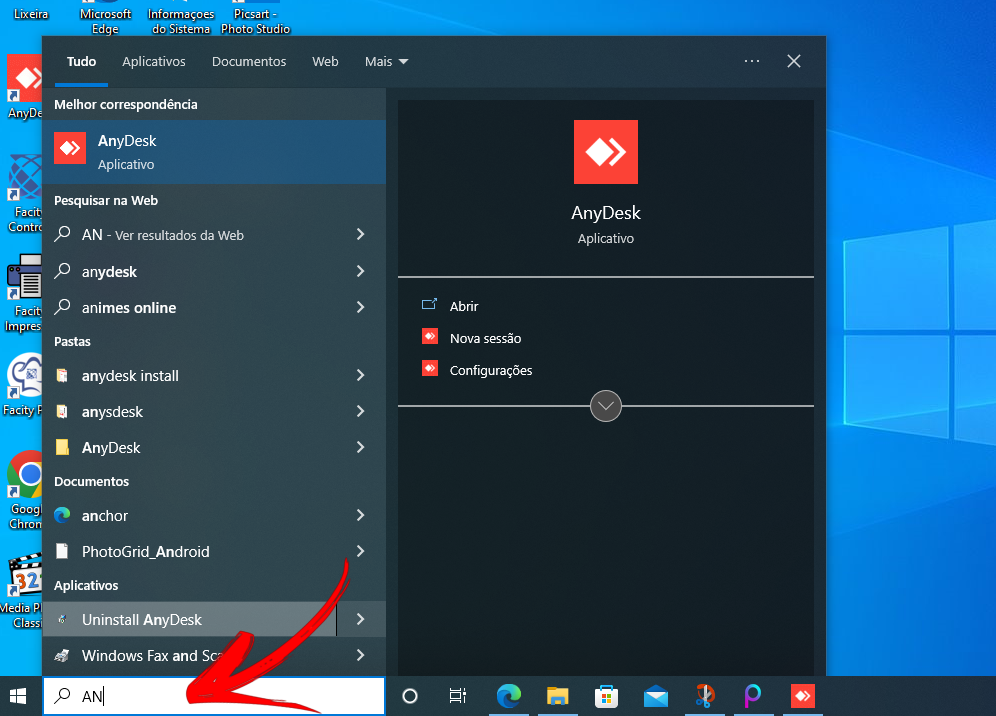
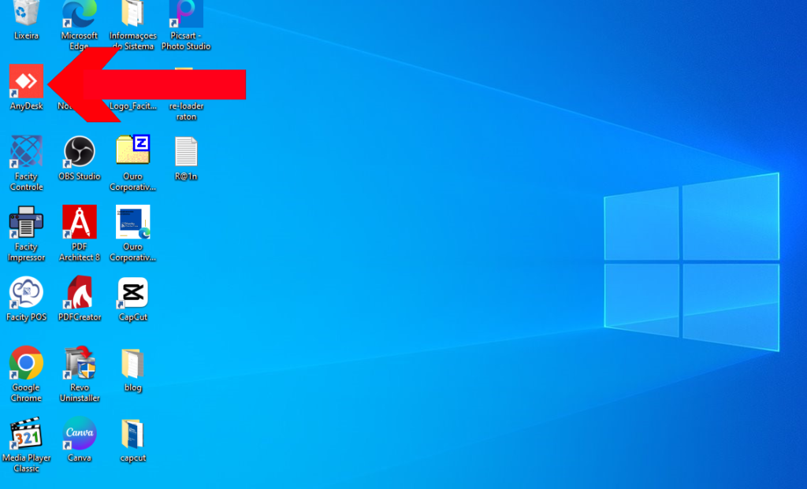

O **Anydesk** é um software que permite a conexão remota entre computadores. Ele é uma ótima ferramenta para quem precisa trabalhar de casa, fazer suporte técnico à distância, ou acessar o computador de outra pessoa. Neste tutorial, vamos mostrar como baixar e instalar o **Anydesk** em seu computador.

**Passo 1:** Acesse o site oficial do **Anydesk**

Para começar, acesse o site oficial do **Anydesk** pelo endereço [https://anydesk.com/pt/downloads/windows](https://anydesk.com/pt/downloads/windows). Certifique-se de estar no site oficial para evitar baixar um arquivo malicioso.

**Passo 2:** Clique em **"Baixar agora"**

No site do **Anydesk**, clique no botão **"Baixar agora"**. O **download** será iniciado automaticamente.

**Passo 3:** Abra o arquivo baixado

Assim que o **download** terminar, abra o arquivo baixado clicando nele. O arquivo deverá ter um nome como **"AnyDesk.exe"**.

**Passo 4:** Instale o **Anydesk**

O programa será aberto sem instalar. Clique em **"Instalar Anydesk"** e aguarde alguns instantes enquanto o programa é instalado. Na tela de instalação, desmarque a opção **"Instalar impressora Anydesk"** se você não precisar dela.

**Passo 5:** Abra o **Anydesk**

Quando a instalação terminar, o **Anydesk** será aberto automaticamente. Caso ele não seja aberto, procure pelo ícone do programa em sua área de trabalho ou na lista de programas.

- Geralmente quando você instala o programa ele já cria uma cópia dele no seu **deskto****p (****tela principal do seu computador)**

**Passo 6:** Configure o **Anydesk (opcional)**

Ao abrir o **Anydesk** pela primeira vez, você pode configurá-lo de acordo com suas preferências. Por exemplo, você pode definir uma senha de acesso remoto para aumentar a segurança da conexão.

Pronto! Agora você já sabe como baixar e instalar o **Anydesk** em seu computador. Lembre-se de sempre baixar softwares de sites confiáveis e atualizar o **Anydesk** sempre que houver uma nova versão disponível.
