Para começar, você precisará realizar a instalação do programa, onde ocorre a configuração do sistema. O processo é bastante simples e você mesmo pode executar seguindo os passos a seguir:

**Passo 1: Download e Instalação do Programa**

**1.1** - Acesse o link abaixo e quando abrir a pagina clique em **"Instalador Facity Controle Cliente Web".**

?? [https://www.facity.com.br/downloads](https://www.facity.com.br/downloads)

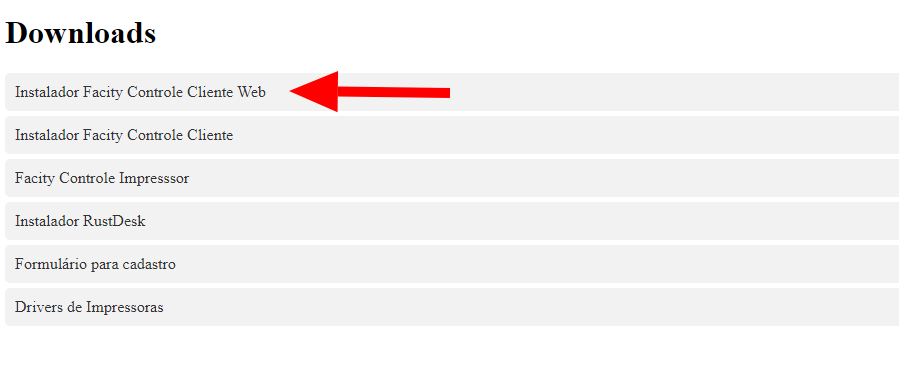

**1.2** - Clique no link para iniciar o download. Dependendo do seu navegador, uma nova guia pode abrir automaticamente para salvar o arquivo ou iniciar o download.

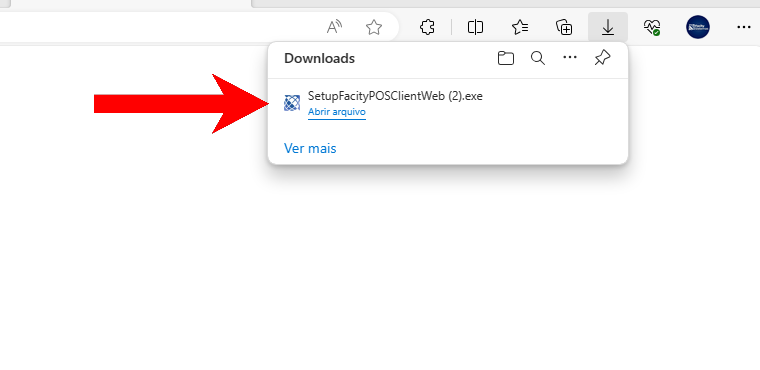

**1.3** - Após o **download**, abra o arquivo _(clicando onde a seta indica na imagem a cima)_. Se o antivírus mostrar uma mensagem de proteção, clique em **"Mais informações"** e selecione **"Executar mesmo assim"**.

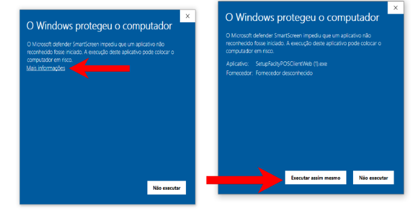

**1.4** \- Na tela de instalação, escolha entre "**Instalação Completa**" (instala o sistema e o servidor de impressão) ou "**Instalação Parcial**" (instala apenas o sistema). Clique em "**Próxima**" até chegar à opção "**Instalar**".

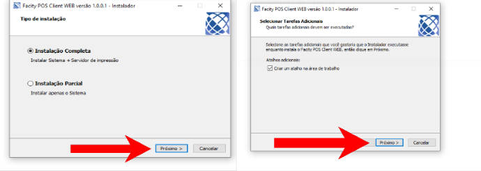

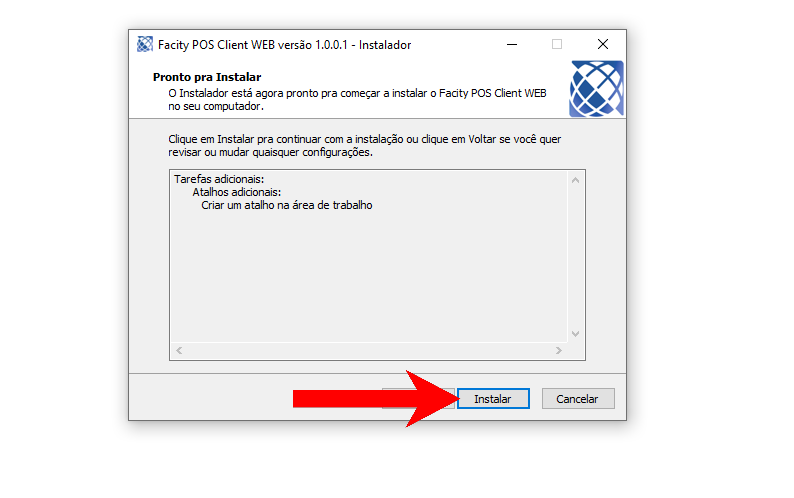

**1.5** - Aguarde a conclusão da instalação e, em seguida, insira o **nome da sua empresa** em **letras minúsculas** quando solicitado. Clique em **"Salvar"**.

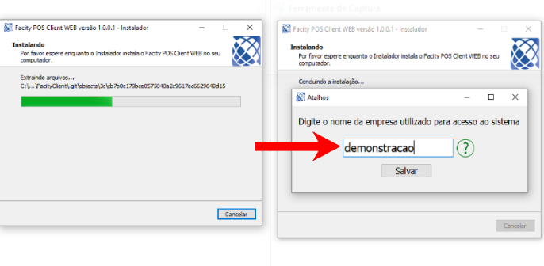

**Passo 2: Programas Instalados na Área de Trabalho**

Na conclusão da instalação, os seguintes programas estarão disponíveis em sua área de trabalho:

- **Rusdesk** (acesso remoto)
- **Facity Pos**
- **Facity Controle**
- **Facity Impressor**

_Imagem dos dos programas mencionados:_

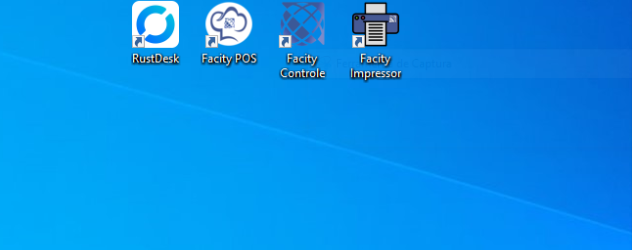

**Passo 3: Configuração do Facity Impressor**

**2.1** - Abra o programa **Facity Impressor**.

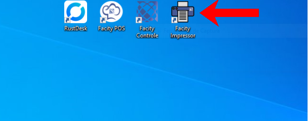

**2.2** \- Clique em **"Configurar Conexão"**.

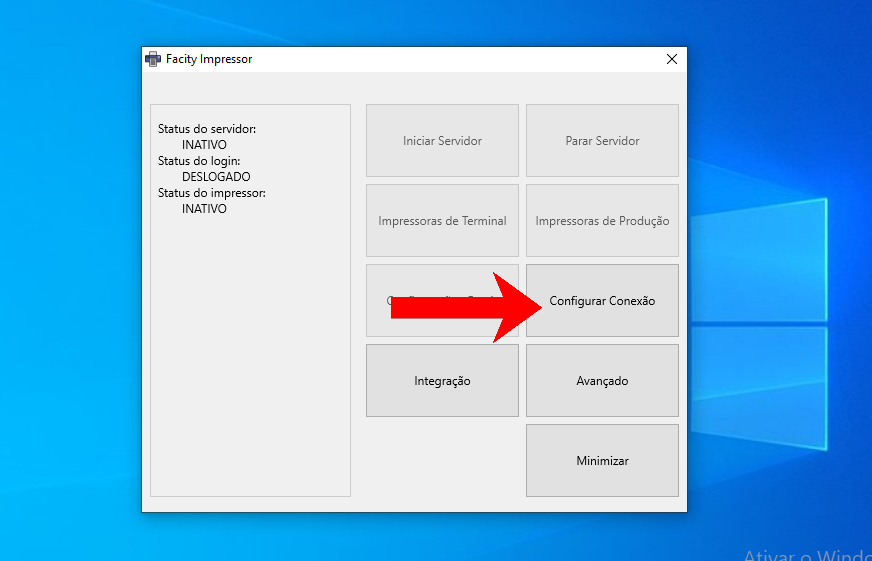

**2.3** \- Escolha **"Online"** e clique em **login**.

Se estiver **reinstalando**, insira o **ID do impressor** encontrado no Facity Controle em "Configuração de Impressor". Clique em **"Trocar a Hash"**, insira a senha **"123456"** e salve antes de copiar o código para colar na configuração do Facity Impressor.

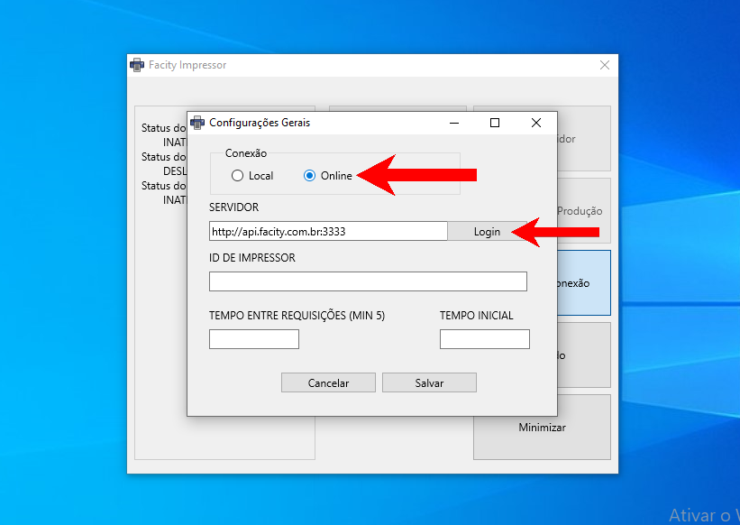

**2.4** \- Insira o **nome da empresa**, **login** e **senha** na nova aba que se abrirá. Clique em **"Logar"**.

**2.5** - Retorne à tela principal do Impressor, clique em **"Configurações Gerais"** e selecione **"Buscar do Administrativo"**. Insira as informações solicitadas e clique em **"Salvar"**

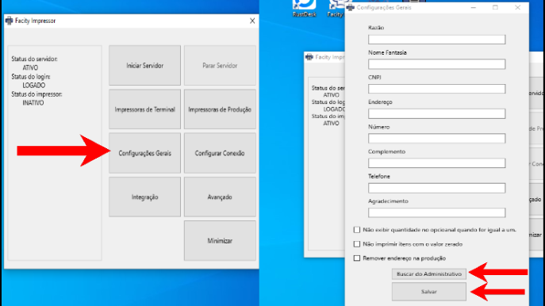

**Passo 4: Adição de Impressoras de Terminal e Produção**

**4.1** - Na tela inicial, clique em **"Parar o Servidor"** e selecione **"Impressora de Terminal"**.

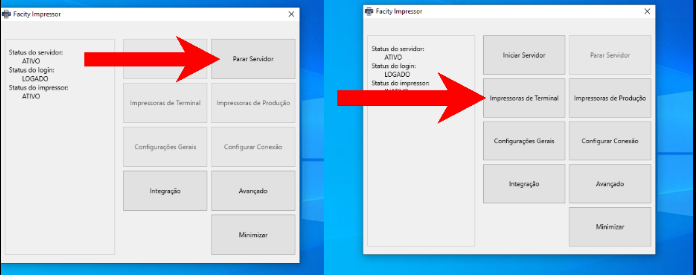

**4.2** \- Escolha o **terminal**(1), modelo da impressora em **"Impressora de Destino"**(2), selecione o **"Modelo"**(3), marque **"Negrito"** e **"Cortar"**. Clique em **"Adicionar"**(4) e **salve**(5) as configurações.

Lembre de escolher o "Modelo" dependendo da marca da sua impressora.

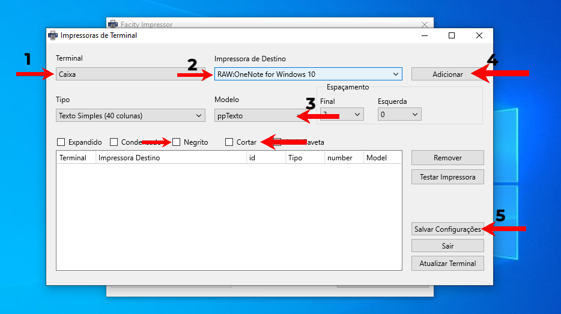

**4.3** \- Repita o mesmo processo para **"Impressora de Produção"**, selecionando a **"Impressora de Origem**"(1), a **"Impressora de destino"**(2), o **"Modelo"**(3) , marcando **"Negrito"** e **"Cortar"**. Clique em **"Adicionar"**(4) e **salve** (5) as configurações.

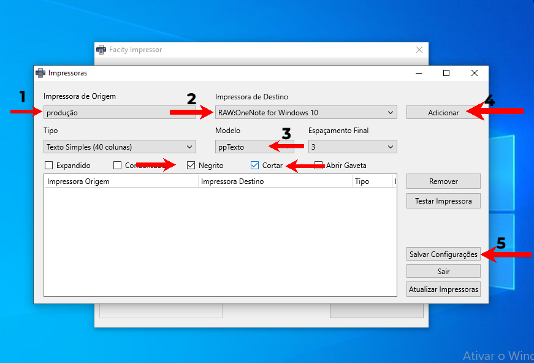

**Passo 5: Iniciar o Servidor**

**5.1** - Após configurar as impressoras, clique em **"Iniciar Servidor"**.

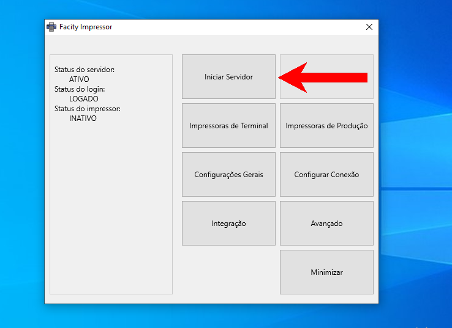

Se as impressoras estiverem corretamente selecionadas, o processo estará completo. Caso encontre dificuldades, entre em contato com o suporte técnico para assistência adicional. Agora, desfrute do controle eficiente e simplificado do **Facity Controle Cliente Web** em sua empresa!
