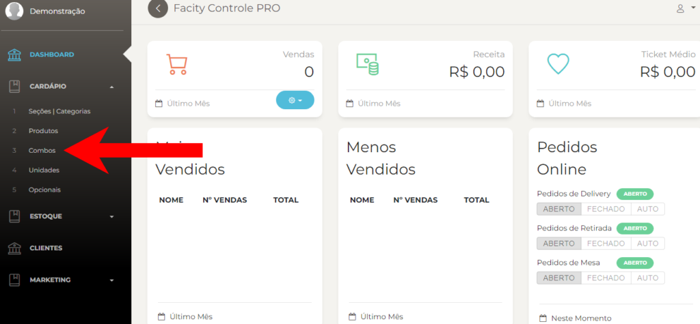
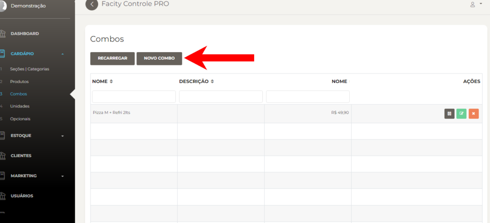
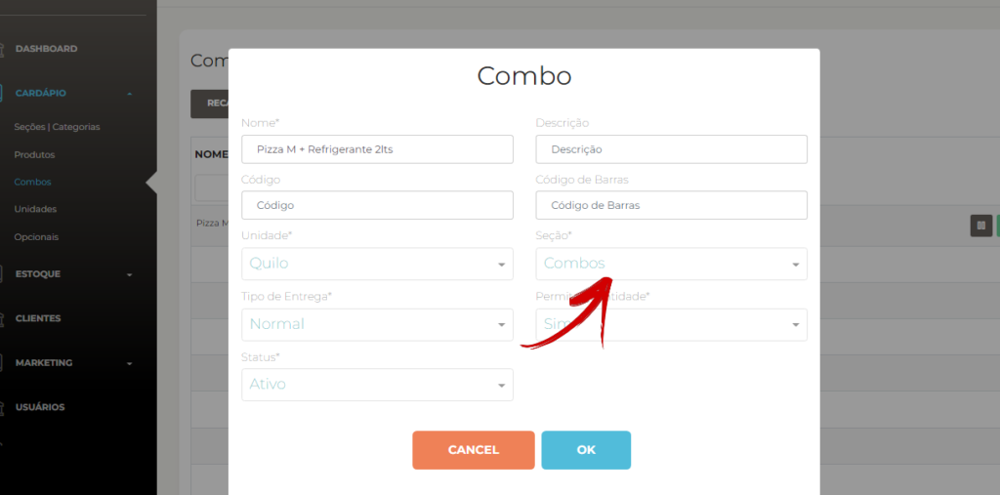
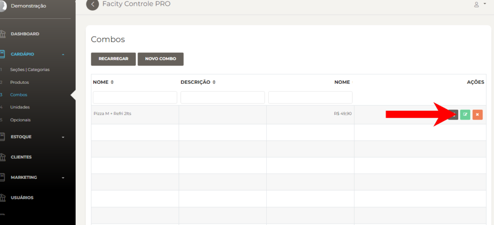
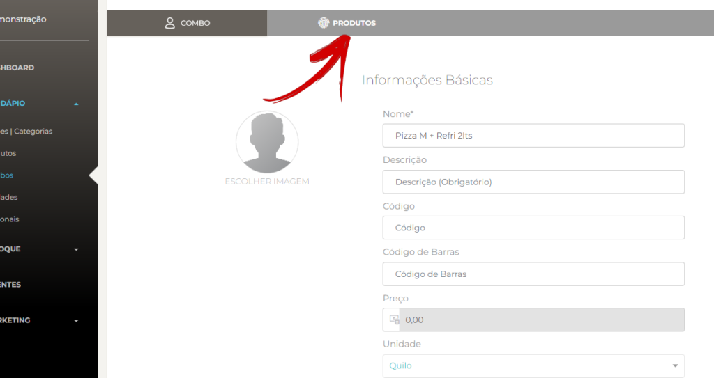
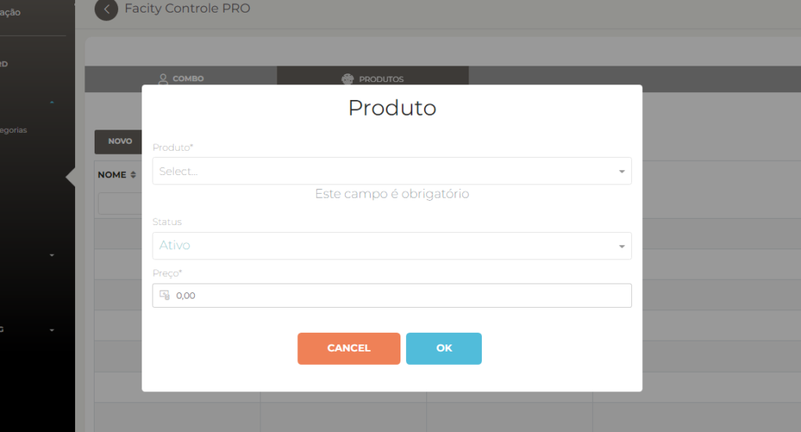
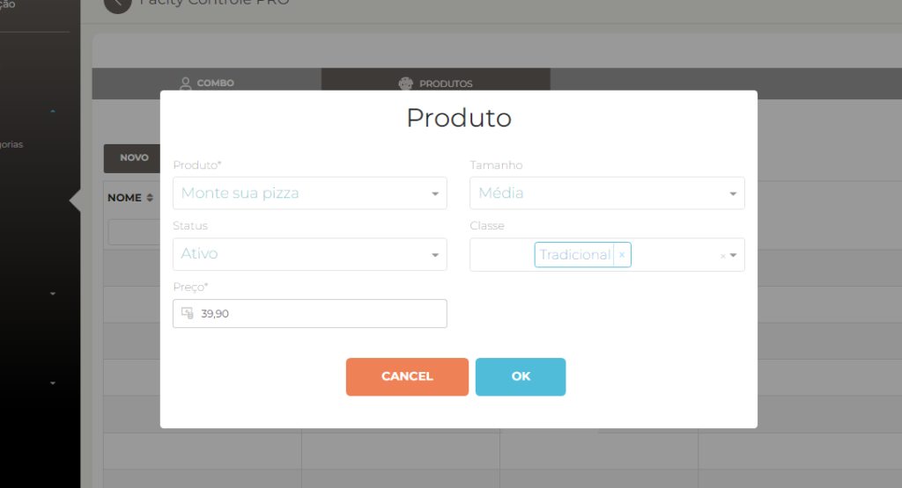
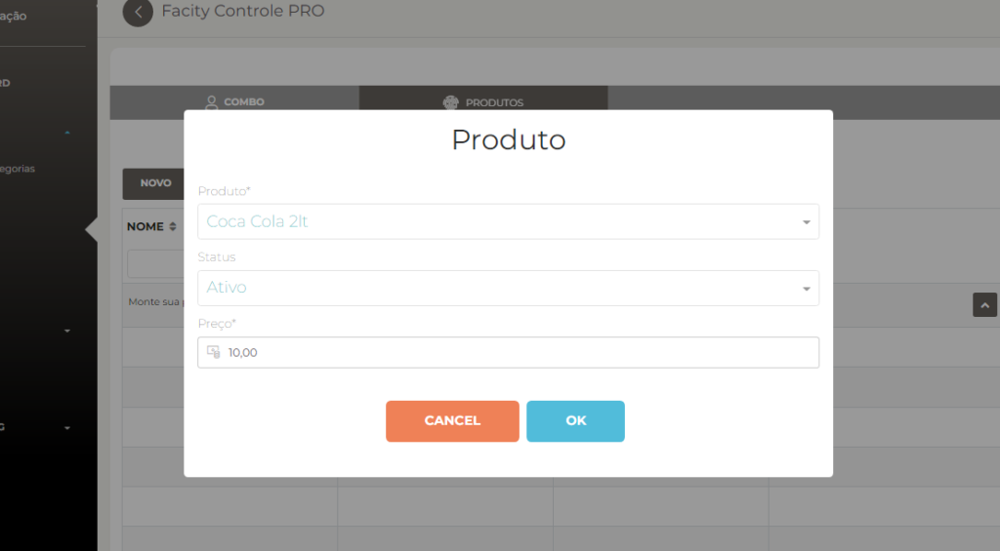
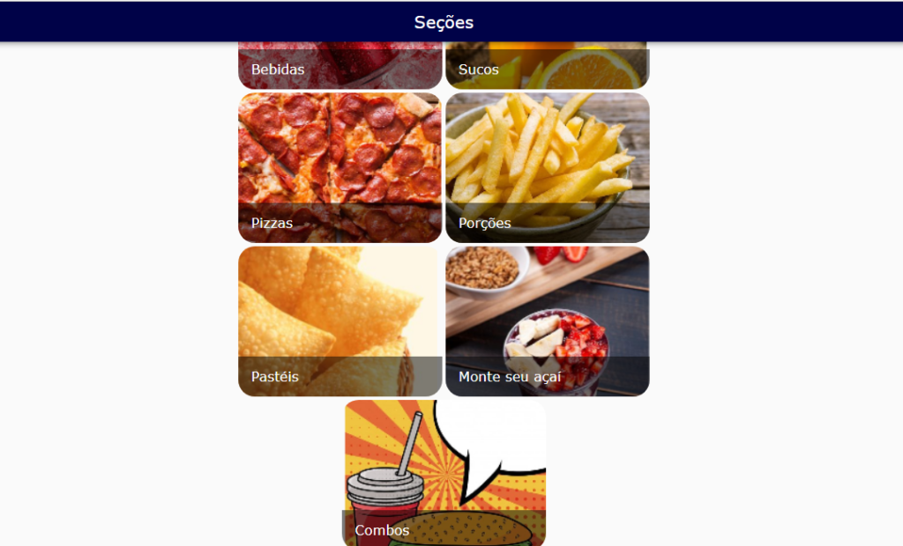
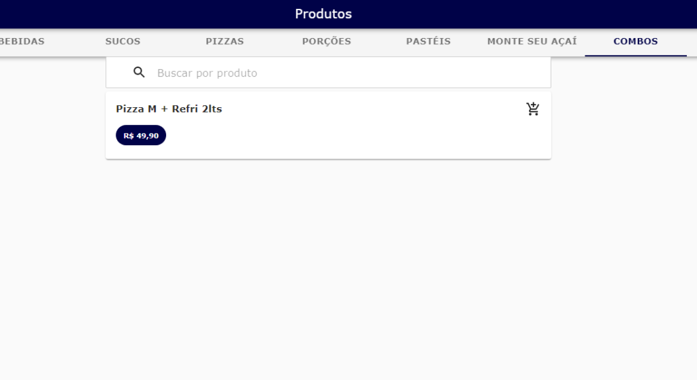

Para cadastrar combos em seu estabelecimento utilizando o **Facity Controle**, siga o passo a passo abaixo:

**1** - Abra o Facity Controle em seu computador e faça login com o nome da empresa, **login** e **senha**, lembrando que tudo deve ser digitado em _letras minúsculas._

**2** - No menu lateral à esquerda, clique em **"Cardápio".**

**3** \- Clique em **"Combos"**

**4** - Clique em **"Novo Combo"** para começar a criar o combo.

**5 -** Coloque o nome do combo e mude a seção para **"Combos"** ou **"Promoção"**, conforme sua preferência.

Lembre se de criar uma **seção** chamada **combo**/**promoção** para quando for criar um combo ela aparecer no **cardápio**.

- Segue **link** de como criar uma **seção**/**categoria**:
- [**http://blog.facity.com.br/?p=35**](http://blog.facity.com.br/?p=35)

**6** - Para adicionar produtos ao combo, clique no **ícone verde** para editar.

_Na página de edição, você pode alterar as informações básicas do combo._

**7** \- Clique em **"Produtos"** para começar a adicionar produtos ao combo.

**8** \- Clique em **"Novo"** e selecione o produto que você deseja adicionar ao combo.

- Exemplo:

**9** - Você pode adicionar um preço de sua preferência ao produto selecionado. Repita o processo para adicionar mais **produtos ao combo** e Clique em **"OK"** para salvar.

- Exemplos de como fica no **cardápio**/**delivery**:

**10** - Verifique como fica o combo no **cardápio/delivery** para ter certeza de que foi cadastrado corretamente.

Com esse passo a passo você poderá cadastrar combos em seu estabelecimento com facilidade e rapidez utilizando o **Facity Controle**.
