**Passo 1:** Acessar o **Facity Controle**

Abra o **Facity Controle** em seu computador e faça **login** com o **nome da empresa**, **login** e **senha**. É importante lembrar que tudo tem que ser em _letras minúsculas_.

**Passo 2:** Criar uma seção

- Para criar uma seção dentro do painel administrativo, comece clicando em **"Cardápio"** no menu lateral à esquerda

- Em seguida, selecione **"Seções/Categorias"**

- Clique em **"Nova Seção"** e coloque o nome da seção no campo indicado:

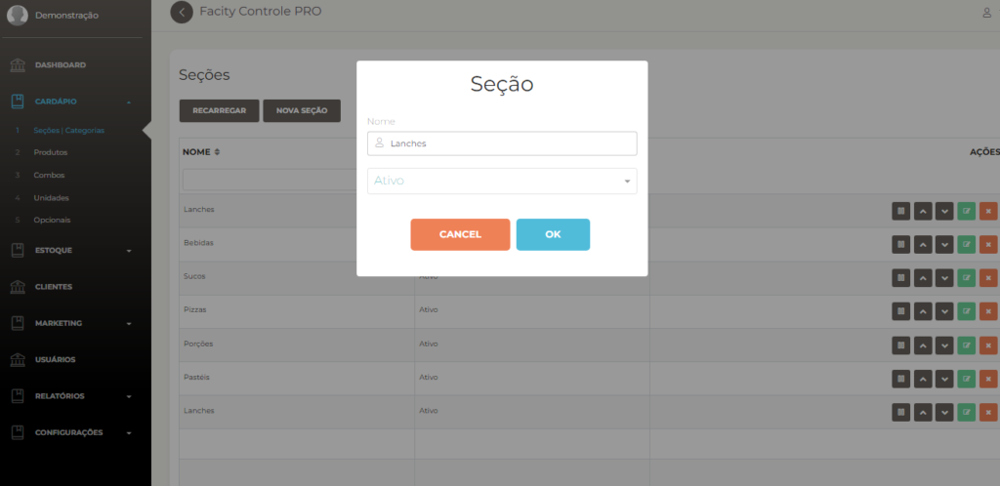

- Clique em **"Ok"** para criar a seção
- Se quiser editar a **"Seção"** mesmo depois de criar ela, é só clicar em editar no ícone verde como está representada na imagem a seguir:  
    

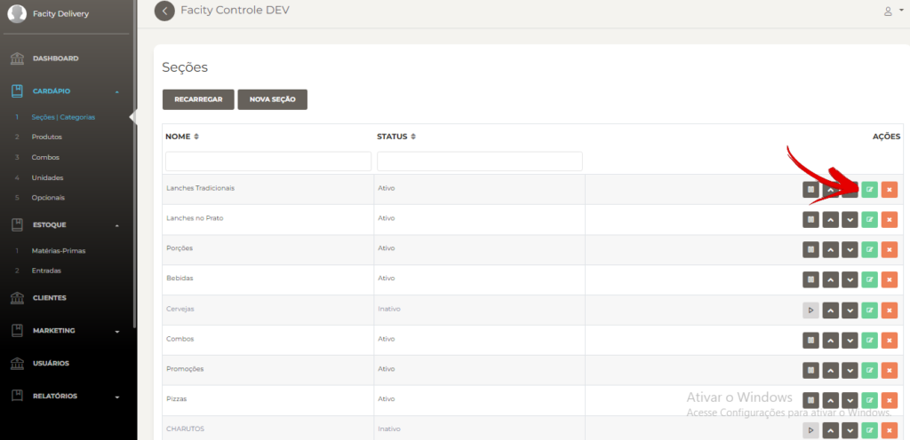

- Na imagem mostra todas as informações para editar caso queira mudar o **nome**, a **foto da seção** ou ajustar outras informações:

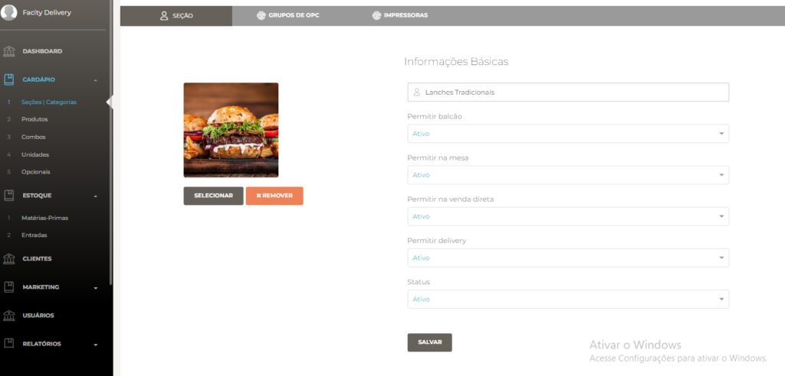

**Passo 3:** Criar produtos

- Agora, vamos criar os produtos que vão compor a seção de lanches. Para isso, volte ao menu **"Cardápio"** e selecione **"Produtos"**

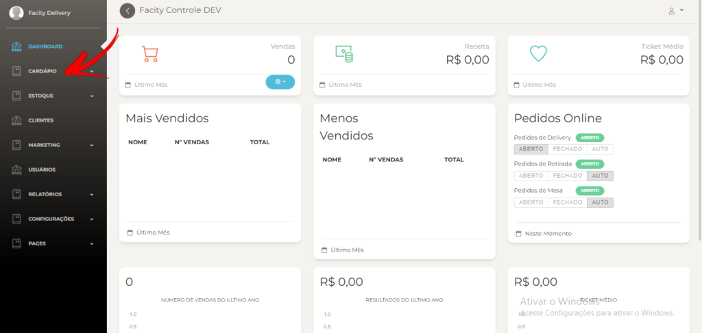

- Clique em **"Novo Produto"**

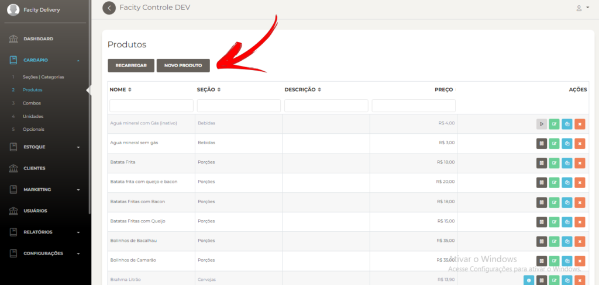

- Preencha as informações necessárias, como **nome**, **descrição**, **valor** e **seção** (no caso, **"Lanches"**)

É importante colocar cada produto na seção específica dele para a organização do cardápio ficar exata.

Comece a criar as opções de lanches que vai estar no cardápio, exemplos: **X-Calabresa**, **X-Bacon**, **X-Salada** e entre outras opções.

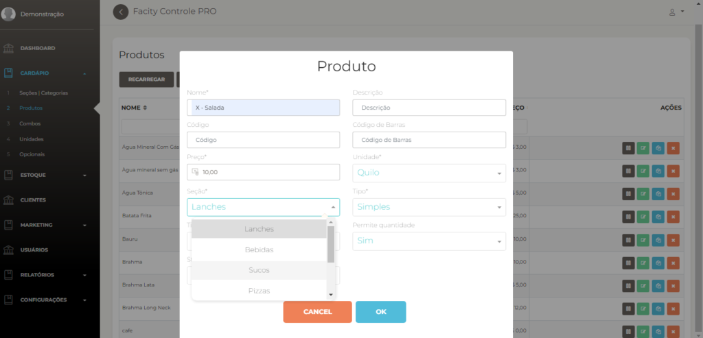

- Para encontrar o produto é só clicar novamente no menu **"Produtos"** e no campo de busca **"Nome",** escrever o nome do produto para encontrar na listagem de produtos já cadastrados.

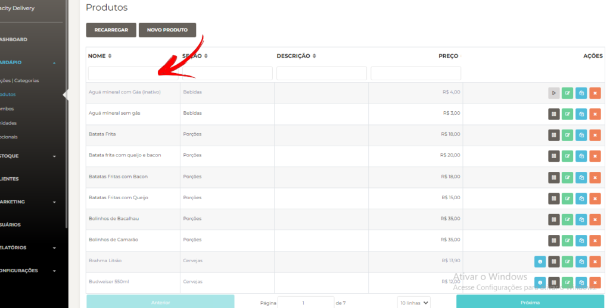

- Para **"Editar"** um produto basta procurar ele pelo nome e clicar no ícone verde conforme o indicado na imagem abaixo:

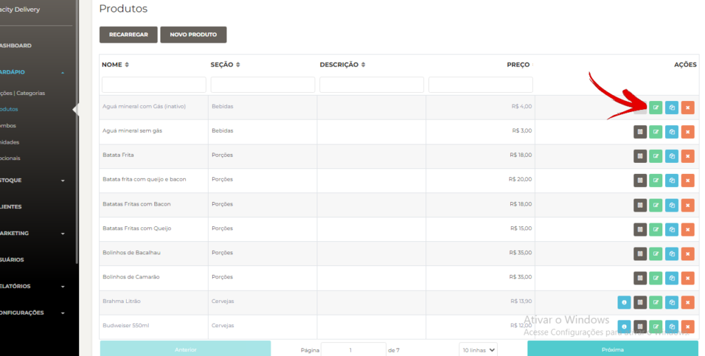

- Depois de clicar no botão verde para editar o produto, irá abrir a página que mostra todas as informações do produto caso queira mudar o **valor**, **nome**, **descrição**, **foto**, **unidade** e **código de barra** etc.

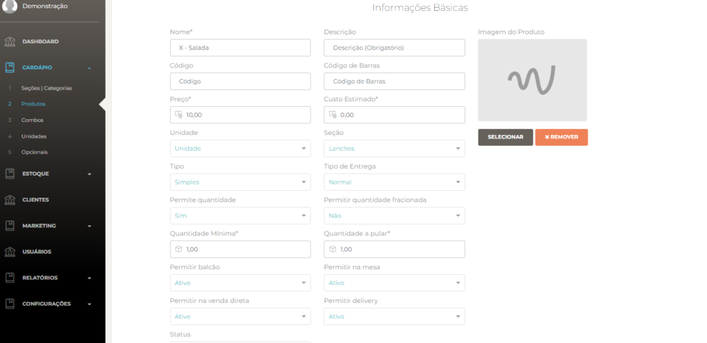

**Passo 4:** Adicionar opcionais

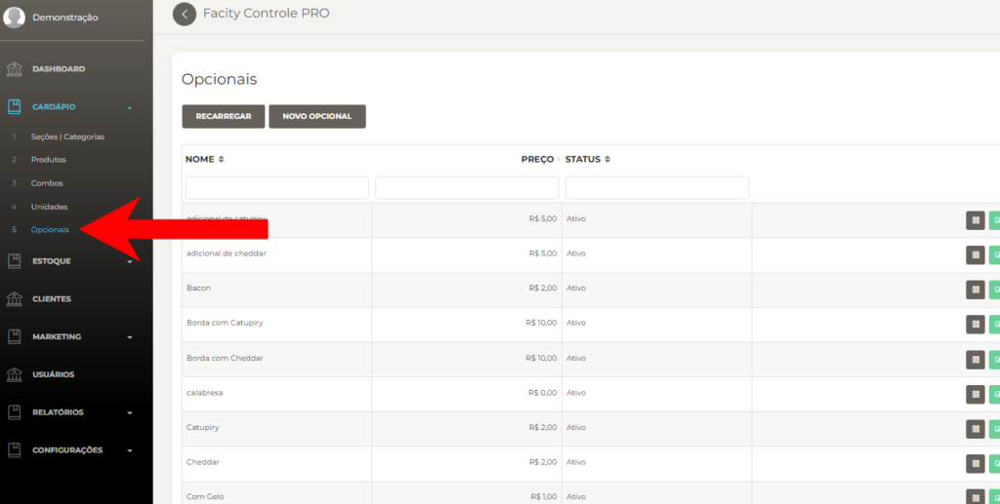

Opcionais são os ingredientes extras que podem ser adicionados aos produtos.

- Para criar um opcional, vá ao menu **"Cardápio"** e selecione **"Opcionais"**
- Clique em **"Novo Opcional"**

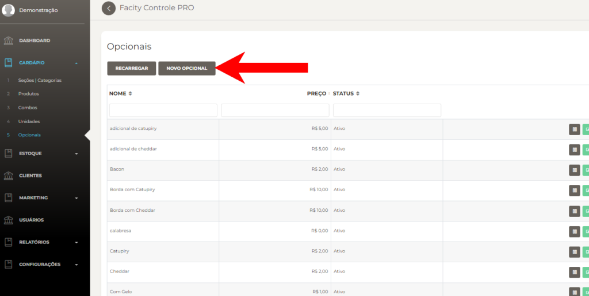

Coloque o nome do opcional no campo indicado. Exemplos de opcionais são **queijo**, **bacon**, **catupiry** e **cheddar**.

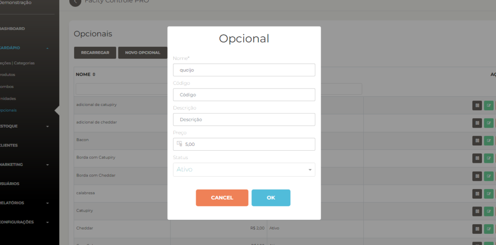

- Clique em **"Ok"** e está feito!

Para buscar e editar um **opcional** vá em **menu**, **opcional** e encontre o produto a ser editado:

Se quiser mudar o valor e outra informação clique no **ícone verde**.

**Passo 5:** Adicionar opcionais na **"Seção"** ou no **"Produto"**

Agora, vamos adicionar os opcionais na seção ou no produto. Se você adicionar no produto, aquele opcional ficará disponível apenas para aquele produto específico. Se adicionar na seção, ele ficará disponível para todos os produtos daquela seção.

- Para adicionar opcionais na seção, vá em **"Seções/Categorias"** e clique no ícone verde para abrir a página de editar a seção

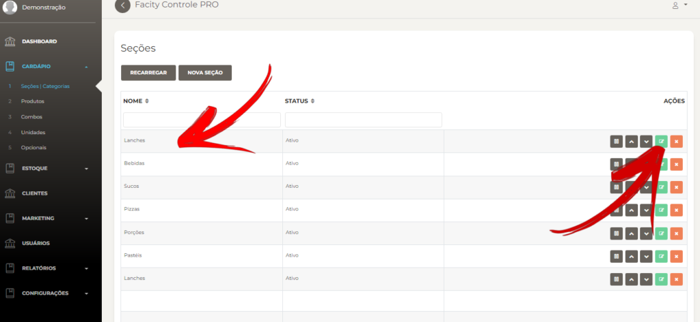

- Busque **"Grupo de Opc"** e clique nessa opção

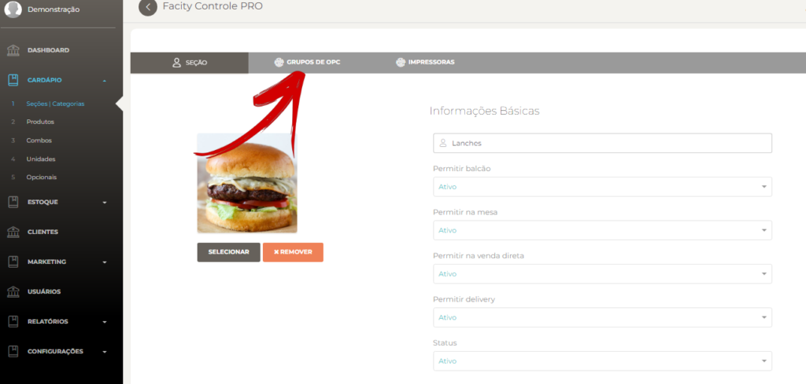

- Crie um novo grupo de opc clicando em **"Novo"**

- Coloque o nome do grupo de opc e a quantidade **mínima** e **máxima** que poderá ser adicionada

<figure>

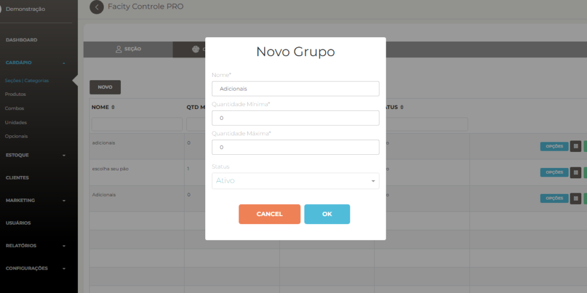

<figcaption>

Se colocar a quantidade igual 0 você não vai ter um limite quando for adicionar opcionais nesse grupo

</figcaption>

</figure>

- Clique em **OK** e grupo está feito!
- Com o grupo criado volte em **Grupo de Opc** dentro da **Seção lanches**:
- Clique no **ícone azul**:

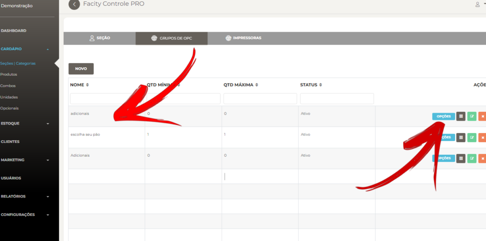

- Selecione "Adicionar"
- Vai abrir uma lista com todos os **"Opcionais'** criados

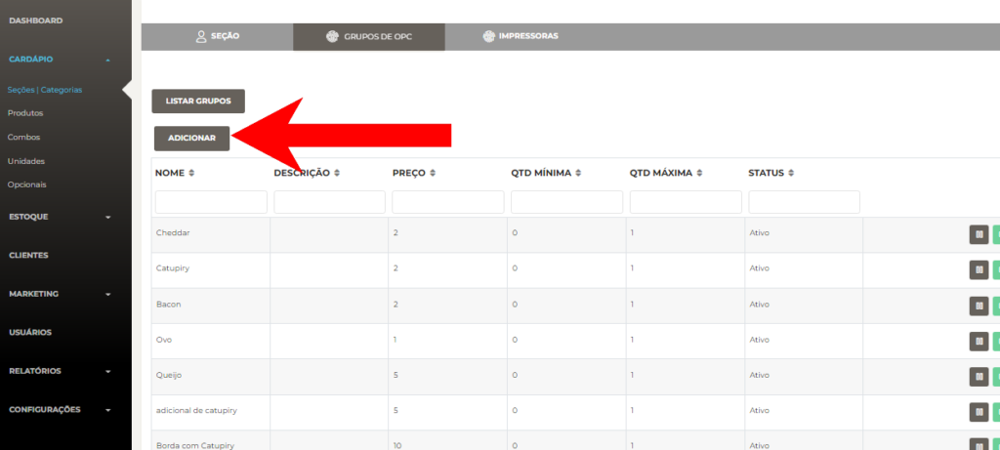

- Adicione todos os **"Opcionais"** que você criou para esse grupo
- Clique em **"Ok"** para salvar

Para criar um grupo de opc para um único produto, crie o grupo diretamente dentro do produto.

Imediatamente! Agora você sabe como cadastrar lanches no **Facity Controle**. Com essas informações, você poderá gerenciar melhor o cardápio do seu restaurante e garantir que os clientes tenham uma boa experiência.
