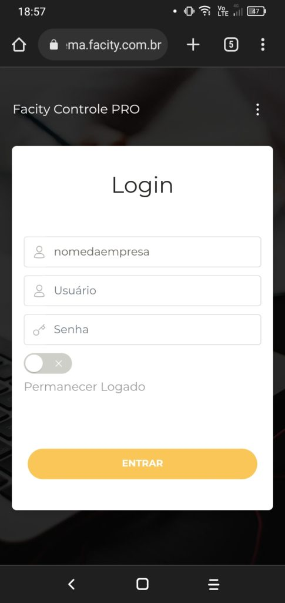
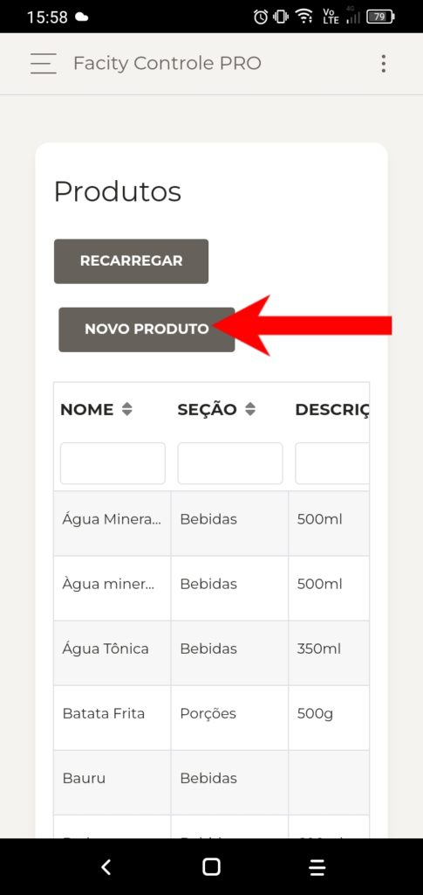
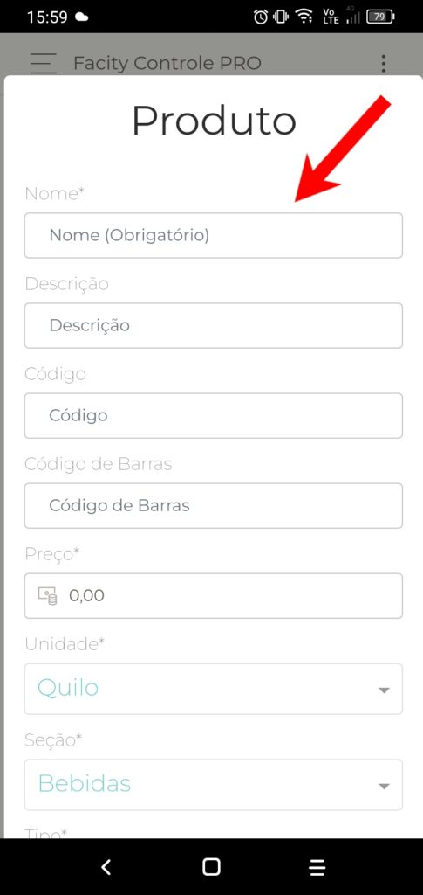
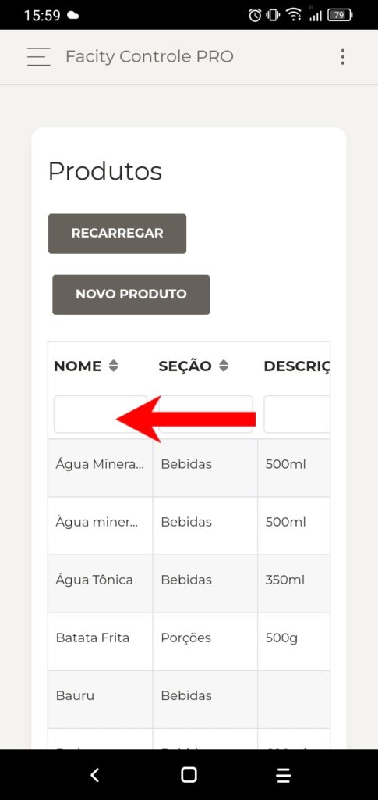
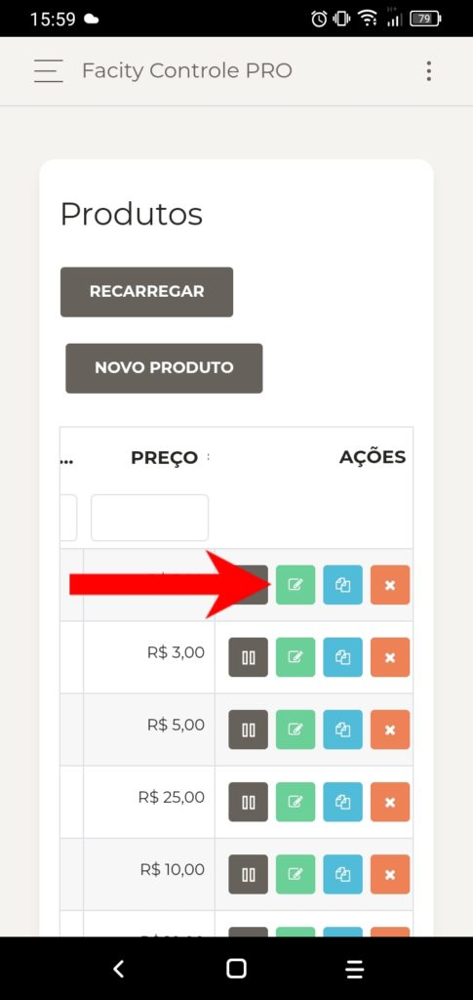
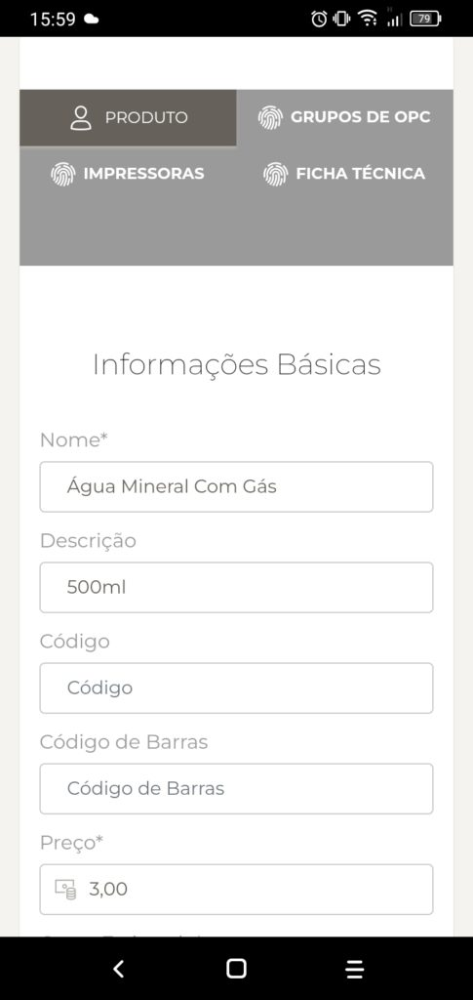

**Passo 1:** Acesse o **Facity Controle**

Acesse o **Facity Controle** pelo seu navegador ou baixe o aplicativo pela **Play Store**. Para acessar a página, copie e cole o **link** abaixo no seu navegador:

[**https://sistema.facity.com.br/login/nomedaempresa**](https://sistema.facity.com.br/login/nomedaempresa)

- Temos a opção de baixar aplicativo pela **Play** **Store** para sistema android, segue o link:
- [https://play.google.com/store/apps/details?id=br.com.facity.facitycontrole1](https://play.google.com/store/apps/details?id=br.com.facity.facitycontrole1)

**Passo 2:** Faça login no **aplicativo**

Após abrir o aplicativo **Facity Controle** no seu celular, insira o **nome da empresa**, **login** e **senha**. Lembre-se de que tudo deve ser digitado em _letras minúsculas_.

Para achar o **menu** do sistema clique no canto superior esquerdo igual apresenta na imagem:

**Passo 3:** Acesse a seção de produtos

Para criar um produto, clique em **"cardápio"** no menu lateral à esquerda e selecione a opção **"produtos"**.

- Selecione **produtos** igual a seta está indicando na imagem:

**Passo 4:** Crie um novo produto

- Clique em **"novo produto"** para começar o cadastramento. Insira as informações solicitadas, como nome, descrição, valor e seção do produto, e clique em **"ok".** Pronto! O produto já foi criado.

**Passo 5:** Encontre um produto

Para encontrar um produto já cadastrado, clique novamente em **"produtos"** no menu lateral e digite o nome do produto no campo de busca **"nome"**.

**Passo 6:** Edite um produto

Se precisar editar um produto, encontre-o na lista de produtos cadastrados, arraste-o para a direita e clique no ícone verde.

Na página de edição, você poderá alterar o valor, nome, descrição, foto, unidade e código de barras, entre outras informações. Depois de fazer as alterações, não se esqueça de salvar.

<figure>

<figcaption>

Rolando tela você vai encontrar todas as informações que deseja alterar e depois é só salvar.

</figcaption>

</figure>

Com este tutorial você pode cadastrar produtos facilmente pelo celular, usando o aplicativo **Facity Controle**. Esperamos que estas informações tenham sido úteis. Caso tenha dúvidas ou sugestões, deixe seu comentário abaixo.
