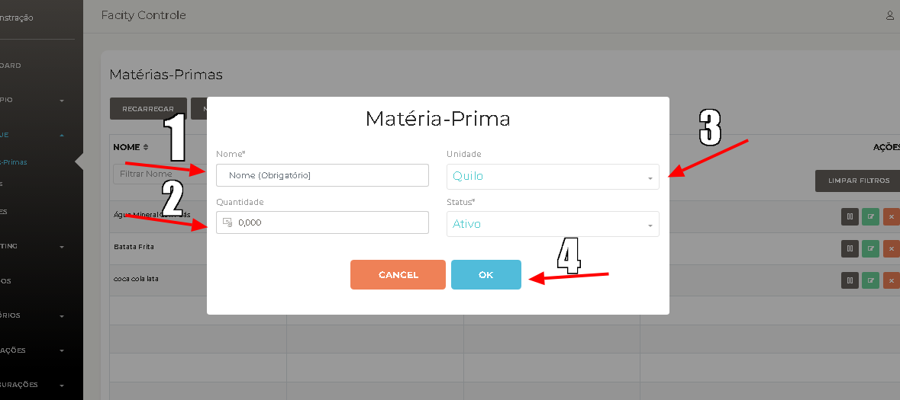
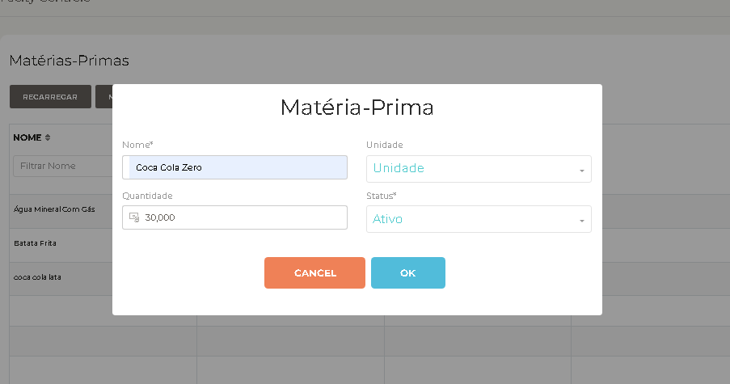
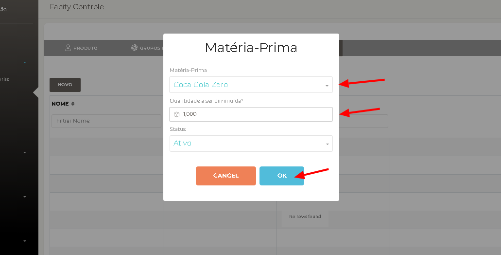
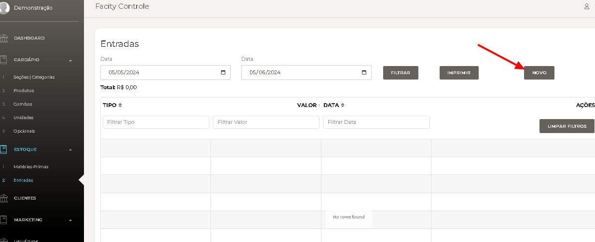
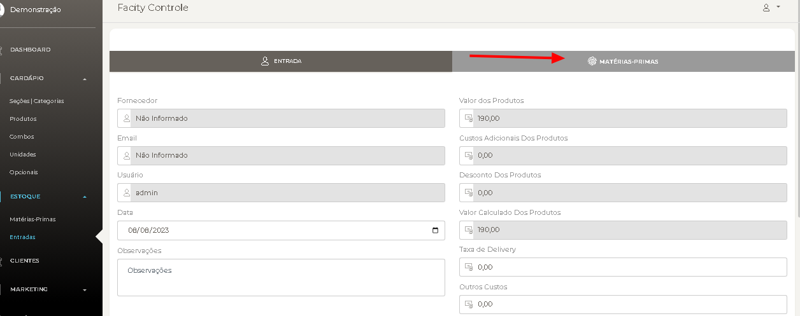
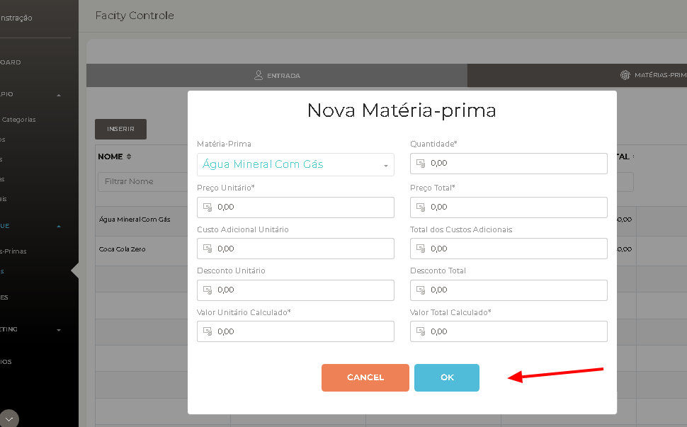

https://www.youtube.com/watch?v=XwC3ZOqH6kM

**Passo 1: Acesse o Facity Controle**

- Abra o Facity Controle no seu computador.
- Faça login com seu usuário e senha, ambos em letras minúsculas.

**Passo 2: Acesse o menu de Estoque**

- Clique em "Estoque".
- Selecione "Matérias-Primas".

**Passo 3: Adicione uma nova matéria-prima**

- Clique em "Novo".

**Passo 4: Cadastre cada produto**

- Preencha as informações: Nome do produto, quantidade e unidade.
- Clique em "Ok" para salvar.
- Repita para todos os produtos.

Faça esse processo de cadastramento com todos os produtos do seu estoque primeiro para depois vincular ele ao produto já cadastrado no sistema.

Exemplo de como colocar a "Quantidade":

**Passo 5: Vincule o estoque aos produtos**

- Clique em "Produtos".

- Encontre o produto desejado e clique em "Editar".

**Passo 6: Edite a entre em Ficha Técnica**

- Clique em "Ficha Técnica".

- Clique em "Novo".

**Passo 7: Adicione a matéria-prima**

- Selecione a matéria-prima correspondente.
- Insira a quantidade a ser diminuída (1.000 é igual a 1).
- O produto está agora vinculado ao seu estoque.

**Passo 8: Adicione entradas de estoque**

- Vá para "Estoque" > "Entradas" > "Novo" > "Matérias-Primas".

- Clique em "Inserir" e preencha as informações.

Pronto! Agora você sabe como cadastrar seu estoque no Facity Controle.
