**Passo 1:** Abra o **Facity Controle** no seu computador e insira o nome da empresa, login e senha. Lembre-se de que tudo deve ser digitado em letras minúsculas.

**Passo 2:** No menu lateral à esquerda, clique em "**Cardápio**".

**Passo 3:** Em seguida, no menu lateral à esquerda, selecione "**Produtos**".

**Passo 4:** Crie o produto com o nome promocional desejado, por exemplo, "**Pizza Grande Promocional**", e clique em "**ok**" para salvar. Não se esqueça de criar a seção para vincular esse produto, como "**Promoções**" ou "**Pizzas Promocionais**".

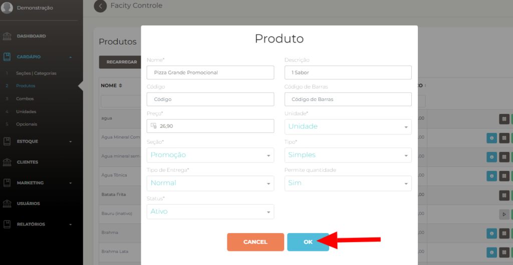

**Passo 5:** Com o produto criado, procure-o novamente em "**Produtos**", seja através da barra de pesquisa ou navegando pelas páginas.

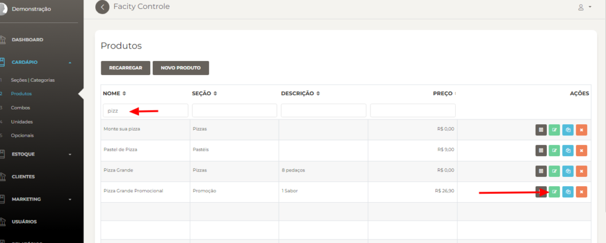

**Passo 6:** Clique em "**Grupos de Opcionais**" para começar a criar grupos de opcionais e, se desejar, atualize a foto do produto.

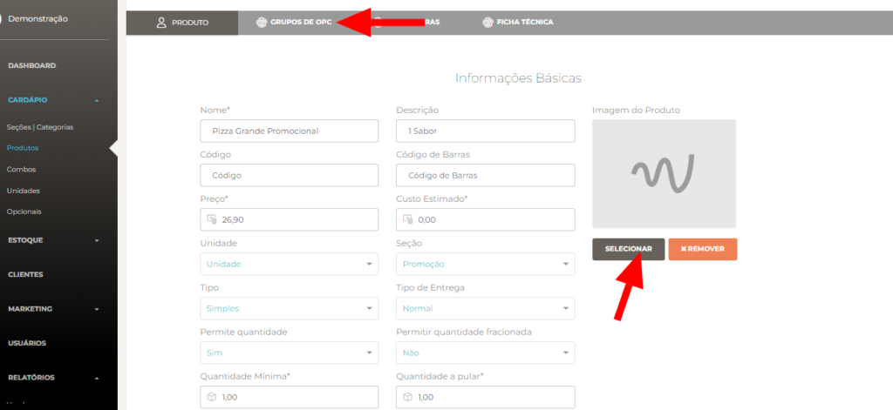

**Passo 7:** Clique em "**Novo**" para criar os grupos. Insira o nome do grupo e defina a quantidade mínima e máxima, então clique em "ok" para salvar.

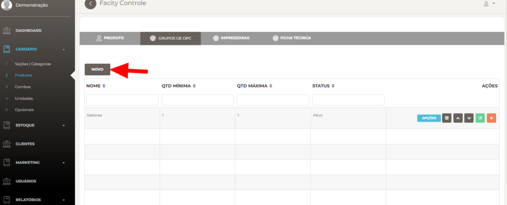

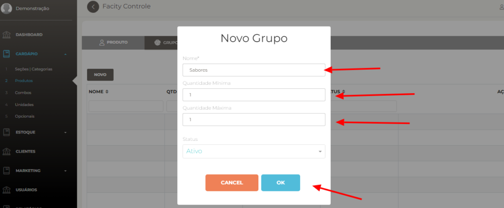

**Passo 8:** Agora, você precisará criar os "**sabores**" nos **opcionais** para, em seguida, adicioná-los ao grupo.

**Passo 9:** Clique em "**Opcionais**" para começar a criação.

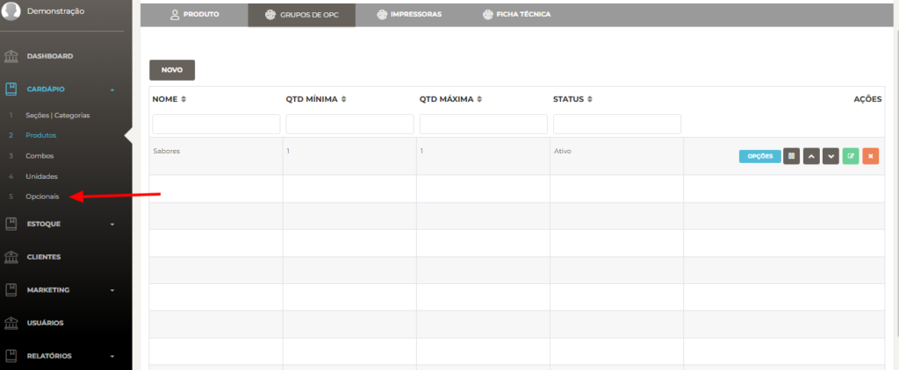

**Passo 10:** Dentro de "**Opcionais**", clique em "**Novo Opcional**".

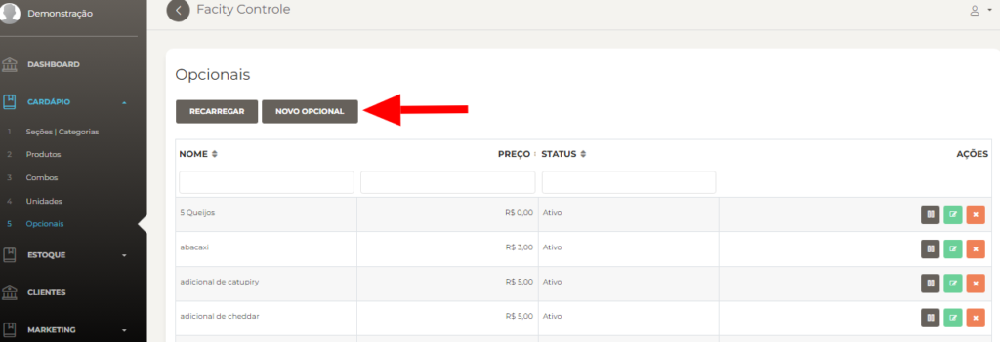

**Passo 11:** Insira o sabor da pizza e uma breve descrição. Não é necessário adicionar o preço, pois ele será definido no produto principal. Clique em "**ok**" para salvar.

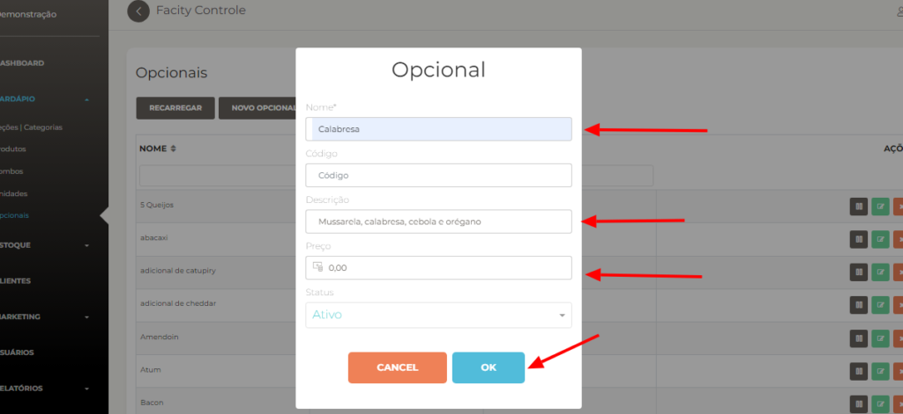

**Passo 12:** Volte para a seção "**Produtos**" e encontre o produto "**Pizza Promocional**". Clique em "**Editar**".

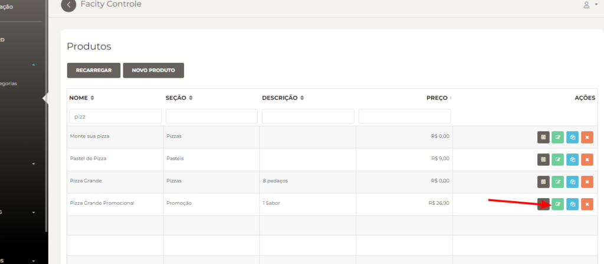

**Passo 13:** Após clicar em "Editar", vá para "**Grupos de Opcionais**". Comece clicando em "**Opções**" para adicionar os sabores.

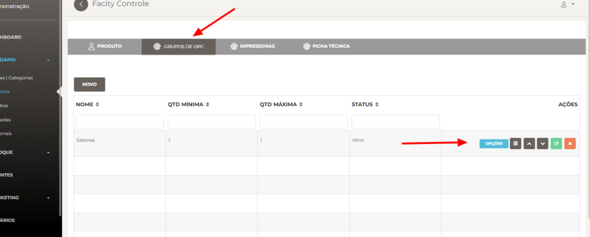

**Passo 14:** Dentro de "**Opções**", procure pelo produto que deseja adicionar dentro do grupo de "**sabores**". Clique em "**Adicionar**".

Você pode usar a caixa de pesquisa ou navegar pelas páginas conforme indicado pela seta.

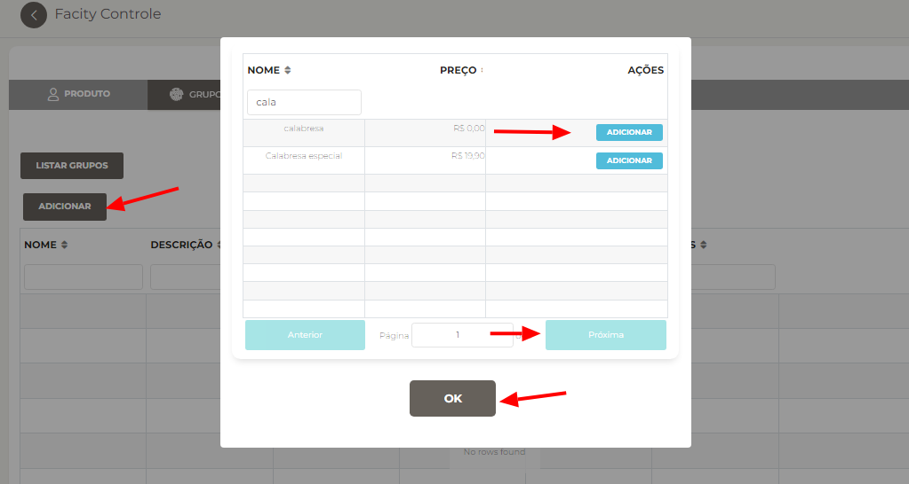

Com esses passos, você criou com sucesso um produto simples tipo pizza com opcionais. Agora, seus clientes poderão desfrutar de suas pizzas promocionais com facilidade. Se tiver alguma dúvida ou precisar de mais orientações, fique à vontade para deixar um comentário ou entrar em contato com o suporte.
