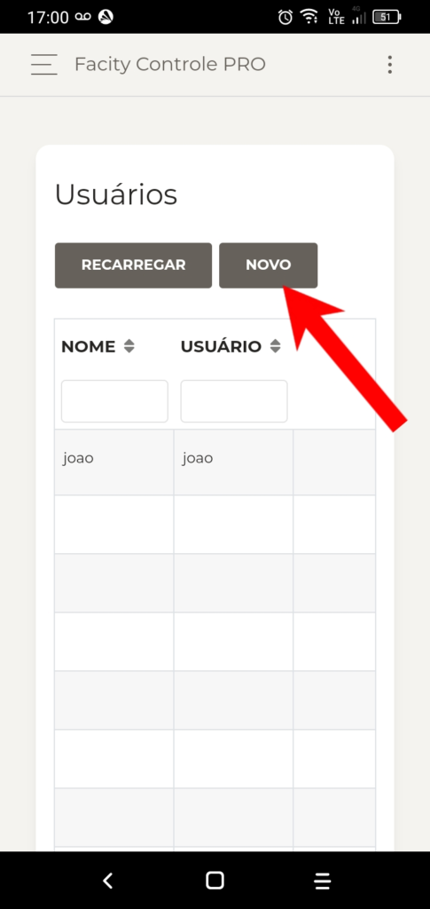
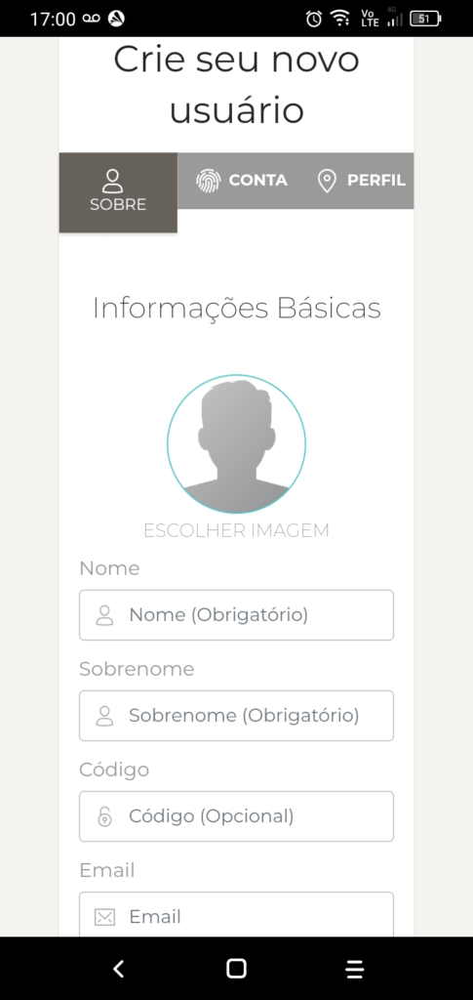
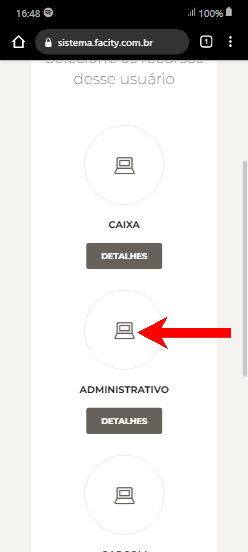
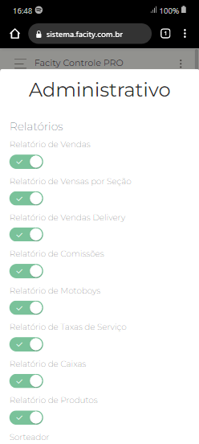
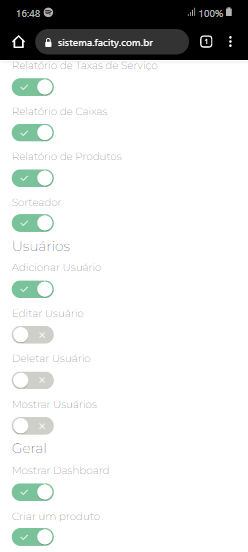

Neste tutorial, vamos mostrar como cadastrar um usuário administrativo pelo celular usando o aplicativo **Facity Controle.**

**Passo 1:** Abra o aplicativo **Facity Controle** em seu celular

**Passo 2:** Coloque o **nome da empresa**, **login** e **senha.** Não esqueça que tudo tem que ser em _letras minúsculas_.

**Passo 3:** Para acessar o menu do sistema, clique no canto superior esquerdo, conforme apresentado na imagem.

**Passo 4:** Busque por **"USUÁRIOS"** no menu do sistema.

**Passo 5:** Clique em **"NOVO"**.

**Passo 6:** Coloque as informações: **nome**, **sobrenome** e **e-mail** (opcional). Clique em **"Próxima"** para seguir no cadastro. Lembre-se de colocar todas as informações do cadastro em _letras minúsculas_.

**Passo 7:** Coloque o **nome** novamente, crie uma **senha** e repita a **senha**. Clique em **"Próxima"**.

**Passo 8:** Clique em cima onde está escrito **"ADMINISTRATIVO"** para selecionar a função. Clique em **"Concluir"** depois de gerenciar as permissões para finalizar o cadastro.

**Passo 9:** O próximo passo é gerenciar as permissões que esse funcionário vai ter no sistema. Para isso, clique em **"Detalhes"** logo abaixo da opção selecionada.

**Passo 10:** Na tela seguinte, você pode selecionar as permissões que deseja dar ao funcionário. Todas as permissões estão liberadas por padrão. Desmarque as opções que não deseja permitir.

**Passo 11:** Após selecionar as permissões, deslize a tela e clique em **"OK"** para salvar.

Pronto! Agora você sabe como cadastrar um usuário administrativo pelo celular usando o aplicativo **Facity Controle.** Lembre-se de manter todas as informações em letras minúsculas e gerenciar corretamente as permissões do usuário no sistema.
