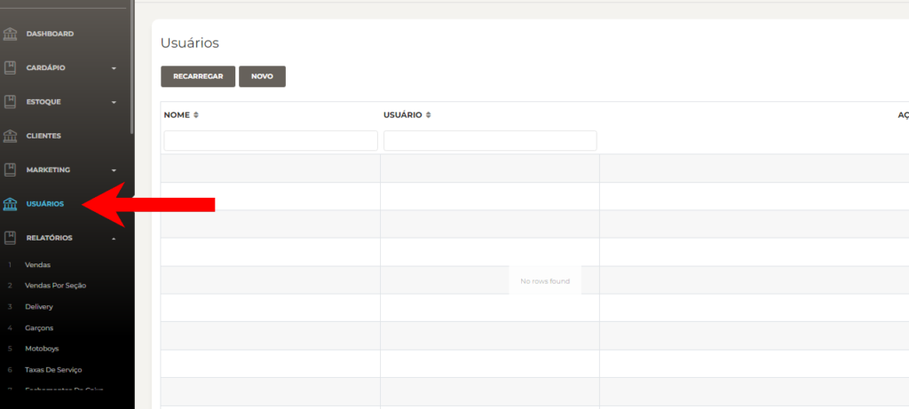
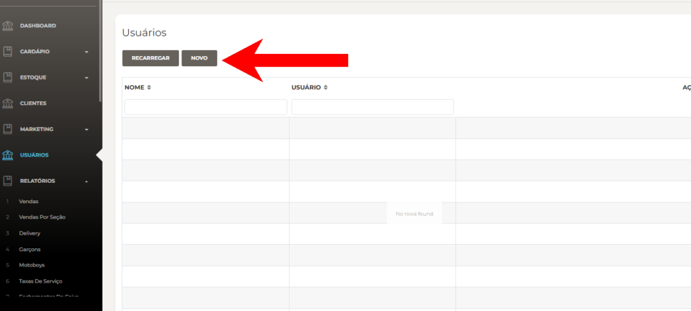
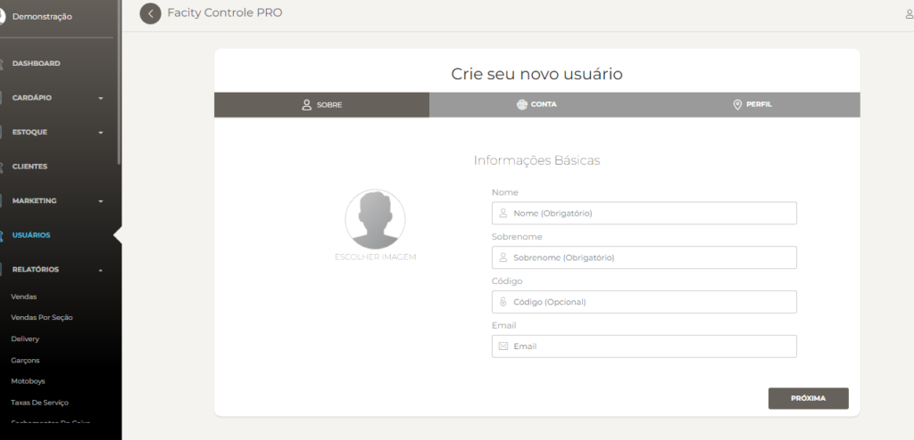
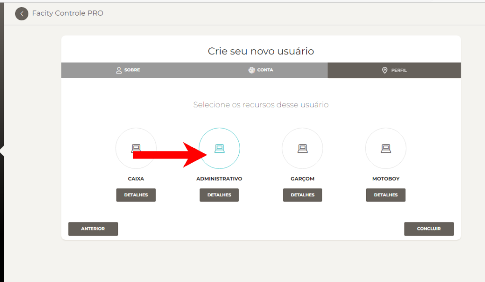
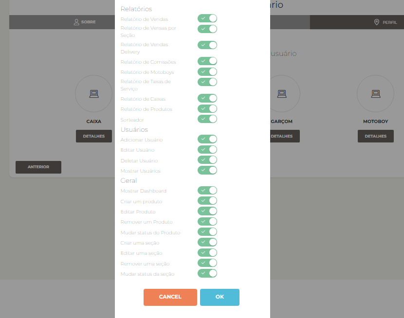
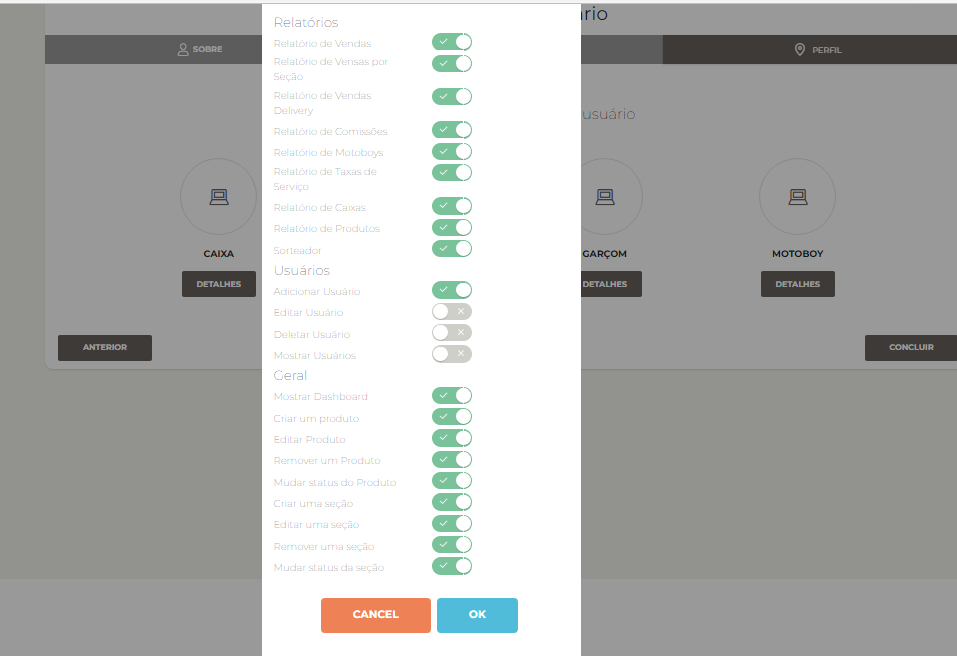

Neste post, vamos mostrar como cadastrar um usuário administrativo no **Facity Controle**. Veja abaixo os passos:

**Passo 1:** Abra o **Facity Controle** em seu computador e insira o **nome da empresa**, **login** e **senha**. Lembre-se de que tudo deve ser escrito em **letras minúsculas**.

**Passo 2:** No menu, procure a opção **"Usuários"** e selecione **"Novo".**

**Passo 3:** Insira as informações do usuário, incluindo **nome**, **sobrenome** e **email** (opcional). Clique em **"Próxima"** para continuar com o cadastro. Lembre-se de que todas as informações devem ser em _letras minúsculas_

**Passo 4:** Insira novamente o **nome**, escolha uma **senha** e **repita a senha** para confirmar. Clique em **"Próxima"**.

**Passo 5:** Clique em cima da opção **"Administrativo"** para selecionar a função.

**Passo 6:** Clique em **"Concluir"** para finalizar o cadastro. Em seguida, você precisará gerenciar as permissões desse usuário no sistema.

**Passo 7:** Clique em **"Detalhes"** logo abaixo da opção selecionada para gerenciar as permissões.

Nessa imagem as permissões estão todas liberadas para essa função

**Passo 8:** Na tela que aparecer, você poderá selecionar quais permissões o usuário terá no sistema. Por exemplo, se você não quer que esse usuário tenha acesso a determinada funcionalidade, basta desmarcá-la.

**Passo 9:** Depois de selecionar as permissões, clique em **"OK"** para salvar.

Pronto! Agora você cadastrou um usuário administrativo no **Facity Controle** e gerenciou suas permissões no sistema. Certifique-se de que todas as informações inseridas estejam corretas e atualizadas para evitar problemas futuros.
