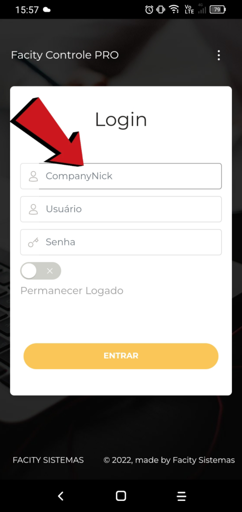
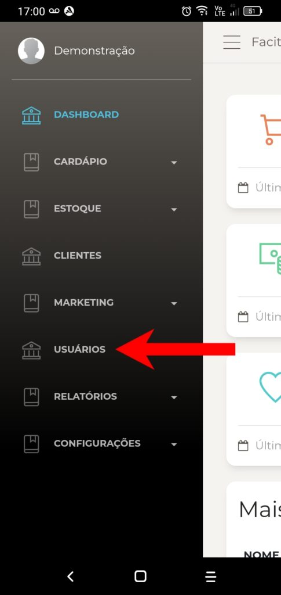
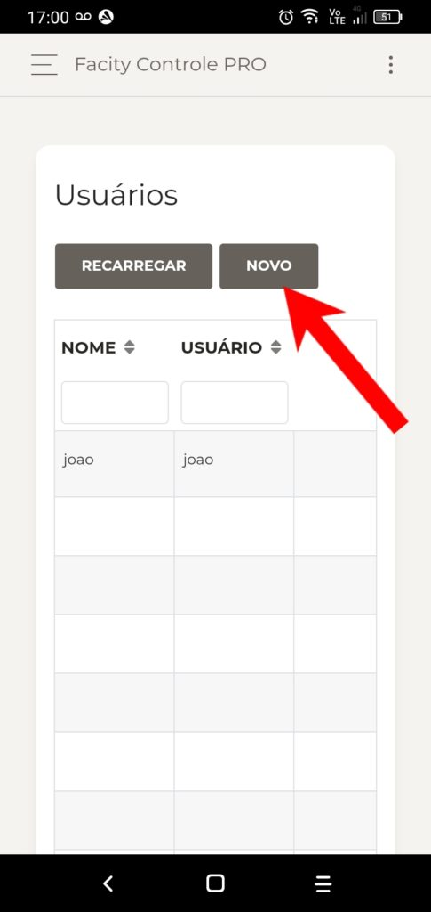
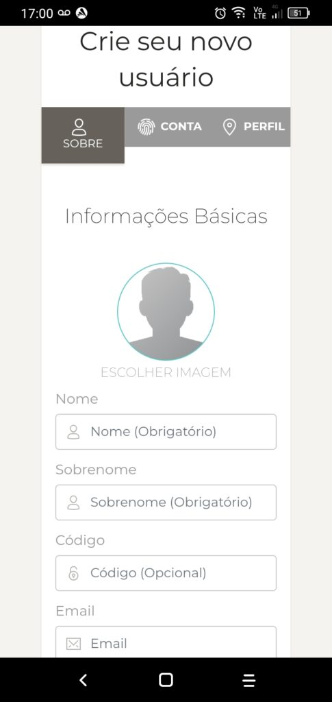
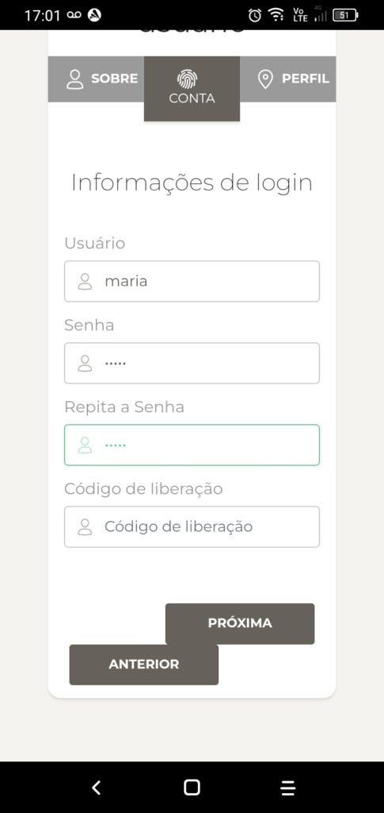
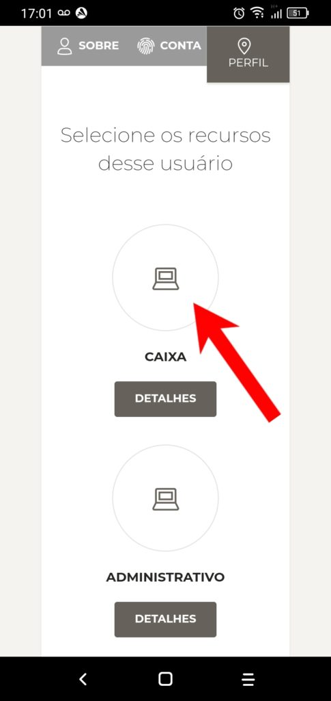
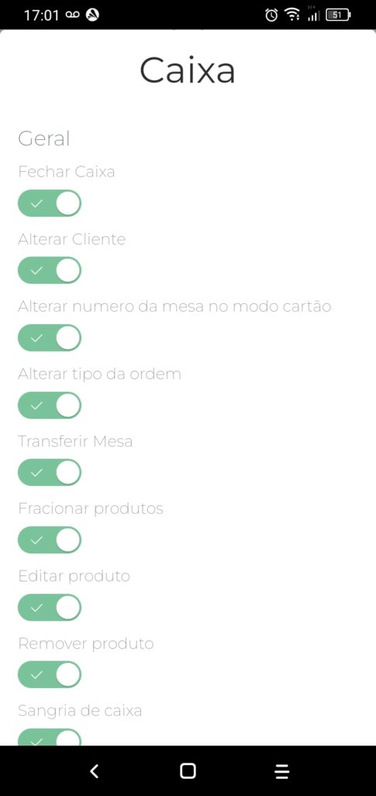
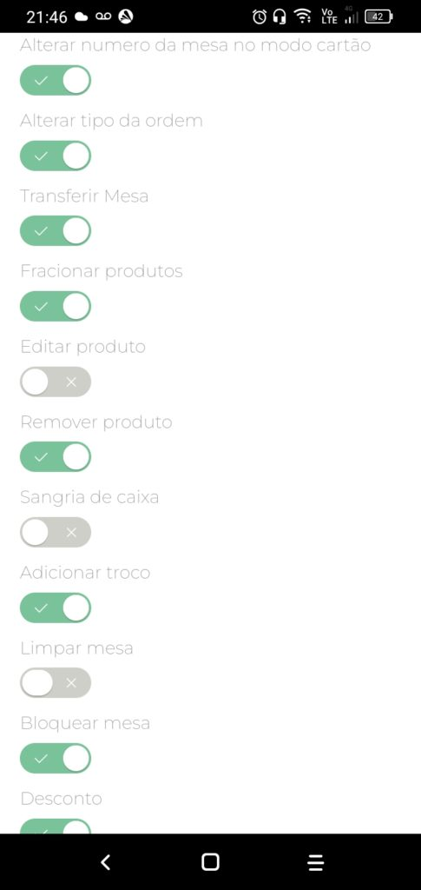

Neste tutorial, eu vou ensinar como cadastrar um usuário caixa pelo celular usando o aplicativo Facity Controle:

**Passo 1:** Abra o aplicativo **Facity Controle** em seu celular.

**Passo 2:** Insira o **nome da empresa**, **login** e **senha**.(_tudo em letras minúsculas_)

**Passo 3:** Para acessar o menu do sistema, clique no canto superior esquerdo, onde há um ícone semelhante ao apresentado na imagem.

**Passo 4:** No menu do sistema, busque por **"USUÁRIOS"** e clique em **"NOVO"**.

**Passo 5:** Insira as informações solicitadas, como **nome**, **sobrenome** e **e-mail** (opcional). Clique em **"Próxima"** para avançar no cadastro. Lembre-se de inserir todas as informações em _letras minúsculas_.

**Passo 6:** Insira novamente o **nome**, uma **senha** e **repita a senha**. Clique em **"Próxima"**.

**Passo 7:** Selecione a função **"CAIXA"** e clique em **"Concluir"** para finalizar o cadastro.

**Passo 8:** Gerencie as permissões do usuário, escolhendo quais funções ele poderá realizar no sistema. Para isso, clique em **"Detalhes"** logo abaixo da opção selecionada.

Nessa imagem as permissões estão todas liberadas para essa função, deslize a tela para ver todas elas:

**Passo 9:** Na tela de permissões, você pode marcar ou desmarcar as opções conforme a necessidade. Ao finalizar, clique em **"OK"** para salvar.

Agora você sabe como cadastrar um usuário caixa pelo celular usando o aplicativo **Facity Controle**. Espero que tenha sido útil. Até a próxima!
