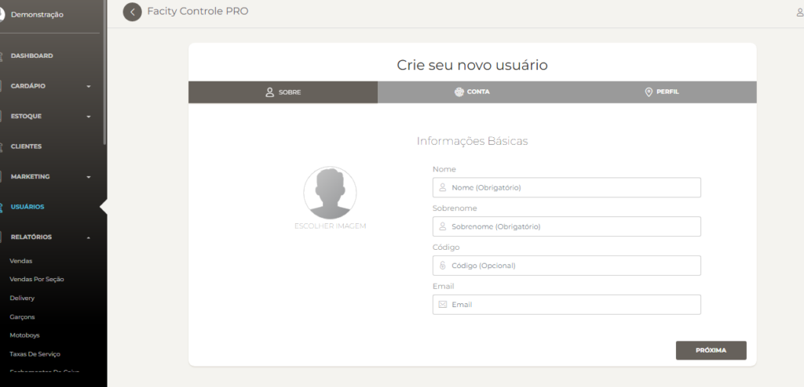
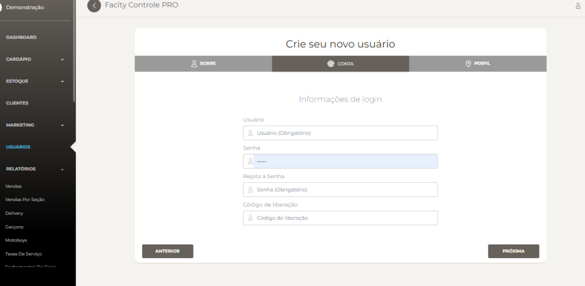
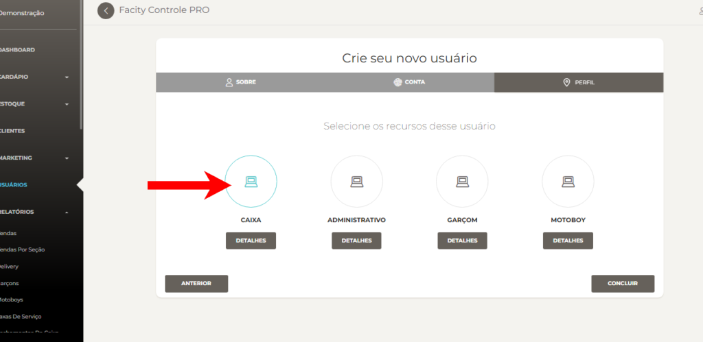
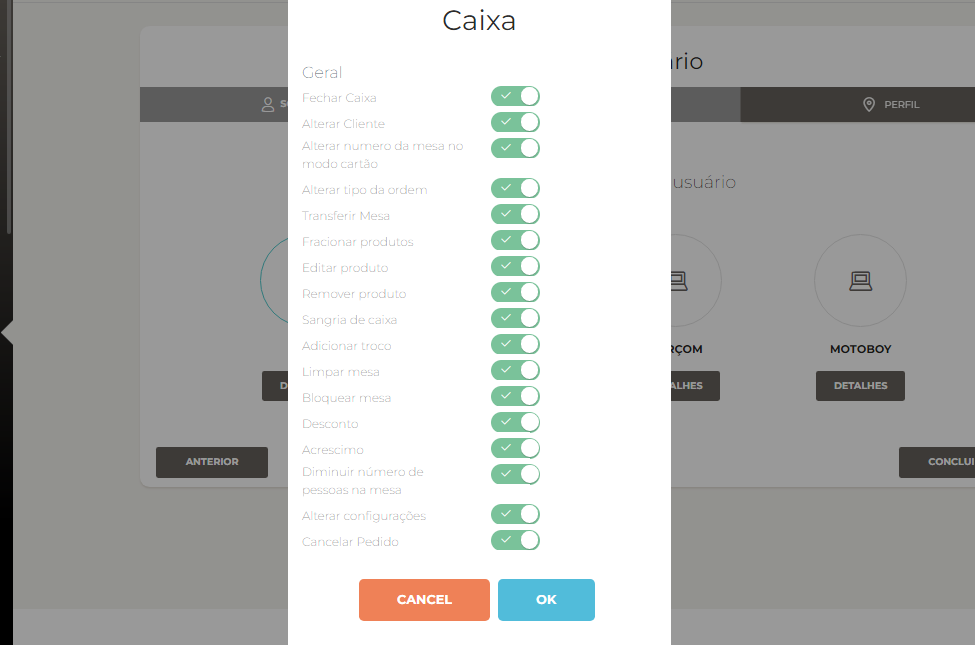
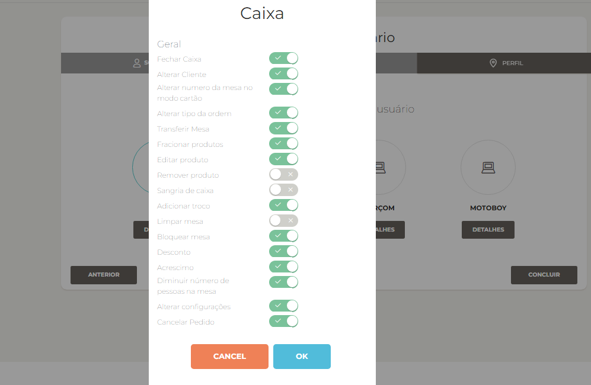

Neste post, vou te mostrar como cadastrar um usuário Caixa no **Facity Controle**. É um processo simples e fácil de seguir, então vamos começar!

**Passo 1:** Abra o **Facity Controle** em seu computador

Para começar, abra o **Facity Controle** em seu computador. Certifique-se de que tem o **nome da empresa**, **login** e **senha em mãos**. Lembre-se de que tudo deve ser digitado em _letras minúsculas_.

**Passo 2:** Entre no menu e busque a opção **"Usuários"**

No menu principal, procure pela opção **Usuários** e clique nela.

**Passo 3:** Selecione **"NOVO"**

Ao selecionar a opção **Usuários**, clique em **NOVO** para cadastrar um novo usuário.

**Passo 4:** Coloque as informações

Preencha as informações necessárias para o cadastro do usuário **Caixa**, incluindo **nome**, **sobrenome** e **e-mail** (opcional). Em seguida, clique em **"Próxima"** para continuar o cadastro. Lembre-se de que todas as informações devem ser digitadas em _letras minúsculas_.

**Passo 5:** Coloque o "**NOME"** novamente

Neste passo, insira novamente o **nome do usuário** e crie uma **senha**. **Repita a senha** para confirmar. Clique em **"Próxima"** para continuar.

**Passo 6:** Selecione a função Caixa

Clique em cima da opção **"Caixa"** para selecionar a função do usuário. Em seguida, clique em **"Concluir"** para finalizar o cadastro.

**Passo 7:** Gerencie as permissões

O próximo passo é gerenciar as permissões que esse funcionário terá no sistema.

Clique em **"Detalhes"** logo abaixo da opção Caixa. Você verá uma lista de permissões que pode gerenciar.

Nessa imagem as permissões estão todas liberadas para essa função

**Passo 8:** Selecione as permissões desejadas

Selecione as permissões que deseja dar ao usuário. É possível marcar todas as permissões ou apenas algumas delas, dependendo do que for necessário para o trabalho do usuário.

**Passo 9:** Salve as permissões

Após selecionar as permissões, clique em **"OK"** para salvar as configurações.

E pronto! Agora o usuário **Caixa** está cadastrado e pronto para utilizar o sistema **Facity Controle**. Se tiver alguma dúvida ou precisar de ajuda, não hesite em entrar em contato com o suporte.
