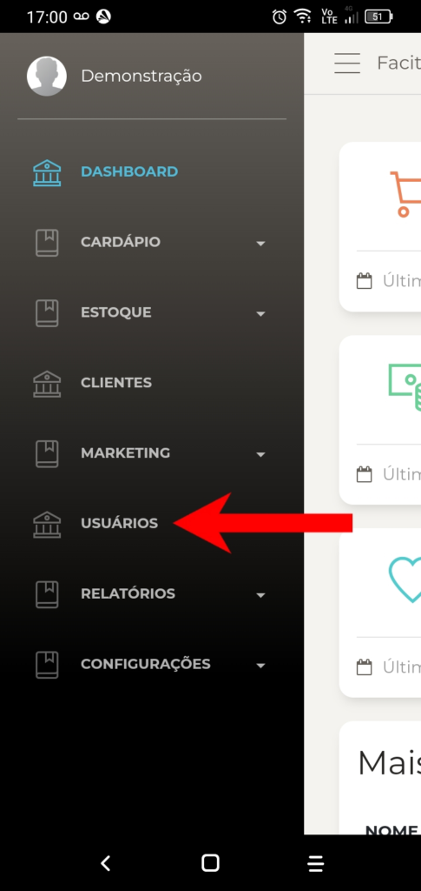
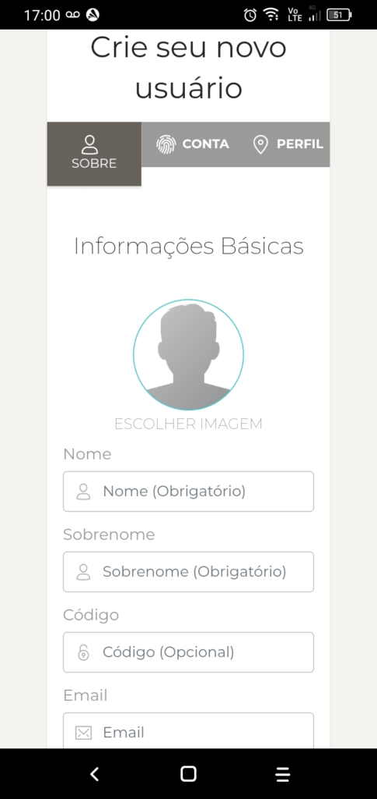
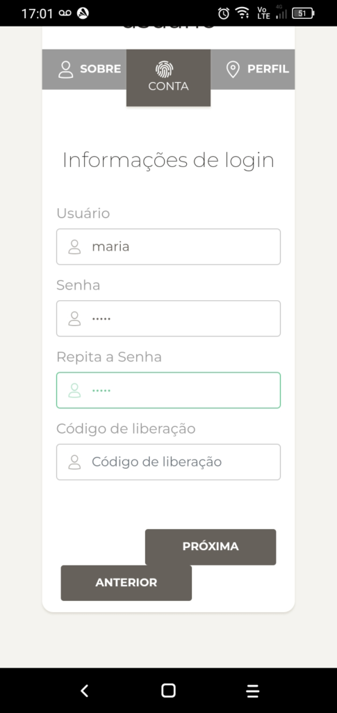
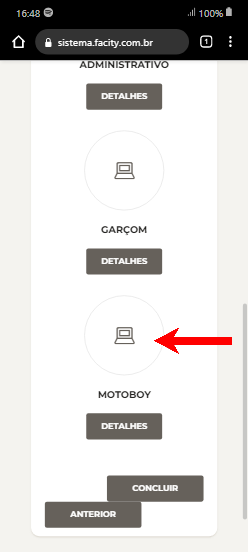

Se você está procurando uma maneira rápida e fácil de cadastrar um usuário motoboy em sua empresa, o aplicativo **Facity Controle** é a solução perfeita para você. Com este tutorial simples e objetivo, você será capaz de realizar o cadastro sem dificuldades.

**Passo 1:** Abra o aplicativo **Facity Controle** em seu celular.

**Passo 2:** Informe o **nome da empresa**, **login** e **senha** em _letras minúsculas_.

**Passo 3:** Clique no ícone de três linhas horizontais no canto superior esquerdo da tela para acessar o menu do sistema.

**Passo 4:** Selecione a opção **"Usuários"**.

**Passo 5:** Clique em **"Novo"** para criar um novo usuário.

**Passo 6:** Preencha as informações do **Entregador/Motoboy,** incluindo **nome**, **sobrenome** e **e-mail** (opcional). Clique em **"Próxima"**.

TODAS AS INFORMAÇÕES DO CADASTRO EM LETRAS MINÚSCULAS.

**Passo 7:** Preencha as informações de **login**, incluindo **nome**, **senha** e confirmação de **senha** em _letras minúsculas_. Clique em **"Próxima"**.

**Passo 8:** Selecione a função **"Motoboy"**(Entregador)

**Passo 9:** Clique em **"Concluir"** para finalizar o cadastro do usuário motoboy em sua empresa.

Lembre-se de que todas as informações devem ser preenchidas em letras minúsculas para evitar erros no cadastro. Com este passo a passo simples, você poderá cadastrar um usuário motoboy pelo celular de forma fácil e rápida usando o aplicativo **Facity Controle**.
