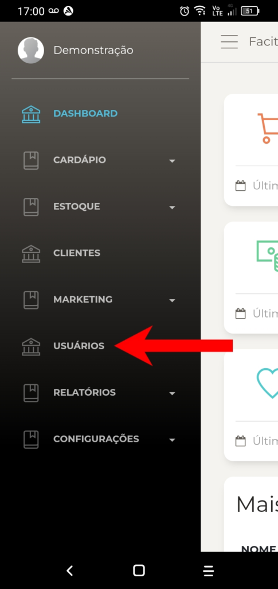
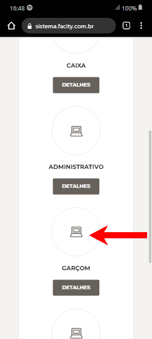

Guia passo a passo para cadastrar um usuário garçom usando o aplicativo:

**Passo 1:** Abra o aplicativo **Facity Controle** em seu celular e faça login

Para começar, abra o aplicativo **Facity Controle** em seu celular e faça **login** com o **nome da empresa**, **login** e **senha**. Lembre-se de que todas as informações devem ser inseridas em _letras minúsculas_.

**Passo 2:** Acesse o menu do sistema

Para acessar o menu do sistema, clique no ícone no canto superior esquerdo da tela.

**Passo 3:** Busque por **"Usuários"** no menu do sistema

No menu do sistema, procure por **"Usuários"** e clique nele.

**Passo 4:** Clique em **"Novo"**

Para cadastrar um novo usuário, clique em **"Novo"**.

**Passo 5:** Insira as informações pessoais do usuário

Agora é hora de inserir as informações pessoais do usuário. Inclua o **nome**, **sobrenome** e **e-mail** (opcional). Clique em **"Próxima"** para continuar com o cadastro. Lembre-se de inserir todas as informações em _letras minúsculas_

**Passo 6:** Insira a senha do usuário

Insira o nome novamente e uma senha para o usuário e repita-a para confirmar. Clique em **"Próxima"** para continuar.

**Passo 7:** Selecione a função **"Garçom"**

Selecione a função **"Garçom"** clicando em cima da palavra.

**Passo 8:** Conclua o cadastro

Clique em **"Concluir"** para finalizar o cadastro do usuário garçom.

O processo de cadastro é simples e rápido, permitindo que você gerencie sua equipe com eficiência.
