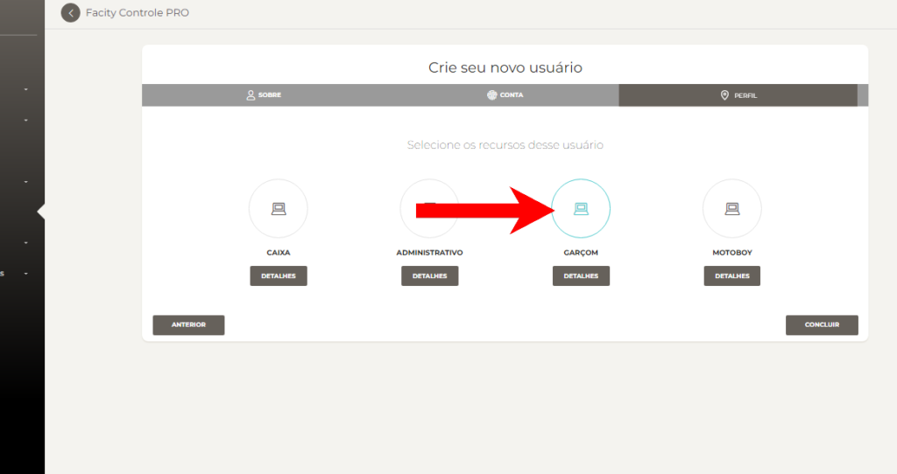

Neste post, vamos mostrar como cadastrar um usuário garçom no **Facity Controle**. Siga as etapas abaixo:

**Passo 1:** Abra o **Facity Controle** no seu computador e insira o **nome da empresa**, **login** e **senha**. Certifique-se de que tudo esteja em letras minúsculas.

**Passo 2:** No menu, procure a opção **"Usuários"** e selecione **"Novo"**.

**Passo 3:** Insira as informações do usuário, incluindo **nome**, **sobrenome** e **email** (opcional). Clique em **"Próxima"** para continuar com o cadastro. Lembre-se de que todas as informações devem ser em _letras minúsculas_.

**Passo 4:** Insira novamente o nome, escolha uma **senha** e **repita a senha** para confirmar. Clique em **"Próxima"**.

**Passo 5:** Clique em cima da opção **"Garçom"** para selecionar a função.

**Passo 6:** Clique em **"Concluir"** para finalizar o cadastro.

Pronto! Agora você cadastrou um usuário garçom no **Facity Controle**.
