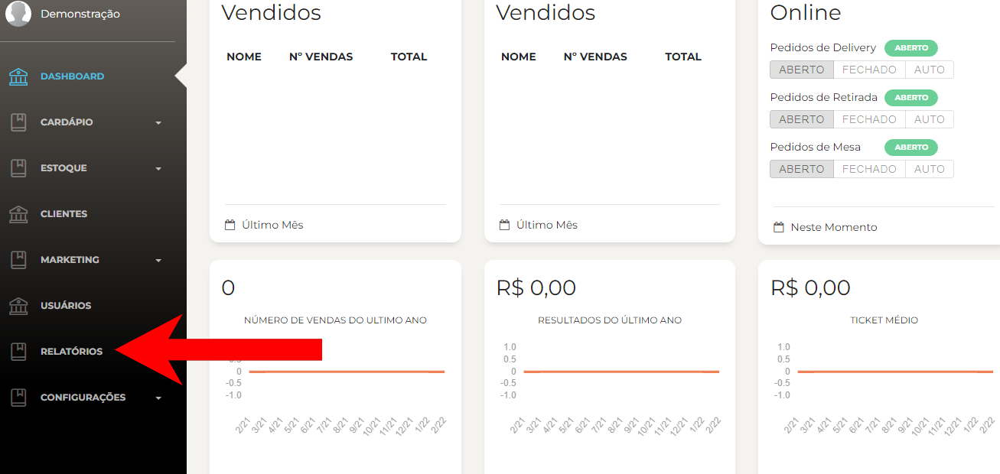
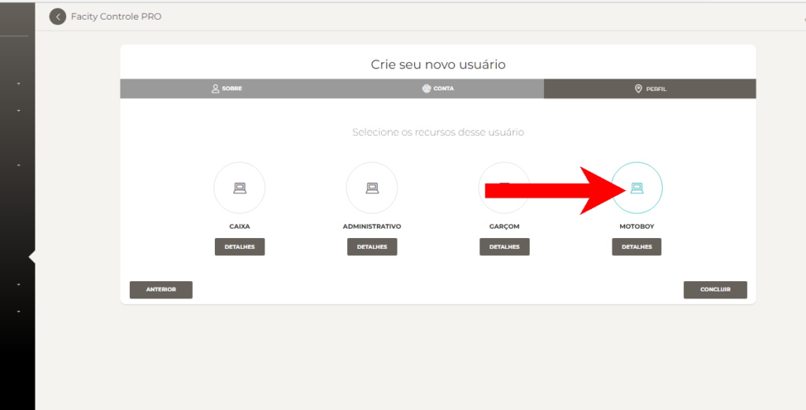

Passo a passo sobre como cadastrar um usuário motoboy no **Facity Controle**:

Você precisa cadastrar um usuário motoboy no **Facity Controle** e não sabe como? Não se preocupe, este guia passo a passo vai te ajudar a realizar essa tarefa de forma simples e rápida.

**Passo 1:** Abra o **Facity Controle** em seu computador e faça o login inserindo o **nome da empresa**, **login** e **senha**, tudo em _letras minúsculas._

**Passo 2:** No menu principal, busque a opção **"Usuários"** e selecione **"Novo"**.

**Passo 3:** Agora é hora de inserir as informações do usuário **Entregador/ Motoboy**. Coloque o **nome**, **sobrenome** e, se desejar, o **e-mail** (lembrando que todas as informações devem estar em letras minúsculas). Clique em **"Próxima"** para seguir com o cadastro.

**Passo 4:** Insira novamente o **nome**, uma **senha** e **repita a senha** para confirmar. Clique em **"Próxima"** novamente.

**Passo 5:** Selecione a função **"Motoboy"**(entregador) clicando em cima da opção correspondente. Clique em **"Concluir"** para finalizar o cadastro.

E pronto! Agora você já sabe como cadastrar um usuário motoboy no **Facity Controle** de forma simples e rápida. Com esse novo cadastro, você poderá gerenciar suas entregas de forma mais eficiente e organizada.
