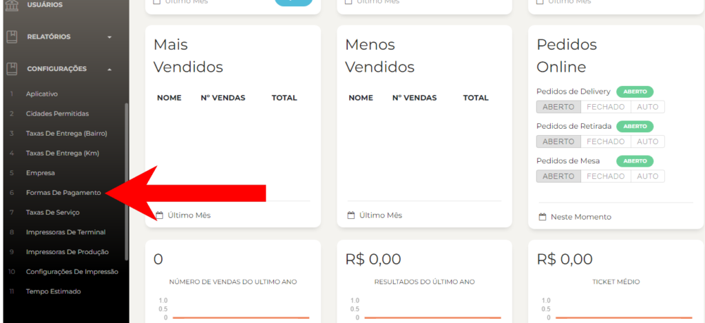
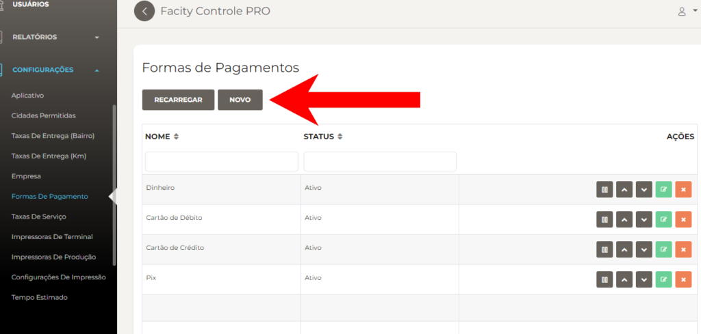
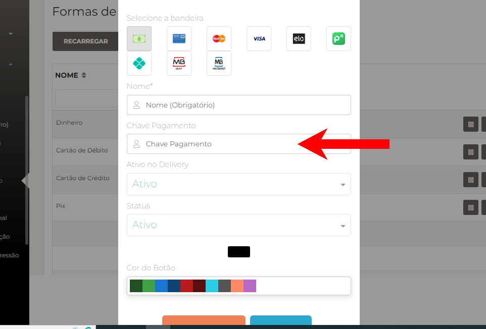
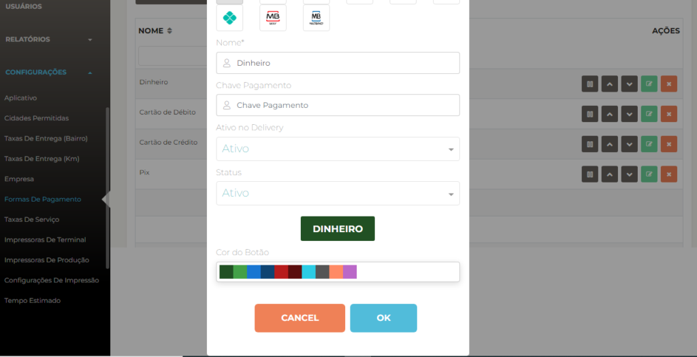

Tutorial sobre como configurar formas de pagamento no Facity Controle:

**Passo 1:** Abra o **Facity Controle** em seu computador.

Ao abrir o **Facity Controle**, você será direcionado para a tela de login. Insira o **nome da sua empresa**, **login** e **senha**, tudo em _letras minúsculas_.

**Passo 2:** Acesse as configurações do sistema.

No menu lateral esquerdo, clique em **"Configurações"** para acessar as opções de configuração do sistema.

**Passo 3:** Selecione **"Formas de Pagamento"**.

Dentro das opções de configuração do sistema, escolha **"Formas de Pagamento"**. Esta seção permitirá que você gerencie as formas de pagamento que estarão disponíveis para seus clientes.

**Passo 4:** Clique em **"Novo"**.

Para adicionar uma nova forma de pagamento, clique em **"Novo"**. Esta ação permitirá que você comece a configurar sua nova forma de pagamento.

**Passo 5:** Escolha a forma de pagamento.

Aqui é onde você escolhe o tipo de pagamento que deseja adicionar. As opções mais comuns são **Dinheiro**, **Cartão de Débito**, **Cartão de Crédito** e **PIX**.

Se a forma de pagamento for **PIX** você pode cadastrar uma chave junto e quando o cliente selecionar essa opção a chave **PIX** é copiada automaticamente

**Passo 6:** Insira a chave **PIX**.

Se você escolheu **PIX** como forma de pagamento, insira a chave **PIX** que deseja usar. Isso permitirá que seus clientes façam pagamentos instantâneos usando essa opção.

**Passo 7:** Selecione a bandeira correspondente à forma de pagamento.

Se você adicionou uma forma de pagamento de cartão de **crédito** ou **débito**, será necessário selecionar a bandeira correspondente ao tipo de cartão.

**Passo 8:** Insira o nome da forma de pagamento.

Insira um nome para a nova forma de pagamento. Isso permitirá que você a identifique facilmente na lista de opções disponíveis.

**Passo 9:** Salve as configurações.

Clique em **"OK"** para salvar as configurações da nova forma de pagamento. Agora, ela estará disponível para ser usada pelos seus clientes.

Pronto! Agora você sabe como configurar formas de pagamento no **Facity Controle**. Certifique-se de que todas as informações estejam corretas antes de salvar as configurações. Lembre-se de que é possível editar ou excluir uma forma de pagamento a qualquer momento.
