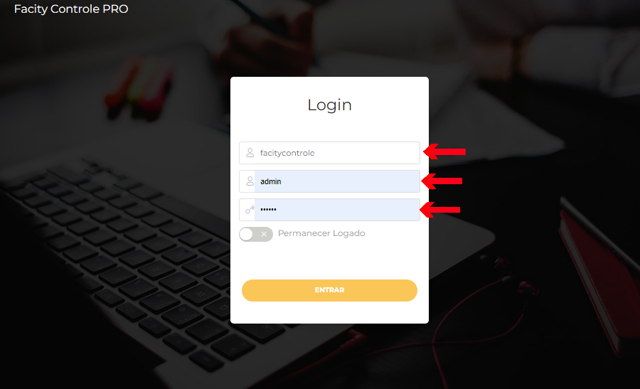
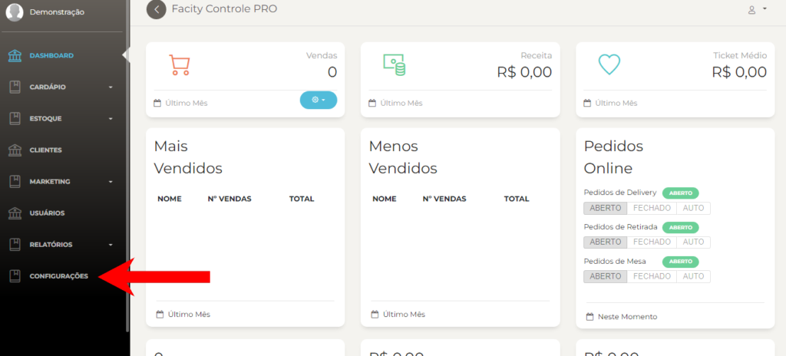
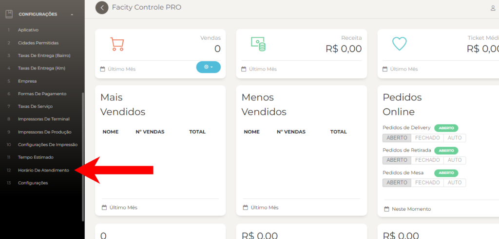
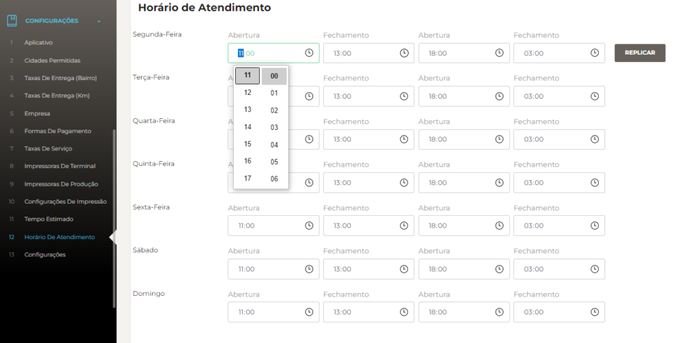

Se você está procurando uma maneira simples e fácil de configurar o horário de atendimento da sua empresa, você veio ao lugar certo. Neste post, eu vou te ensinar a fazer isso passo a passo usando o **Facity Controle**. Vamos lá!

**Passo 1:** Abra o Facity Controle em seu computador

O primeiro passo é abrir o **Facity Controle** em seu computador. Certifique-se de ter o **nome da empresa**, **login** e **senha** em mãos e lembre-se que tudo deve ser digitado em _letras minúsculas_.

**Passo 2:** Clique em **CONFIGURAÇÕES** no menu lateral esquerdo

Depois de entrar no **Facity Controle**, clique no menu lateral esquerdo em **CONFIGURAÇÕES**.

**Passo 3:** Clique em **HORÁRIO DE ATENDIMENTO**

Ao acessar as configurações, você verá uma lista de opções. Clique em **HORÁRIO DE ATENDIMENTO**.

**Passo 4:** Ajuste o horário de atendimento para cada dia da semana

Agora você está na tela de configuração de horário de atendimento. Ajuste o horário de atendimento para cada dia da semana. Se você quiser que os horários de atendimento sejam os mesmos todos os dias, clique em **"Replicar"** para copiar as informações do primeiro dia.

**Passo 5:** Clique em **SALVAR**

Depois de ajustar os horários de atendimento, clique em **SALVAR** e a configuração estará pronta.

Pronto! Seguindo esses passos simples, você configurou o horário de atendimento da sua empresa. Se tiver qualquer dúvida, não hesite em entrar em contato com o suporte da **Facity Controle**. Obrigado por ler este post e até a próxima!
