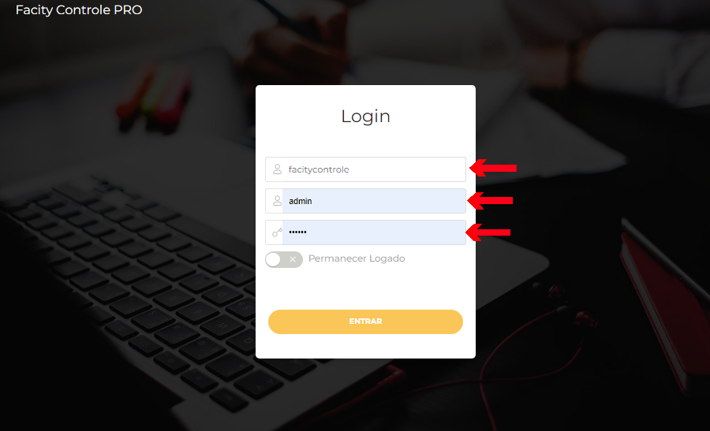
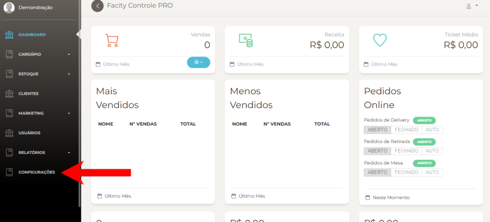
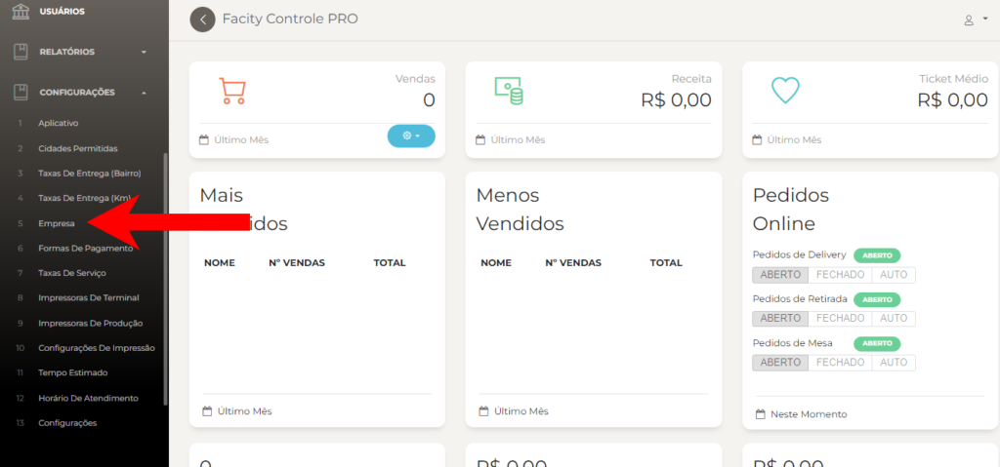
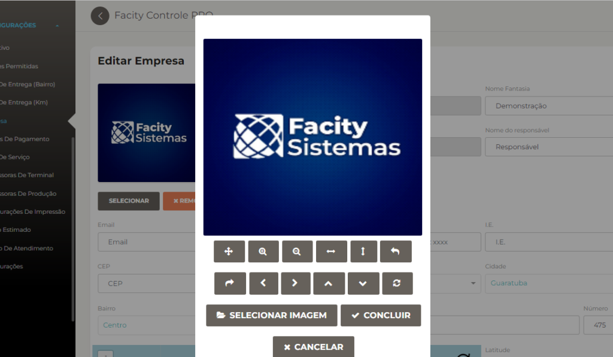
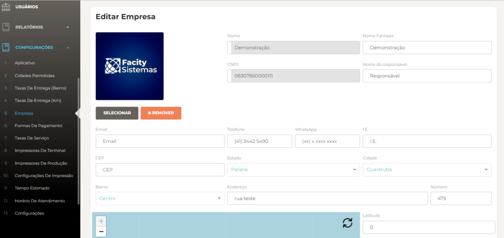
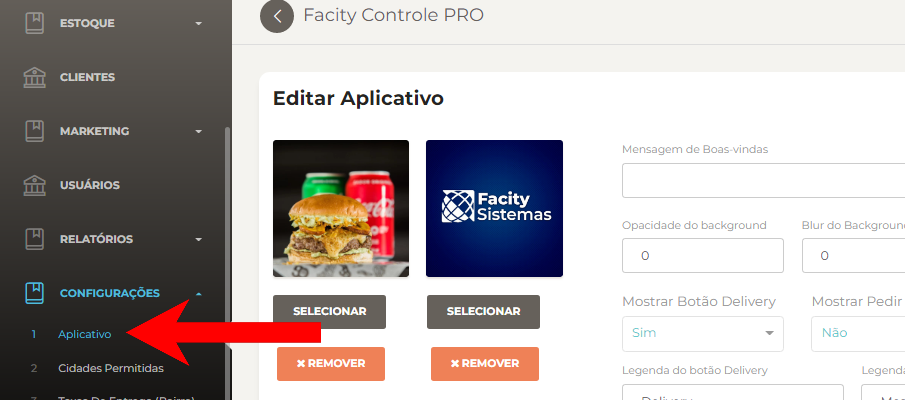

Neste post, eu vou ensinar como configurar as informações da sua empresa. É importante manter esses dados atualizados para que seus clientes possam entrar em contato com você e encontrar sua empresa com facilidade.

**Passo 1:** Abra o **Facity Controle** em seu computador

Certifique-se de que está com o programa aberto e que já fez **login** com suas informações de usuário.

**Passo 3:** Clique em **EMPRESA**

Agora você verá uma lista de opções disponíveis. Clique em **"Empresa"** para começar a editar as informações da sua empresa.

**Passo 4:** Clique em **SELECIONAR IMAGEM** para adicionar uma foto ou alterar

Para adicionar ou alterar a imagem da sua empresa, clique em **"Selecionar imagem"**.

**Passo 5: CONCLUIR** para salvar

Depois de selecionar a imagem, clique em **"Concluir"** para salvar as alterações.

**Passo 6:** Edite as informações da sua empresa

Você verá que algumas informações, como o nome e o **CNPJ**, já estão cadastradas no sistema. No entanto, você pode editar outras informações importantes, como o **nome fantasia**, o **nome do responsável**, o **email**, o **telefone**, o **WhatsApp**, o **CEP**, o **estado**, a **cidade**, o **bairro** (se ele não estiver listado, você precisará cadastrá-lo em **"Taxas de Entrega Bairro"**), o **endereço** e o **número**. A **latitude** e a **longitude** serão configuradas automaticamente quando você inserir o **endereço completo**.

**Passo 7:** Troque a logo no aplicativo

Por fim, lembre-se de trocar a logo também no aplicativo para que seus clientes possam reconhecer facilmente a sua marca. Para fazer isso, basta clicar em **"Selecionar imagem"** e escolher a nova logo da sua empresa.

E pronto! Agora você sabe como configurar as informações da sua empresa no **Facity Controle**. Mantenha seus dados atualizados para garantir a satisfação dos seus clientes e o sucesso do seu negócio.

Espero ter ajudado!
