Após baixar e instalar o **Sistema Facity**, siga estas etapas para configurar o Impressor:

Se precisar de ajuda com a instalação, consulte o tutorial completo:

**Link:** [https://blog.facity.com.br/como-baixar-e-instalar-o-sistema-facity/](https://blog.facity.com.br/como-baixar-e-instalar-o-sistema-facity/)

**Passo 1:**  
Abra o programa **"Facity Impressor"** na área de trabalho.

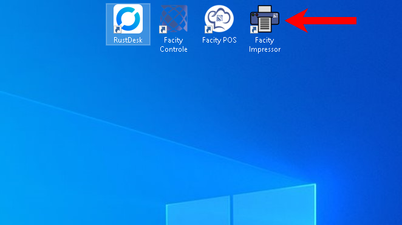

**Passo 2:**  
Clique em **"Configurar Conexão"**.

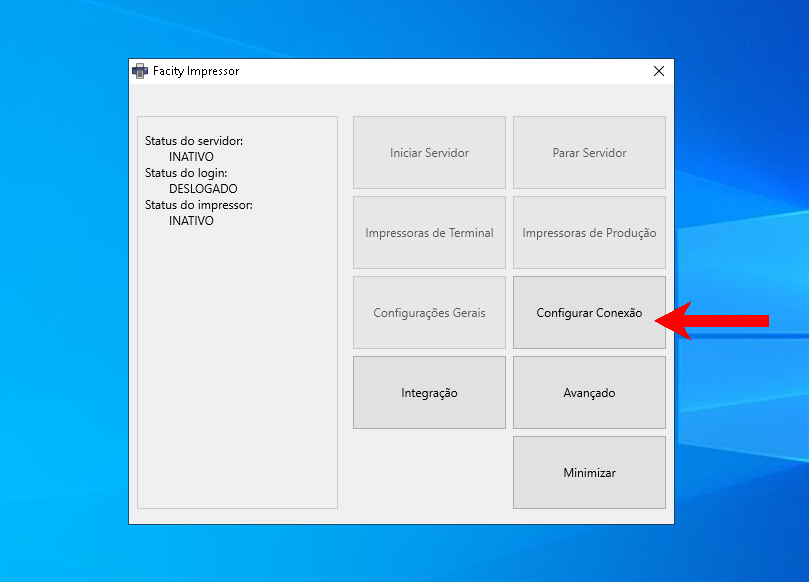

**Passo 3:**  
Selecione **"Online"** e clique em **"Login"**.

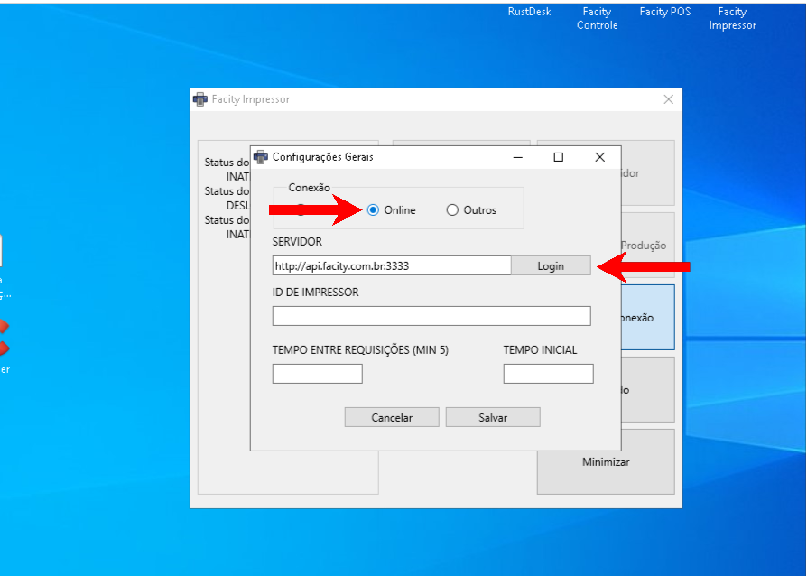

**Passo 4:**  
Insira as informações solicitadas:

- Nome da empresa (sem espaços e em minúsculas)
- Usuário
- Senha
- Clique em **"Logar"**

_**Nota:** Se não tiver as informações de login, contate o **Suporte Facity.**_

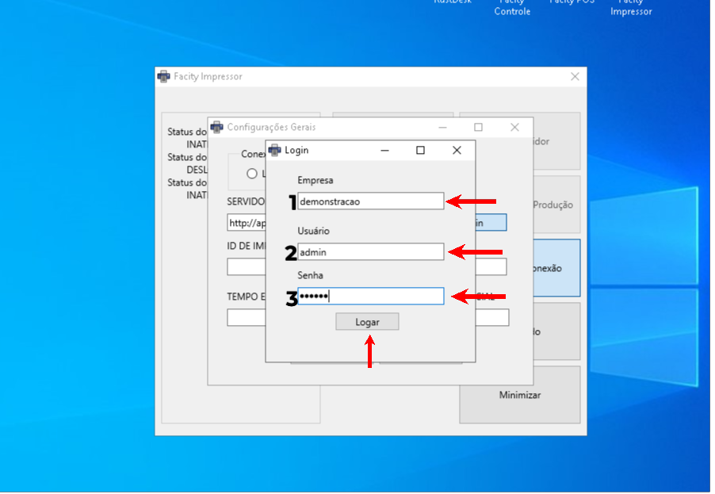

**Passo 5:**  
Vá em **"Configurações Gerais"** e clique em **"Buscar do Administrativo"**. Verifique as informações e clique em **"Salvar"**.

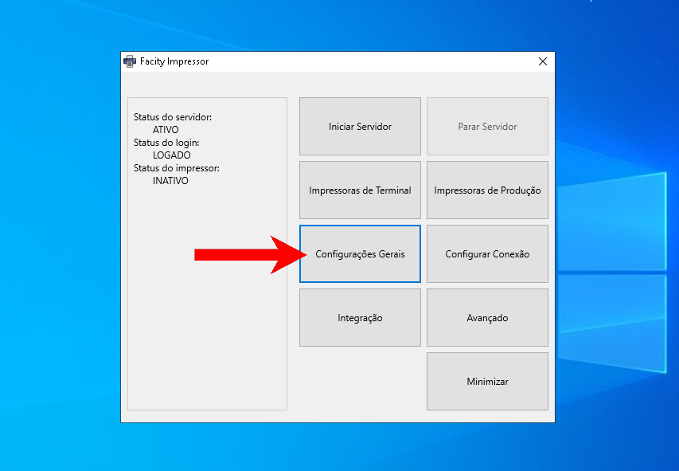

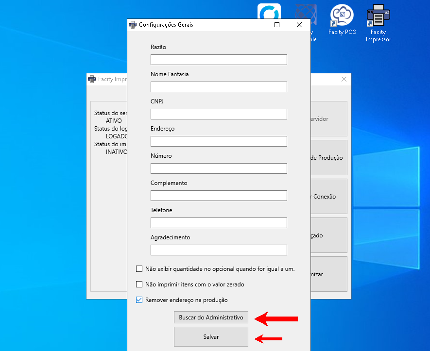

**Passo 6:**  
Configurar a Impressora de Terminal:

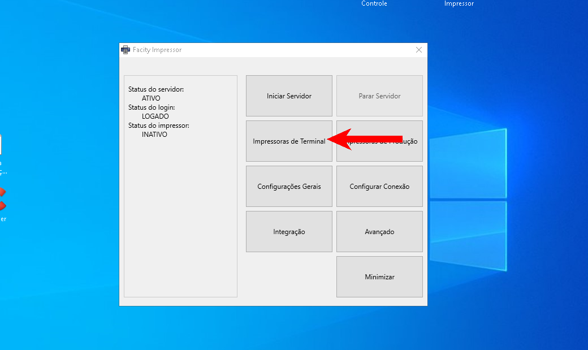

1. Clique em **"Impressora de Terminal"**.
2. Selecione o Terminal.
3. Escolha a impressora na lista.
4. Selecione o modelo e marque **"negrito"** e **"cortar"**.
5. Clique em "**Adicionar"** e salve as configurações.

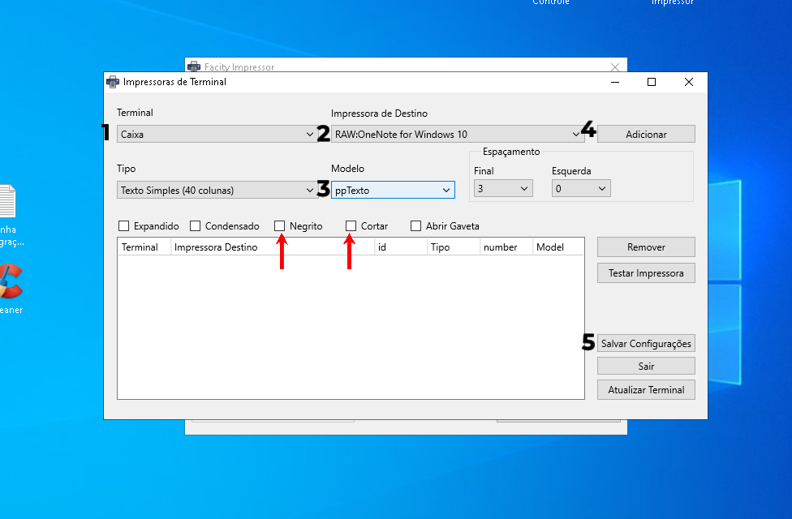

**Passo 7:**  
Configurar a Impressora de Produção:

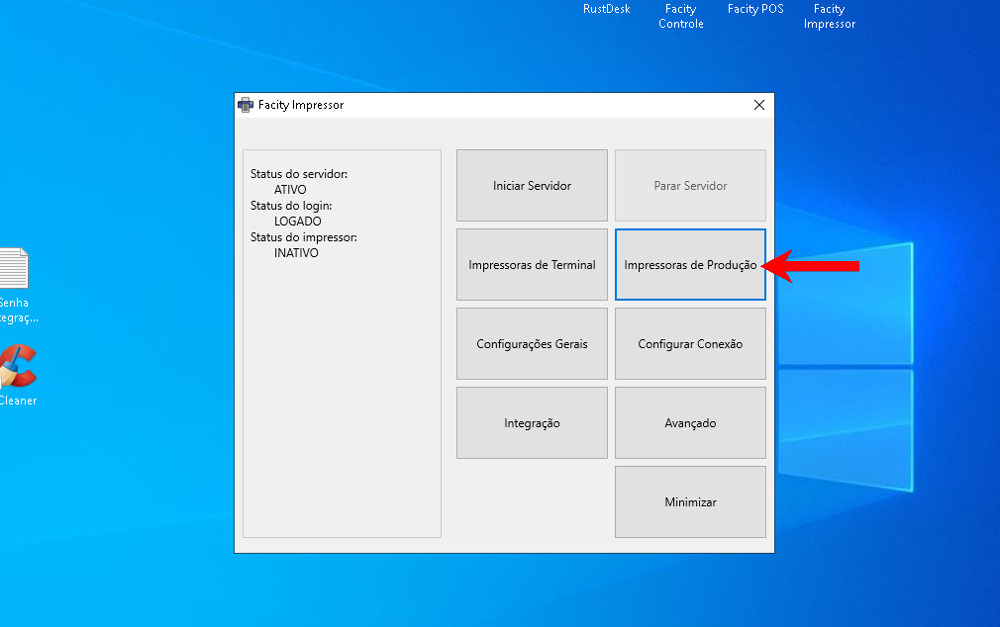

1. Clique em **"Impressoras de Produção"**.
2. Selecione o Terminal.
3. Escolha a impressora na lista.
4. Selecione o modelo e marque **"negrito"** e **"cortar"**.
5. Clique em **"Adicionar"** e salve as configurações.

_**Nota:** O processo é o mesmo para ambas as impressoras, variando conforme o modelo._

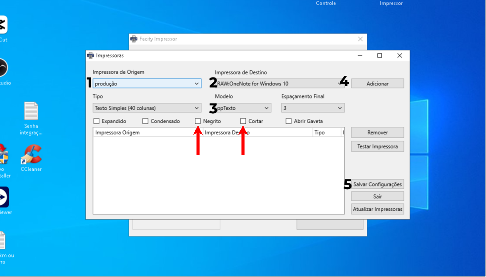

**Passo 8:**  
Clique em **"Iniciar Servidor"** para começar a usar o impressor.

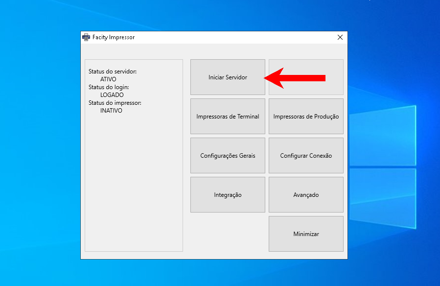

**Finalizando a Configuração:**

1. Teste todas as impressoras configuradas para garantir que estão imprimindo corretamente.
2. Se houver problemas, revise as configurações ou entre em **contato** com o **Suporte Facity.**

**Dicas Adicionais:**

- Mantenha os drivers das impressoras atualizados.
- Realize manutenções periódicas nas impressoras para evitar falhas.

Com esses passos, seu **Facity Impressor** estará configurado e pronto para uso, garantindo eficiência e precisão nas suas impressões.
