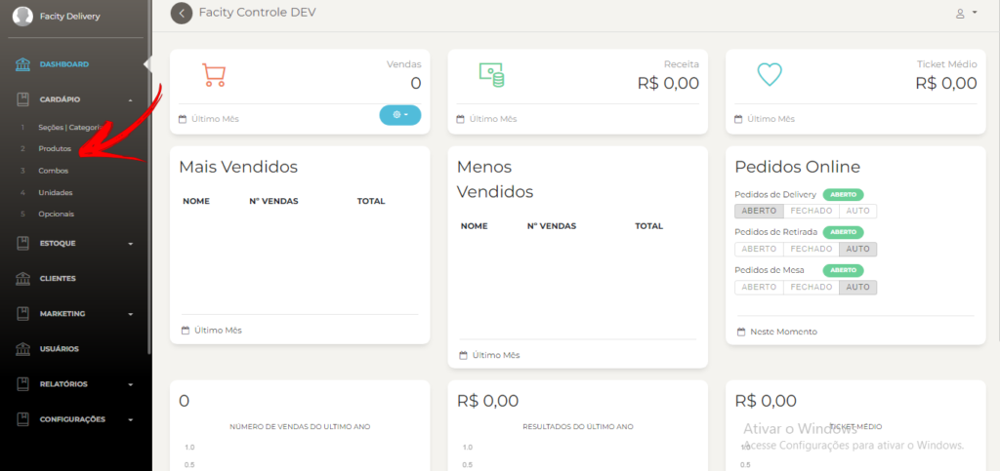
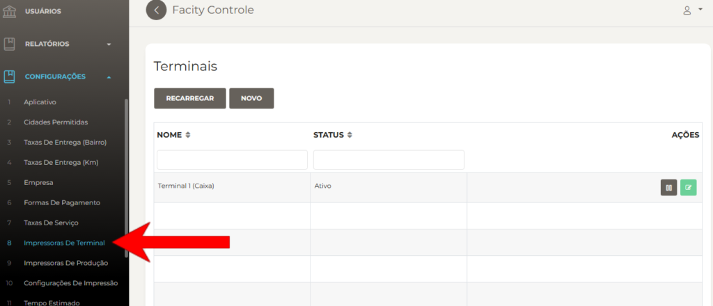
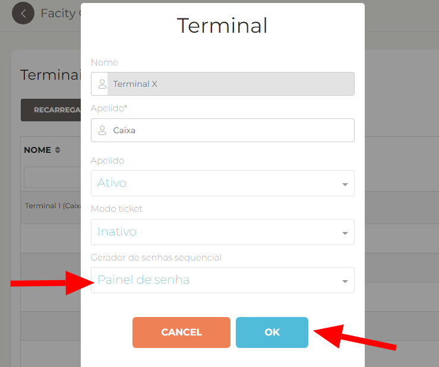
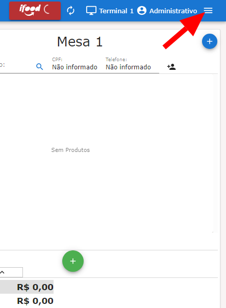
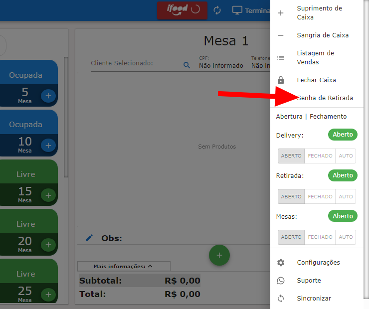
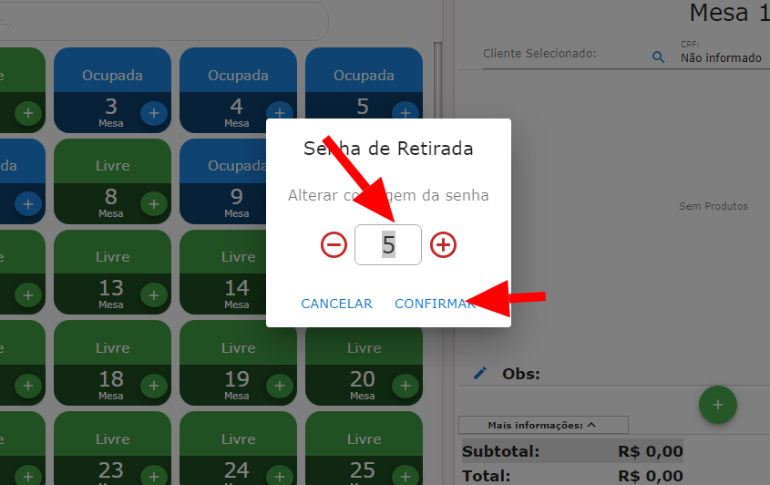

**Passo 1:** Acesse o **Facity Controle** no seu computador e faça o **login** na sua conta.

**Passo 2:** No menu lateral esquerdo, clique em **"Impressoras de Terminal"**.

**Passo 3:** Clique em **"Editar Terminal"** e selecione as opções desejadas. Em seguida, clique em **"OK"** para salvar. Isso criará a opção de senha de retirada.

**Passo 4:** Entre no **Facity POS** e clique onde a seta indica na imagem abaixo:

**Passo 5:** Após clicar, você será redirecionado para a seguinte página. Clique em **"Senhas de Retirada"** para configurar.  

**Passo 6:** Na próxima tela, você pode alterar os números das senhas usando os símbolos **"+"** e **"-"** ou digitando os números diretamente no espaço fornecido.

**Passo 7:** Por fim, clique em **"Confirmar"** para finalizar a configuração. Lembre-se de que, sempre que desejar alterar as senhas no painel, você deve voltar a esta configuração.

Com esses simples passos, você configurou com sucesso senhas de retirada no **Facity POS**. Agora você pode desfrutar de uma experiência mais segura e organizada em seu sistema.

Esperamos que este guia tenha sido útil! Se tiver alguma dúvida, não hesite em entrar em **contato conosco**.
