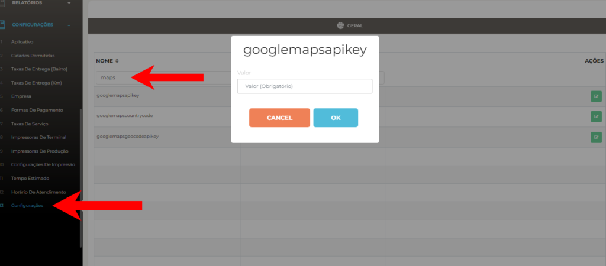
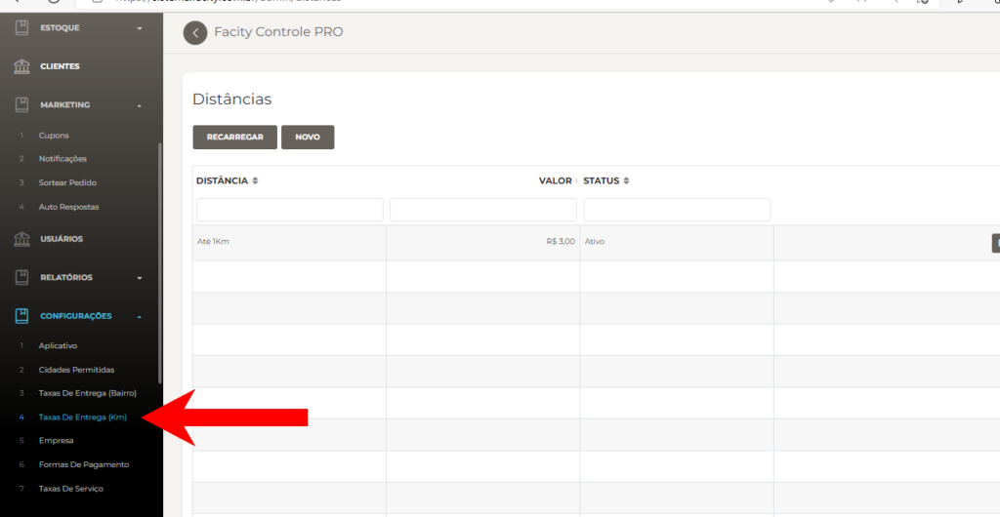
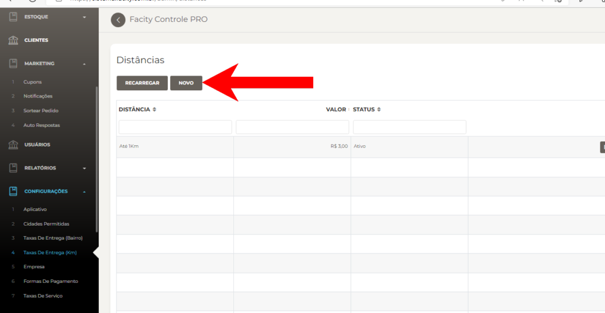
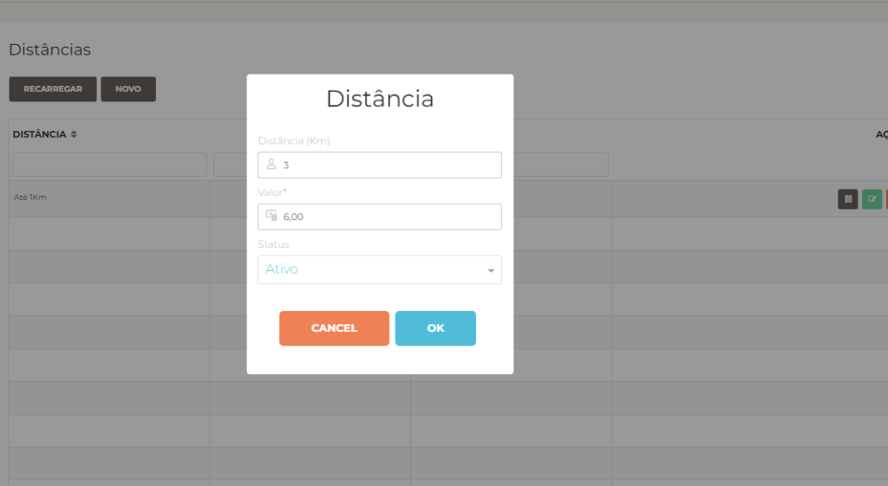
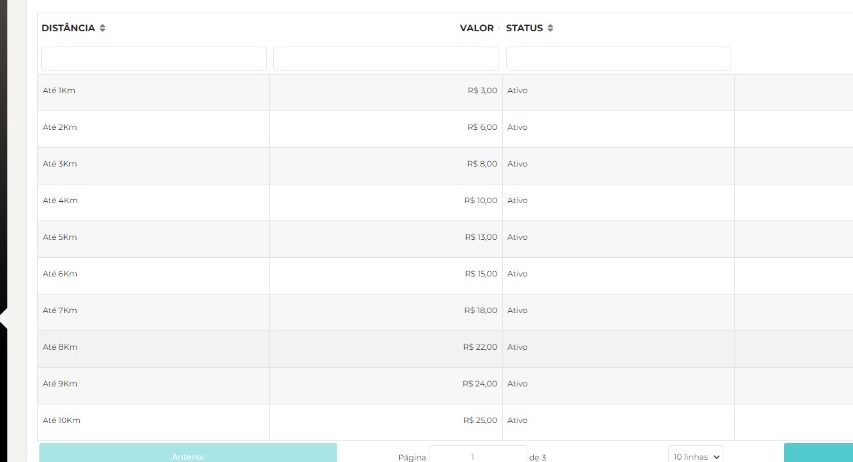

Neste post, vou explicar de forma simples e objetiva como criar uma chave do **Google Maps** e configurar a **taxa de entrega (Km)** no **Facity Controle**. Com essas configurações, você poderá utilizar o **Google Maps** para calcular a distância das entregas e definir a taxa correspondente. Vamos começar?

https://www.youtube.com/watch?v=zkJlZHsZbTQ

1. Criação da chave do **Google Maps:**

Para criar a chave do **Google Maps**, assista ao vídeo explicativo acima ou peça ajuda a um atendente da Facity Sistemas. Com a chave criada, siga os passos abaixo para adicioná-la no **Facity Controle**:

- Acesse o Menu do **Facity Controle**
- Clique em **Configurações**
- Busque por **"Maps"** no campo de pesquisa
- Clique em **Editar** no **ícone verde** e cole a chave gerada nas duas configurações que estão com o nome **"googlemapsapkey"**

2. Configuração da **taxa de entrega (Km):**

- Abra o **Facity Controle** em seu computador
- Faça **login** com o **nome da empresa**, **login** e **senha** (_tudo em letras minúsculas_)

- Abra o Menu Administrativo e clique em **Configurações**
- Busque por **"Taxas de entrega (Km)"**

- Selecione **NOVO**

- Coloque apenas valores numéricos no campo onde pede **DISTÂNCIA (Km)**
- Coloque o valor e clique em **OK** para salvar.

Exemplo de **Taxa de entrega (Km)** na imagem abaixo:

Agora que você já sabe como criar a chave do **Google Maps** e configurar a **taxa de entrega (Km)**, poderá utilizar essas funcionalidades para otimizar o seu serviço de delivery.
