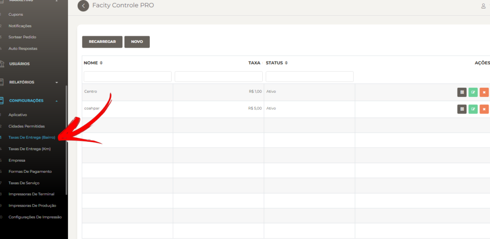
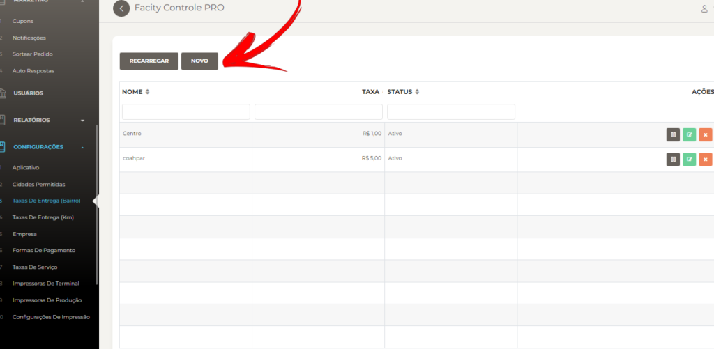
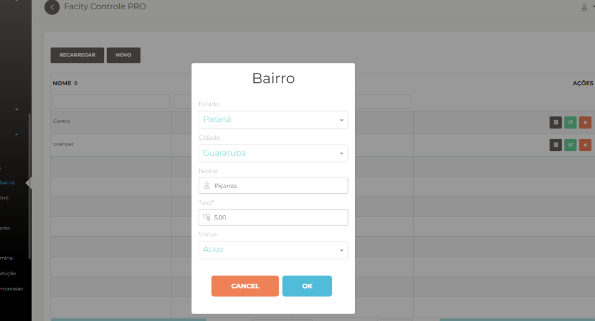

Passo a passo simples para configurar taxas de entrega por bairro no **Facity Controle**:

**Passo 1:** Abra o **Facity Controle** no seu computador. Insira o **nome da sua empresa**, **login** e **senha em letras minúsculas.**

**Passo 2:** Clique em **"Configurações"** no menu administrativo e busque **"Taxas De Entrega (Bairro)"**.

**Passo 3:** Clique em **"Novo"**.

**Passo 4:** Digite o nome do bairro que deseja adicionar.

Clique em **"OK"** para salvar a configuração.

Pronto! Agora você pode cobrar taxas de entrega diferentes para cada bairro cadastrado no **Facity Controle**.
