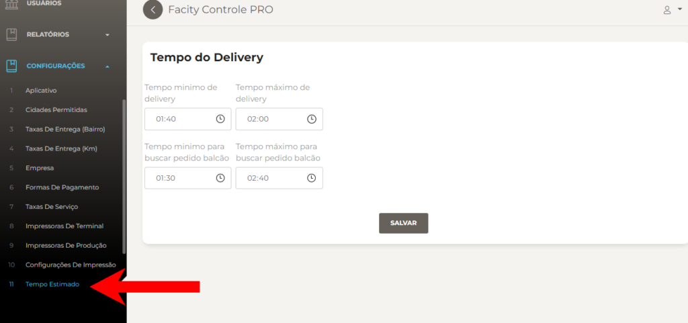
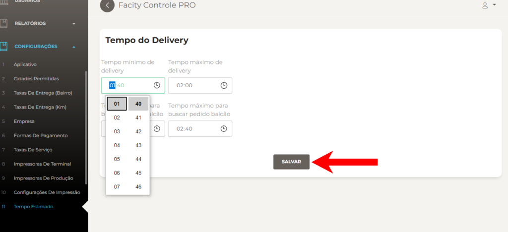

Configurar o tempo estimado é uma forma de otimizar o tempo de atendimento na sua empresa. Com o **Facity Controle**, é possível configurar o tempo estimado de forma fácil e rápida. Neste post, vamos mostrar como fazer isso passo a passo.

**Passo 1:** Abra o **Facity Controle** em seu computador

Para começar, abra o **Facity Controle** em seu computador. Certifique-se de que tem o **login** e **senha corretos da sua empresa**. Lembre-se de que tudo tem que ser digitado em _letras minúsculas_.

**Passo 2:** Clique em **"Configurações"**

No menu lateral à esquerda, clique em **"Configurações"**.

**Passo 3:** Clique em **"Tempo Estimado"**

Dentro de **"Configurações"**, clique em **"Tempo Estimado"**.

**Passo 4:** Configure o tempo estimado

Na tela de **"Tempo Estimado"**, é possível configurar o tempo estimado para cada serviço prestado pela sua empresa. Para alterar os horários, clique no relógio e ajuste o tempo estimado conforme necessário. Depois de configurar o tempo estimado, clique em **"Salvar"** para confirmar as alterações.

Seguindo esses passos simples, você pode configurar o tempo estimado na sua empresa de forma rápida e fácil. Com essa configuração, é possível otimizar o tempo de atendimento e oferecer um serviço mais eficiente para os seus clientes.
