Com o **Facity BOT**, você pode ter respostas automáticas para pré-atender seus clientes no **WhatsApp**. O **chatbot** é especialmente útil quando há muitos clientes a serem atendidos, pois pode responder simultaneamente sem que você precise atendê-los um por um.

Para começar a usar o **chatbot**, você precisa instalar uma extensão no seu navegador. Siga estes passos:

1. Abra o link **[https://chrome.google.com/webstore/detail/facity-bot/gjnhbgneccjnjjgpnbbclnmphgpgdnnf/related?hl=pt-BR&authuser=0](https://chrome.google.com/webstore/detail/facity-bot/gjnhbgneccjnjjgpnbbclnmphgpgdnnf/related?hl=pt-BR&authuser=0)** no seu navegador.

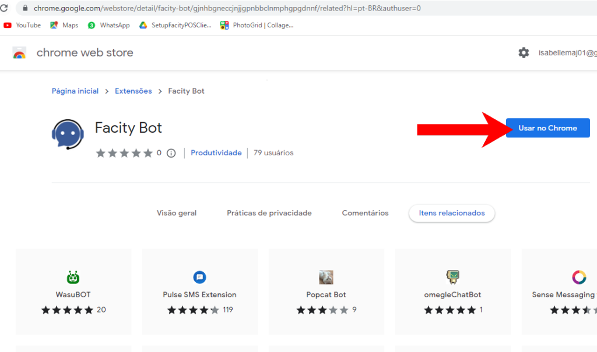

2\. Clique no botão azul **"Adicionar ao Chrome"**.

3\. Clique em **"Adicionar extensão"**.

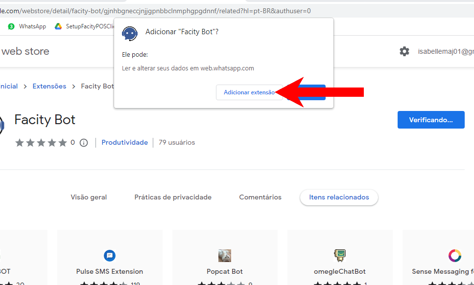

Agora, abra o **WhatsApp** Web para continuar a instalação do **BOT**. Uma tela de cadastro aparecerá. Preencha com as seguintes informações:

- **ONLINE**: Deixe como está, a menos que você possua a versão offline do sistema.
- **Nome da sua empresa** (_em letras minúsculas_).
- **Usuário**.
- **Senha**.

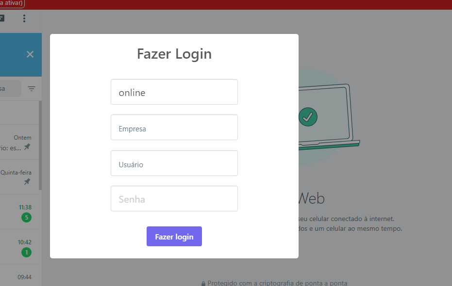

Quando terminar de preencher as informações, clique em **"Fazer Login"**. O **BOT** ficará disponível no sistema com a cor **vermelha (offline)** ou **verde (online)**.

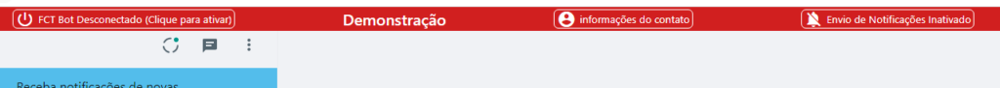

Com o **BOT** instalado, você pode começar a criar suas auto respostas. Siga estes passos:

1. Abra o **Facity Controle** no seu computador.
2. Insira o **nome da sua empresa**, **login** e **senha** (_em letras minúsculas_).

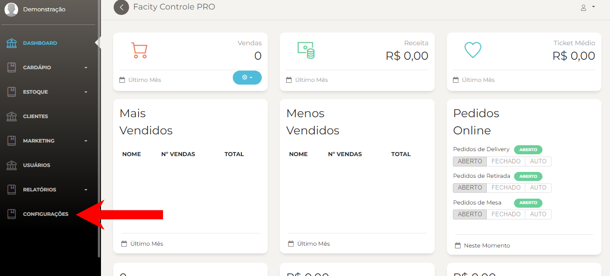

3\. Clique em **"Marketing"** no menu lateral esquerdo.

4\. Selecione **"Auto Resposta".**

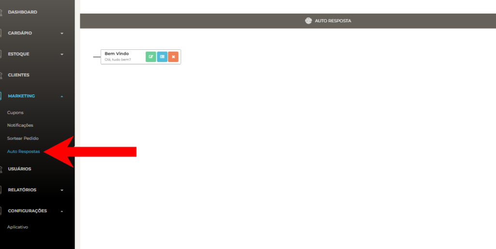

5\. Para criar uma nova auto resposta, clique no **ícone azul**. Para editar uma auto resposta existente, clique no **ícone verde**. Para deletar uma auto resposta, clique no **ícone vermelho**.

6\. Crie as **sub-respostas** a partir da primeira mensagem para que a sequência seja seguida corretamente.

_Toda sub resposta ela tem que ser criada a partir da primeira mensagem pra ela seguir em um_a sequência igual

**Veja alguns exemplos de auto respostas abaixo:**

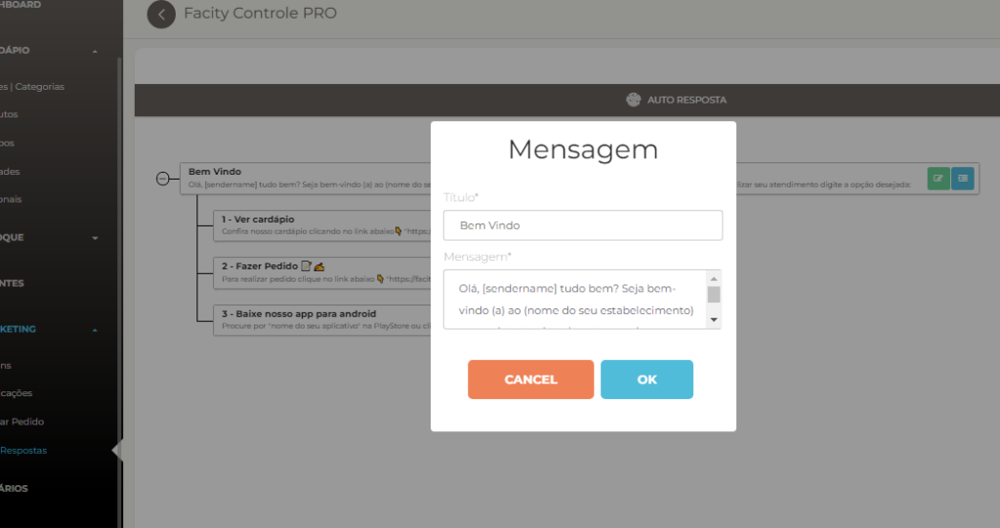

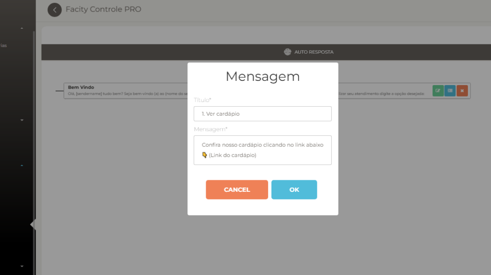

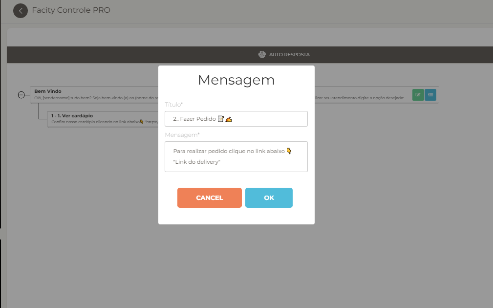

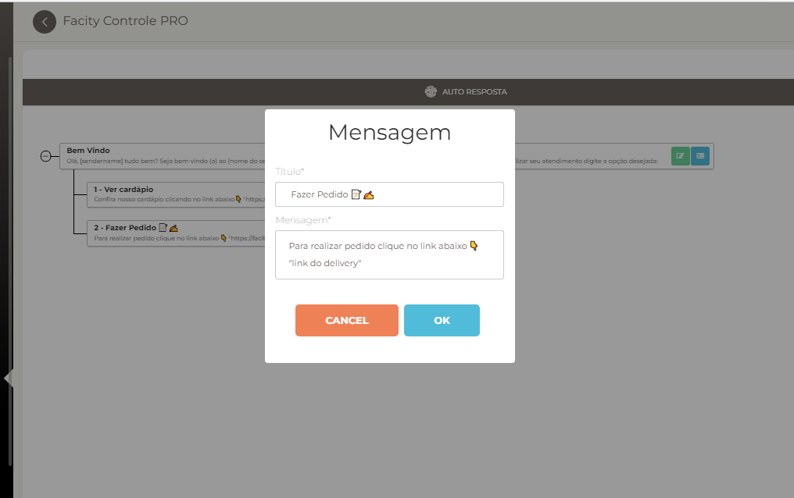

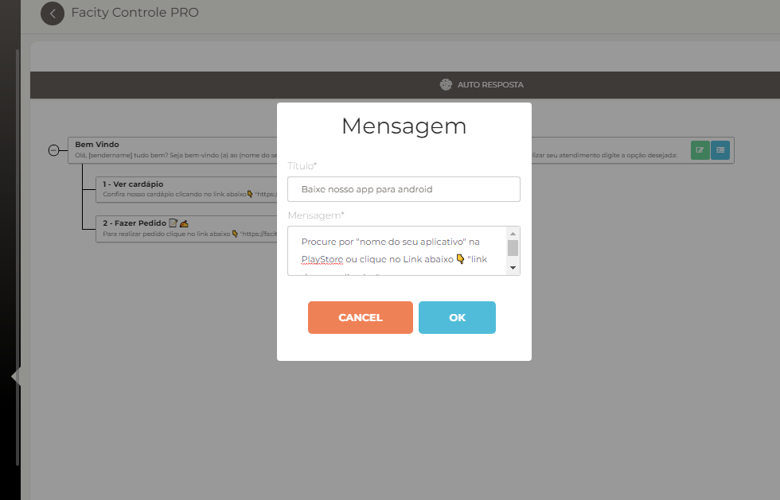

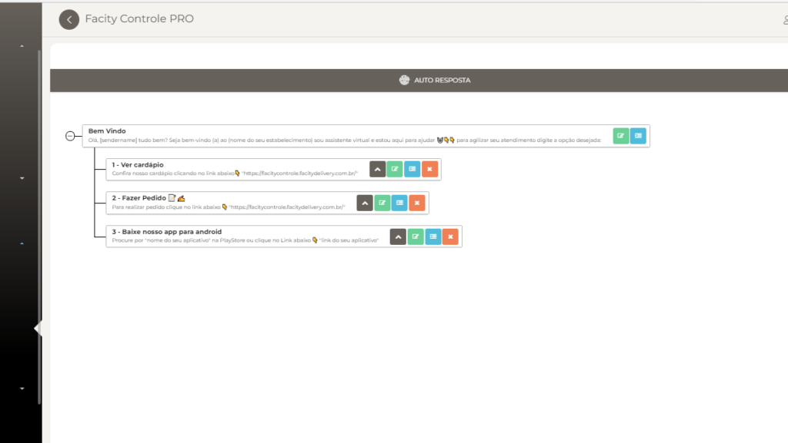

- Um exemplo de **auto respostas** completo:

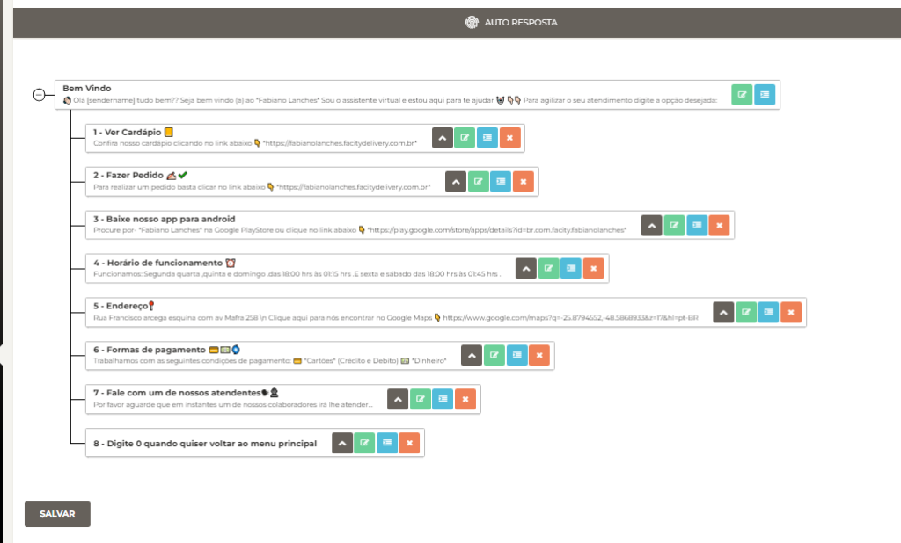

Não se esqueça de **salvar** todo o processo no final para que suas auto respostas fiquem disponíveis no sistema. Com esses passos simples, você pode instalar o **Facity BOT** e criar suas próprias auto respostas para o **WhatsApp**.
