### Tutorial Simples para Criar uma Conta no Google Analytics e Configurar GA4

#### Passo 1: Criar uma Conta no Google Analytics

1. **Acesse o Google Analytics**:
    - Vá para o site do [Google Analytics](https://analytics.google.com/).

1. **Fazer Login ou Criar uma Conta Google**:
    - Faça **login** com sua conta do Google. Se você não tiver uma conta Google, clique em "**Criar Conta**" e siga as instruções.

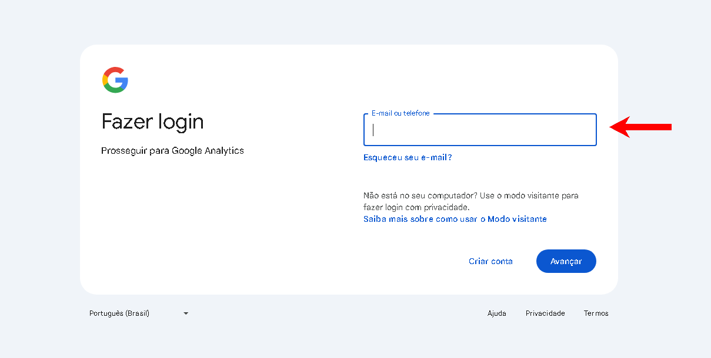

1. **Criar uma Nova Conta no Google Analytics**:
    - Após o **login**, você verá um botão "**Começar a usar**". Clique nele.

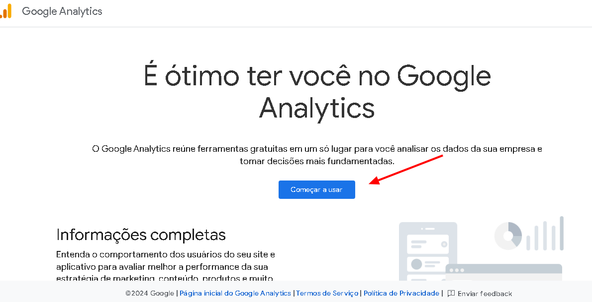

#### Passo 2: Configurar Propriedade GA4

1. **Configurar a Conta**:
    - Dê um **nome** para sua conta (por exemplo, "Vida Mansa Bistro").
    - Configure as opções de compartilhamento de dados conforme suas preferências e clique em **"Próximo"**.

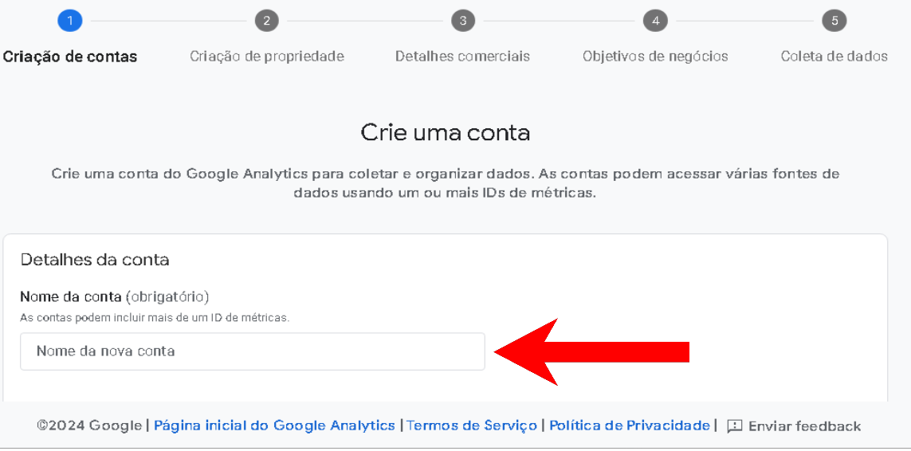

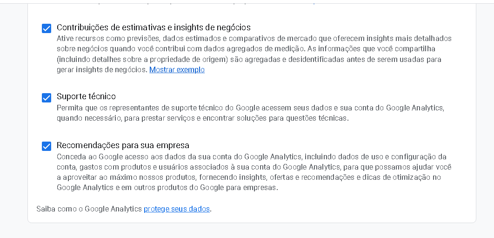

1. **Configurar a Propriedade**:
    - Dê um nome à sua propriedade (por exemplo, "Website Demonstracao").
    - Selecione seu fuso horário e moeda.
    - Clique em "Próximo".

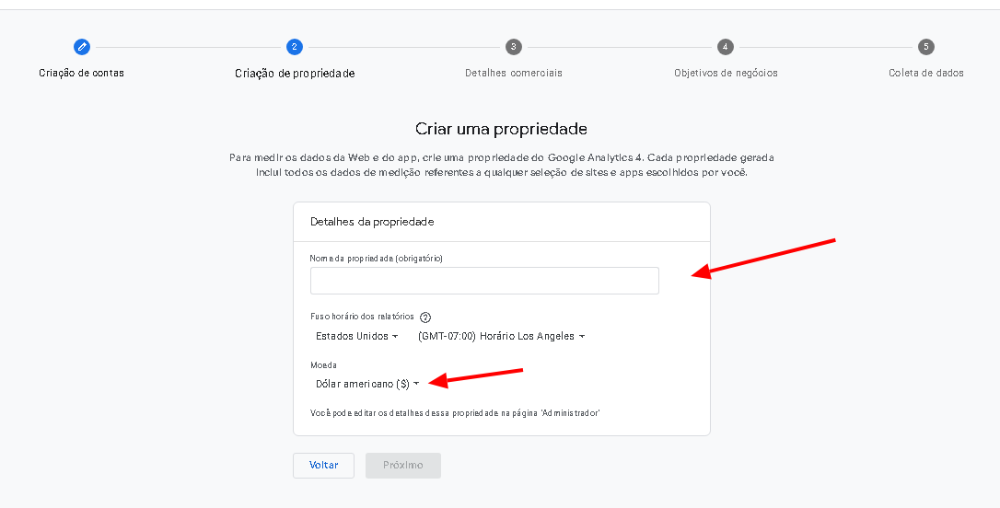

1. **Configurar Detalhes da Empresa**:
    - Selecione a **categoria da indústria**, o **tamanho da empresa** e como pretende usar o Google Analytics.
    - Clique em "**Criar**".

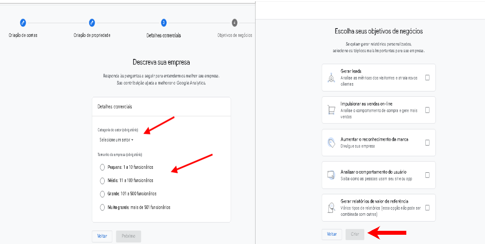

1. **Aceitar os Termos de Serviço**:
    - Leia e **aceite** os Termos de Serviço do **Google Analytics** e a Política de Processamento de Dados da Google.

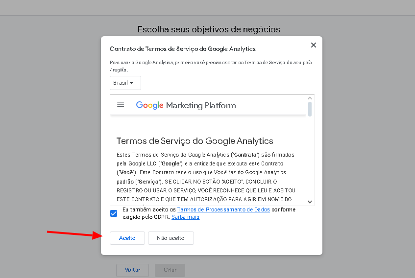

#### Passo 3: Obter o ID de Medição GA4

1. **Adicionar um Fluxo de Dados**:
    - Escolha "**Web**" como plataforma para rastrear.
    - Insira a URL do **seu** site ([https://demonstracao.facitydelivery.com.br/](https://demonstracao.facitydelivery.com.br/)[)](https://bistrovidamansa.facitydelivery.com.br/) "‌") e um nome do fluxo (**por exemplo**, "Website Demonstracao").
    - Clique em "**Criar Fluxo**".

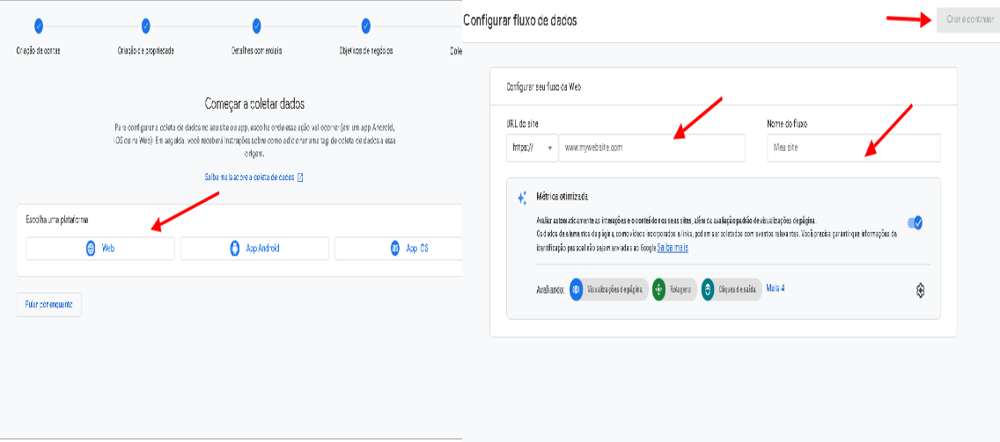

1. **Obter o ID de Medição**:
    - Será exibido um ID de medição (algo como "G-XXXXXXX"). Copie este ID.

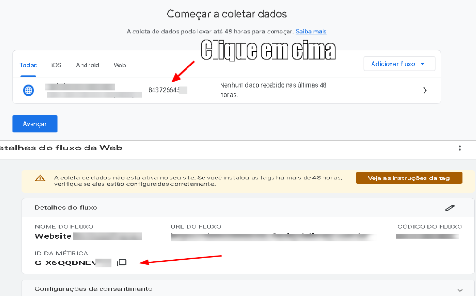

#### Passo 4: Adicionar o ID ao Seu Site

1. **Acessar o Painel de Administração do Seu Site (Facity)**:
    - Faça login no painel de administração do seu site no Facity Delivery.

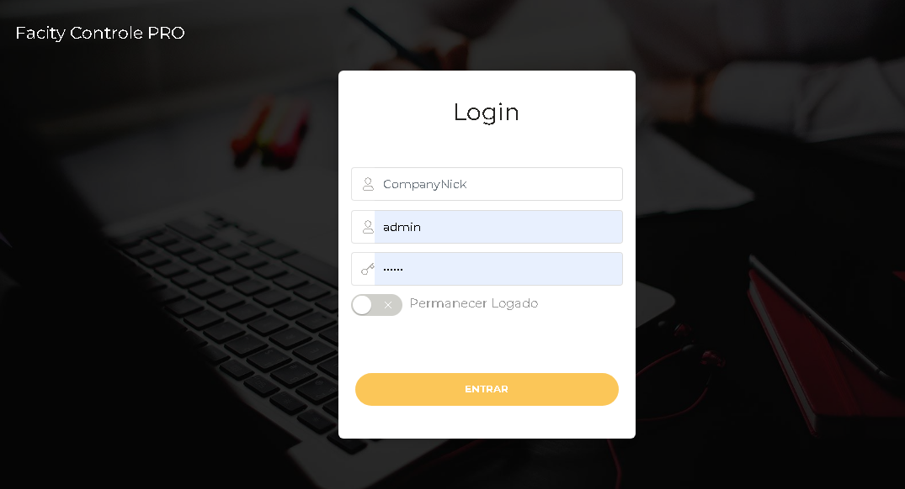

1. **Adicionar o ID de Medição**:
    - No painel Facity, vá para **Configurações** > **Configurações**.

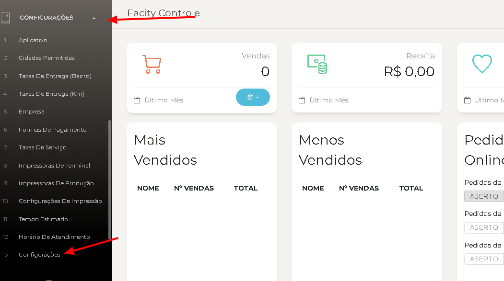

1. Procure pela configuração "**googleadsgtag**".
    - Edite a configuração clicando no **botão verde de edição**.
    - Cole o **ID** de medição (G-XXXXXXX) no campo apropriado e **salve** as alterações.  
        **Alternativa**:
    - Se preferir, você pode passar o código G-XXXXXXX para o **suporte do Facity** e eles farão a alteração para você.

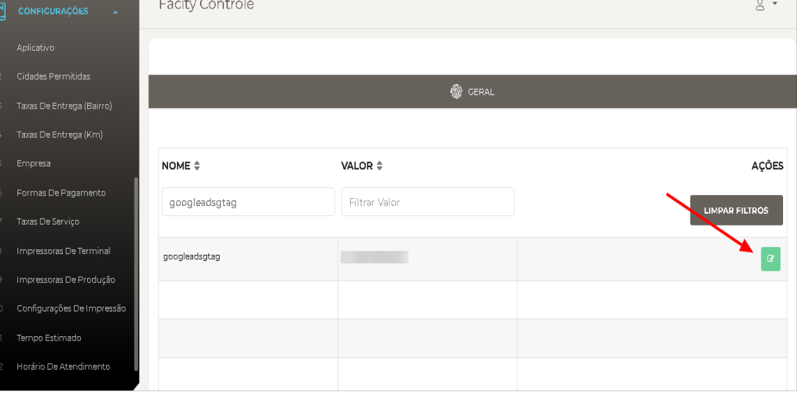

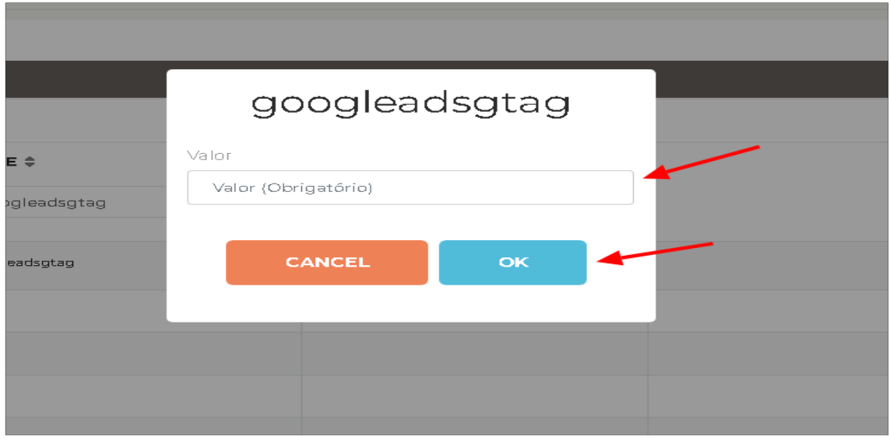

#### Passo 5: Verificar se o Rastreamento Está Funcionando

1. **Acessar o Google Analytics**:
    - Volte para o painel do **Google Analytics**.
2. **Verificar os Relatórios**:
    - Vá para a seção "**Tempo Real**" e veja se há atividade no seu site. Caso contrário, aguarde alguns minutos e **atualize** a página.

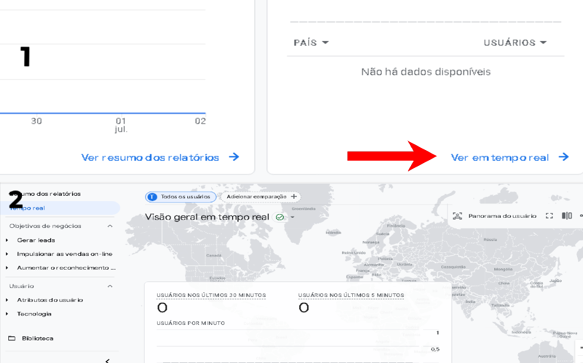

**Parabéns**! Você configurou com sucesso o **Google Analytics** para o seu site . Agora você pode monitorar o tráfego e o comportamento dos usuários para obter insights valiosos sobre o desempenho do seu site.
