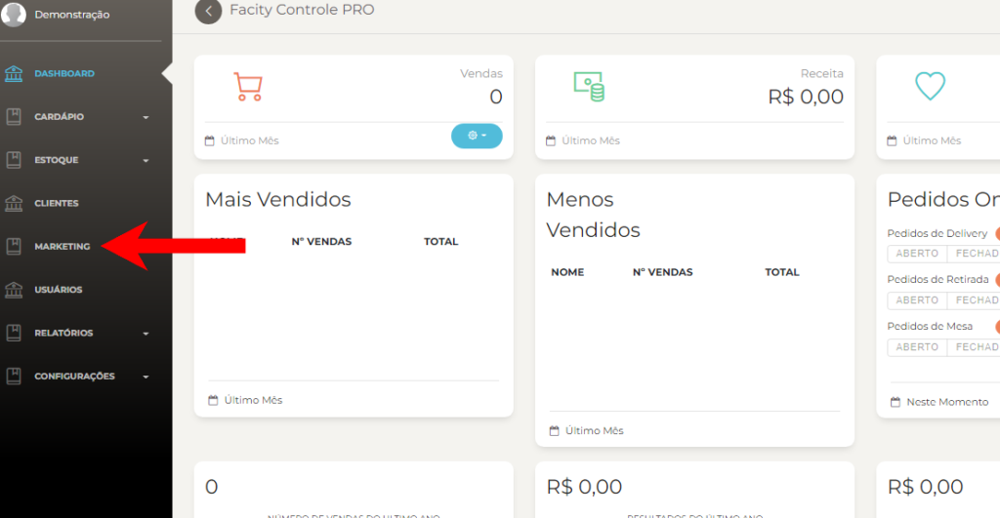
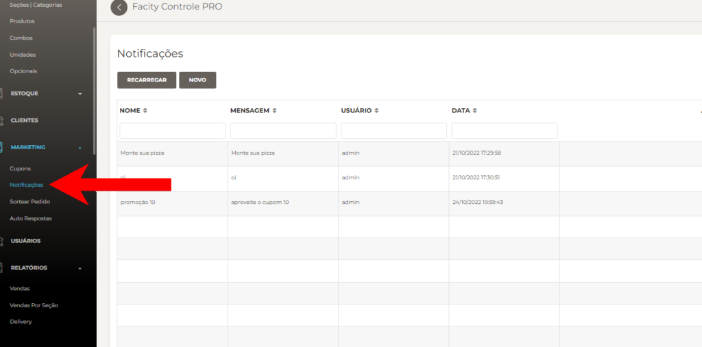
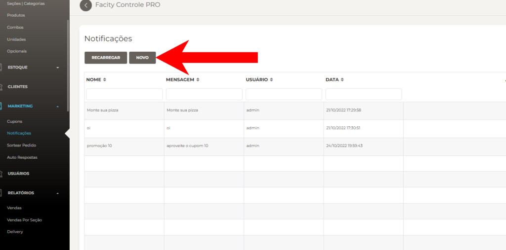
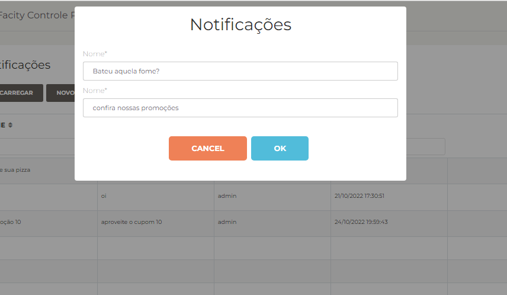

**Passo 1:** Acesse o **Facity Controle**

Abra o **Facity Controle** em seu computador e insira o **nome da empresa**, **login** e **senha**. Certifique-se de que tudo esteja em **letras minúsculas**.

**Passo 2:** Acesse o menu de **marketing**

Uma vez logado no **Facity Controle**, clique em **marketing** no menu lateral esquerdo.

**Passo 3:** Crie uma nova notificação

Na página de **marketing,** selecione a opção **NOTIFICAÇÕES** e, em seguida, clique em **NOVO** para criar uma nova notificação.

**Passo 4:** Configure sua notificação

Ao criar uma nova notificação, você poderá personalizá-la de acordo com o que deseja comunicar. Inclua um título para sua notificação, uma breve descrição.

**Notificações** servem para avisar clientes de promoções ou até mesmo comunicado para fazer aquela propaganda e incentivar a fazer uma compra

**Passo 5:** Envie sua notificação

Depois de configurar sua notificação, clique em **ENVIAR** para enviá-la aos seus clientes. As notificações serão entregues por meio do aplicativo Facity, que seus clientes precisam ter instalado em seus smartphones.

Exemplo de **notificação** na imagem abaixo:

**Passo 6:** Acompanhe suas notificações

Todas as notificações que você enviar ficarão armazenadas no histórico, e você poderá acessá-las sempre que precisar.

Com o **Facity Controle**, é fácil criar e enviar notificações aos seus clientes, mantendo-os sempre atualizados e informados sobre as novidades e promoções do seu negócio.
