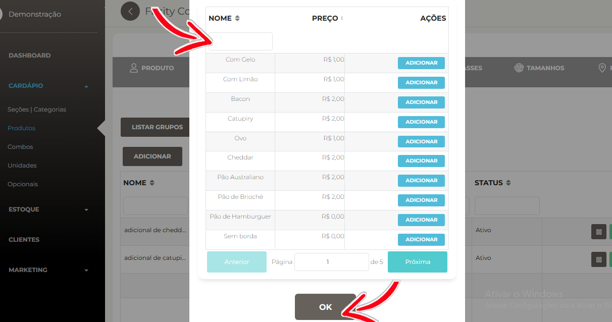
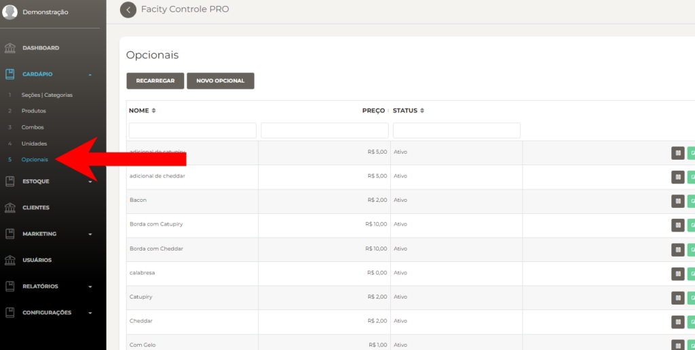
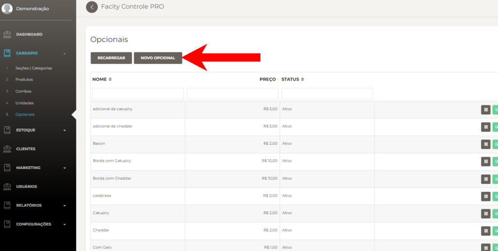
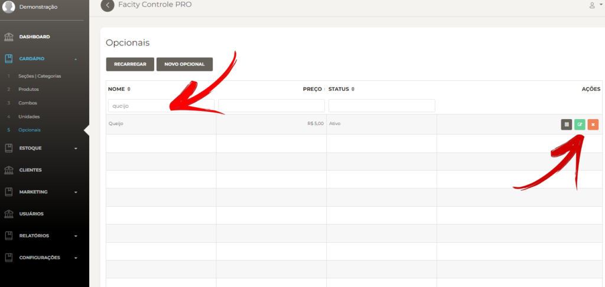
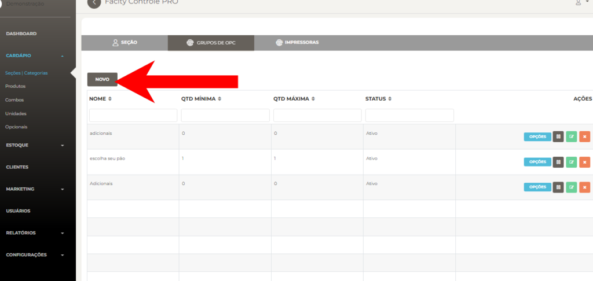
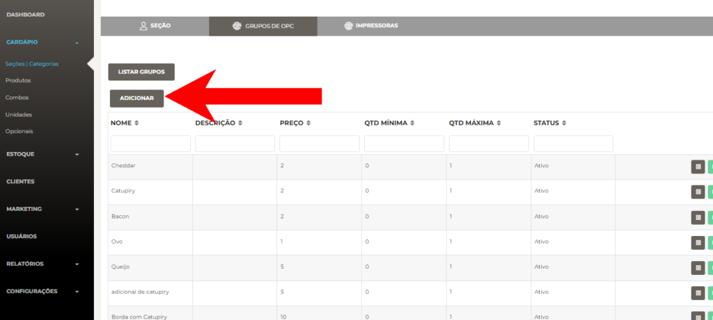
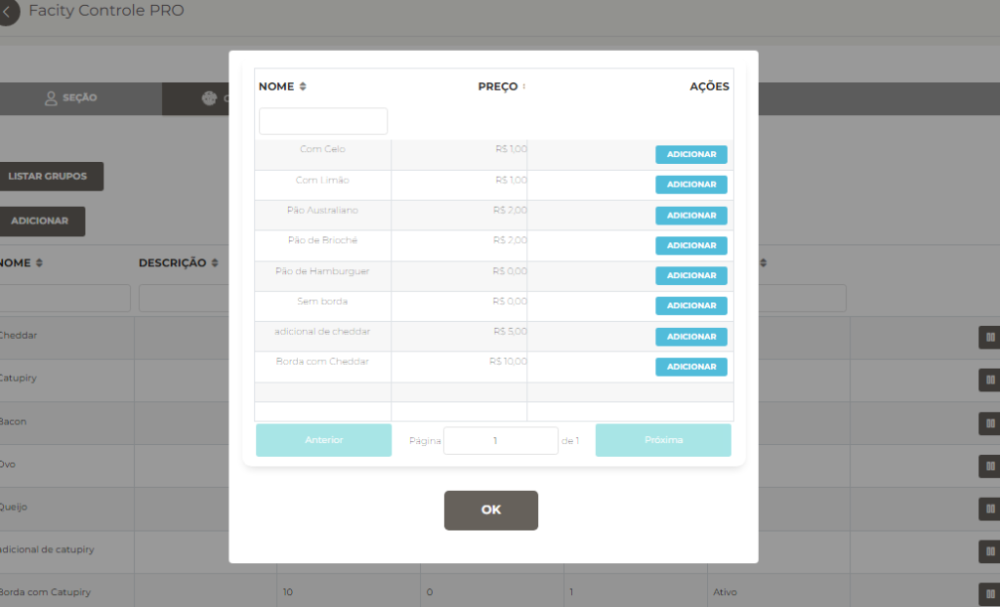

**Passo 1:** Abrir o **Facity Controle** e fazer login

Para começar, abra o **Facity Controle** em seu computador e insira o **nome da empresa**, **login** e **senha**. É importante lembrar que tudo deve ser escrito em _letras minúsculas_.

**Passo 2:** Acessar o menu e buscar a opção **"opcionais"**

Após fazer login, acesse o menu e busque pela opção **"opcionais"**. Selecione essa opção e clique em **"novo opcional"**.

**Passo 3:** Criar novos opcionais

Nesse passo, você vai criar os seus opcionais. Por exemplo, você pode criar opções como **ovo**, **queijo**, **bacon**, **cebola** ou outras que desejar. Clique em **"OK"** para finalizar.

**Passo 4:** Buscar e editar opcionais

Para buscar e editar um opcional, vá em **"menu"**, **"opcional"** e encontre o produto a ser editado. Se quiser mudar o valor ou outra informação, clique no **ícone verde**.

Se quiser mudar o valor e outra informação clique no **ícone verde**.

**Passo 5:** Adicionar opcionais à **seção** ou **produto**

A próxima etapa é adicionar o opcional à **seção** ou ao **produto**. Se você adicionar o opcional ao **produto**, ele ficará disponível apenas para aquele **produto específico**. Se você adicionar à **seção**, ele ficará disponível para todos os **produtos daquela seção**. O processo de criação do opcional é o mesmo, só muda onde você vai adicioná-lo.

**Passo 6:** Acessar o menu **"cardápio"** e depois **"seções/categorias"**

Acesse o menu **"cardápio"** e selecione a opção **"seções/categorias"**.

**Passo 7:** Editar a seção

Clique no **ícone verde** para abrir a página de editar a seção.

**Passo 8:** Buscar **"grupo de opc"** e criar um novo grupo

_Caso você queira adicionar a um grupo existente pule essa etapa_

- Crie um novo **Grupo de** **Opc** clicando e **Novo:**

Se quiser adicionar a um grupo existente, pule essa etapa. Para criar um novo grupo de opc, clique em **"novo"** e coloque o nome do grupo de opc e a quantidade mínima e máxima que poderá ser adicionada. Se colocar a quantidade igual a 0, não haverá limite quando for adicionar opcionais nesse grupo.

<figure>

<figcaption>

Se colocar a quantidade igual 0 você não vai ter um limite quando for adicionar opcionais nesse grupo

</figcaption>

</figure>

- Clique em **OK** e grupo está feito!

**Passo 9:** Adicionar opcionais ao grupo

Com o grupo criado, volte em **"grupo de opc"** dentro da seção correspondente. Clique no ícone azul e selecione **"adicionar"**. Vai abrir uma lista com todos os opcionais criados.

Adicione todos os opcionais que você criou para esse grupo. Clique em **"OK"** para salvar.

**Passo 10:** Adicionar um opcional para um único produto

Para adicionar um opcional a um único produto, faça o mesmo processo, mas crie o **grupo de opc** diretamente dentro do produto e siga as mesmas etapas.
