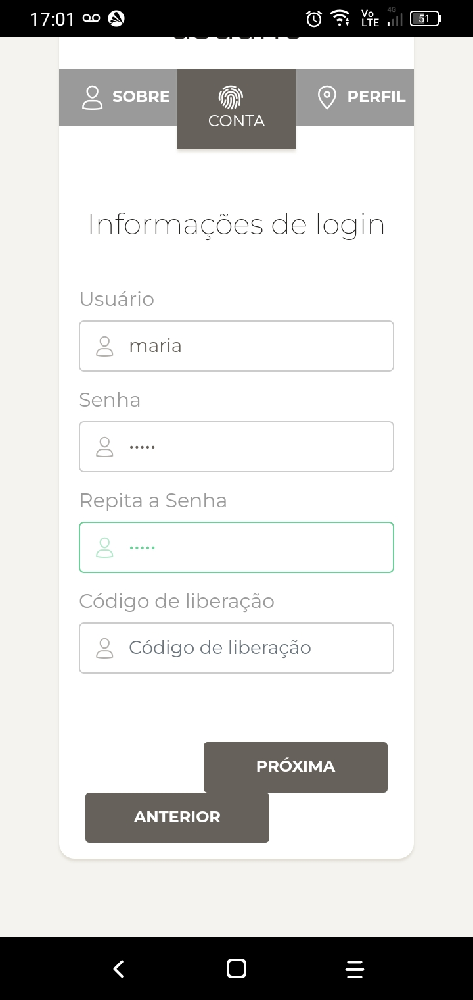
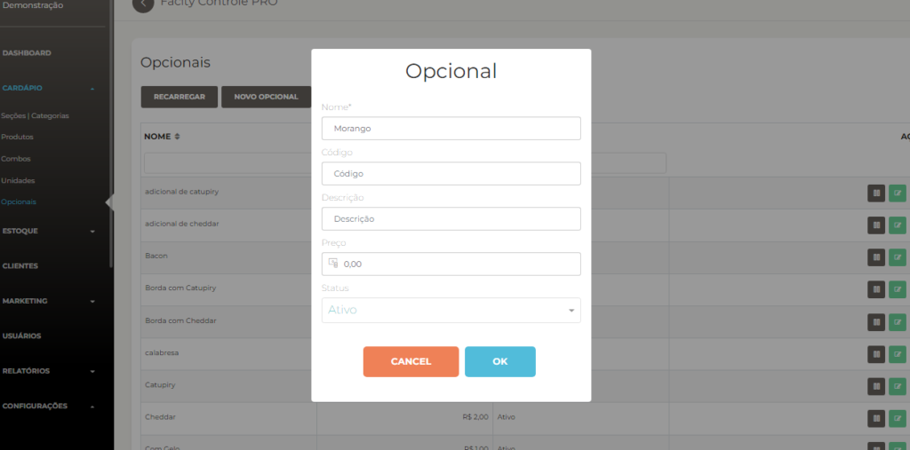
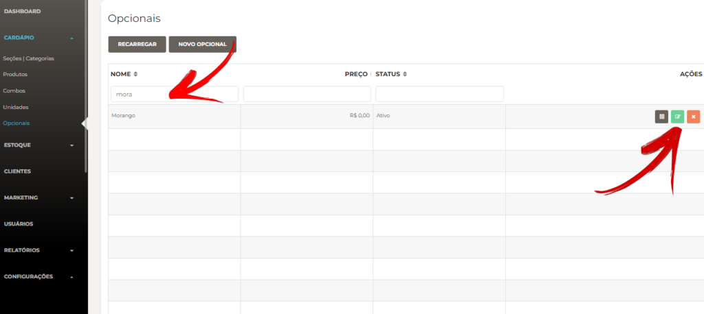
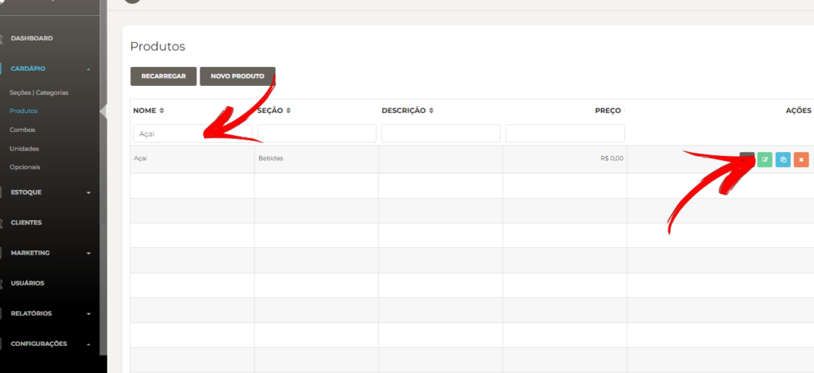
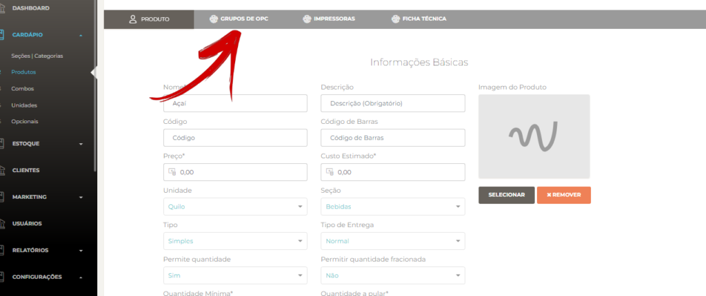
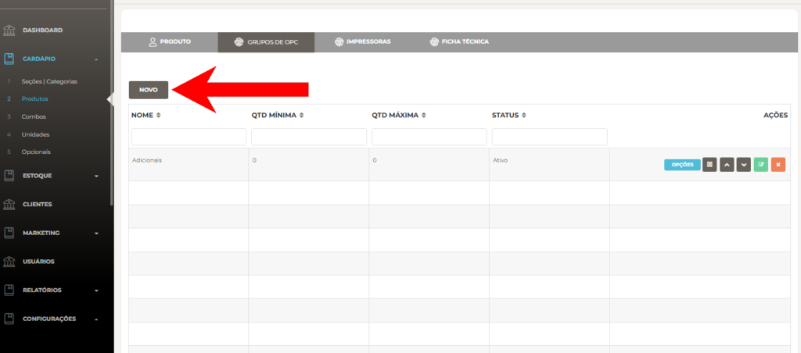
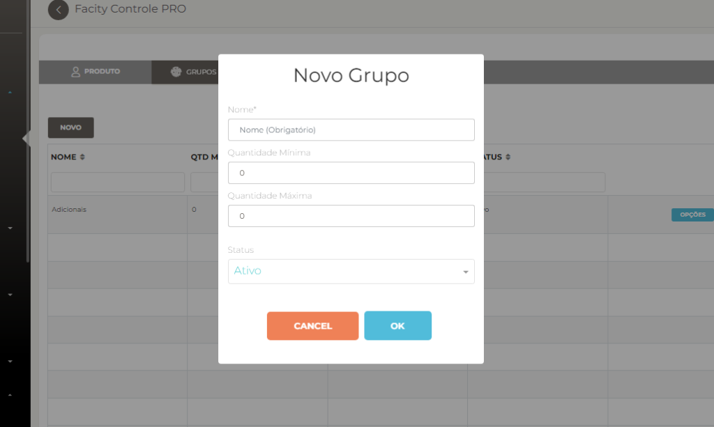
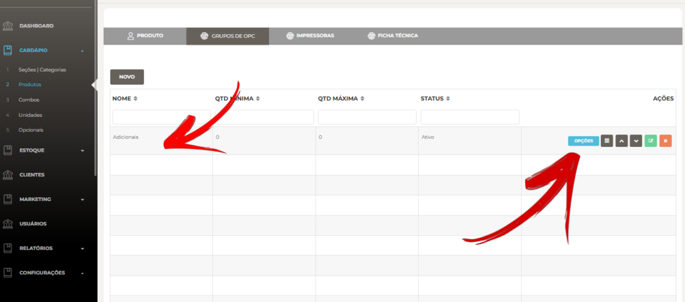
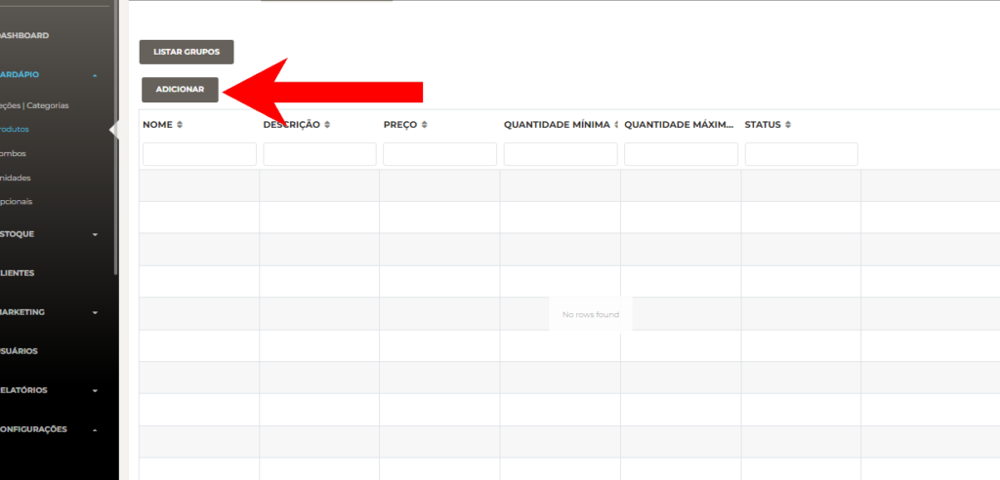
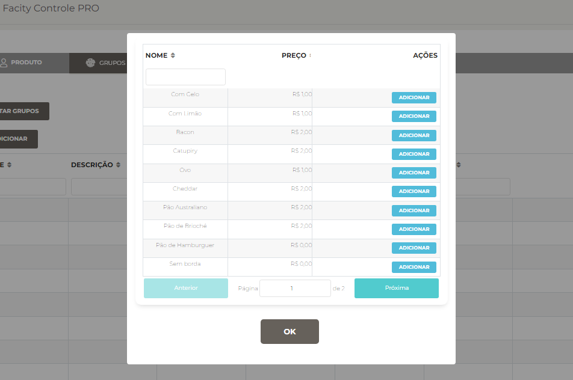

**Passo 1:** Abra o **Facity Controle** em seu computador

Para começar, abra o **Facity Controle** em seu computador e faça **login** com o **nome da empresa**, **login** e **senha**. Lembre-se de digitar tudo em _letras minúsculas_.

**Passo 2:** Acesse o menu e busque a opção **"opcionais"**

No menu do sistema, procure pela opção **"opcionais"** e clique nela.

**Passo 3:** Crie um novo opcional

Dentro de opcionais, selecione a opção **"novo opcional"** para criar um novo opcional. Você pode criar vários tipos de opcionais, como gelo, morango, limão e outras opções que desejar.

Você pode criar vários tipos de **opcionais** no seu **cardápio**:

Exemplos:

- _Gelo_
- _Morango_
- _Limão_

Entre outras opções que você desejar.

Clique em **OK** e está feito!

**Passo 4:** Edite um opcional existente (opcional)

Se precisar editar um opcional existente, vá em **"menu"**, **"opcional"** e encontre o produto a ser editado. Para fazer a edição, clique no ícone verde.

**Passo 5:** Adicione o opcional ao produto

Agora que você já criou os opcionais, é hora de adicioná-los ao produto. Para fazer isso, vá em **"menu"**, **"cardápio"**, **"produtos"** e busque o produto desejado. Em seguida, clique no ícone verde para abrir a página de edição do produto.

Dentro da página de edição do produto, busque a opção **"grupo de opc"** e clique nela.

**Passo 6:** Crie um novo grupo de opcionais

Crie um novo grupo de opcionais clicando em **"novo"**. Em seguida, coloque o nome do grupo de opc e a quantidade mínima e máxima que poderá ser adicionada.

Se colocar a quantidade igual a 0, você não terá um limite quando adicionar opcionais nesse grupo. Depois, clique em **"OK"** e o grupo estará pronto.

**Passo 7:** Adicione o opcional ao grupo

Com o grupo criado, volte em **"grupo de opc"** dentro do produto e clique no ícone azul.

Em seguida, selecione **"adicionar"** para abrir uma lista com todos os opcionais criados.

Adicione o opcional que você criou para esse grupo e clique em **"OK"** para salvar.

<figure>

<figcaption>

Busque o nome do opcional que você que criou e adicione ele

</figcaption>

</figure>

Pronto! Agora você já sabe como criar opcionais e adicioná-los em um produto usando o **Facity Controle.** Essas informações são importantes para o controle do estoque e para facilitar a venda.
