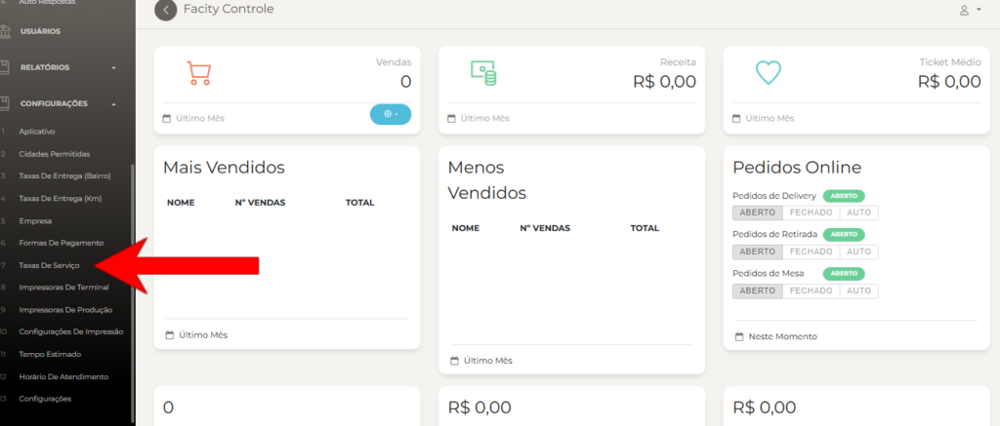
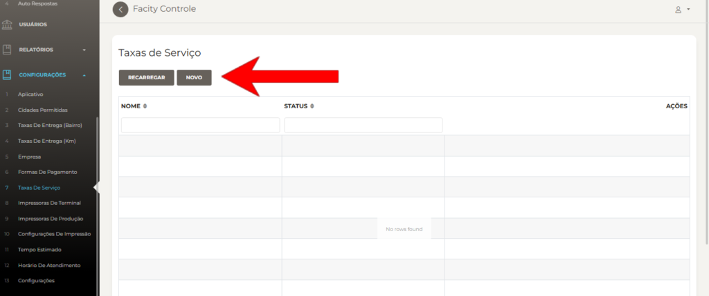
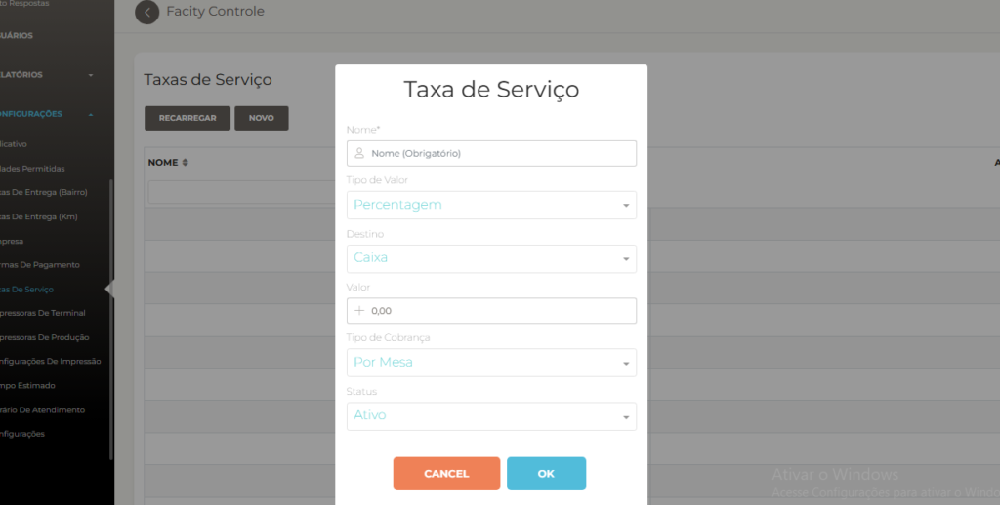
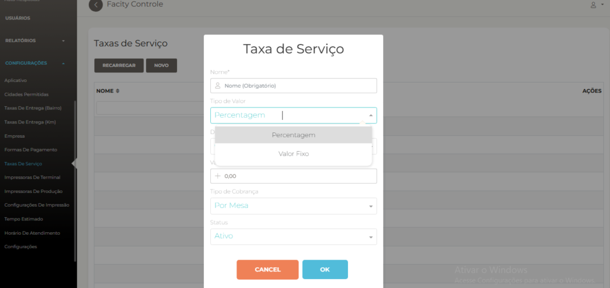
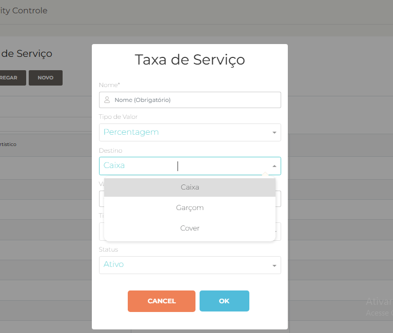
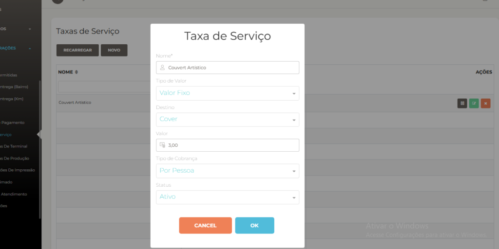
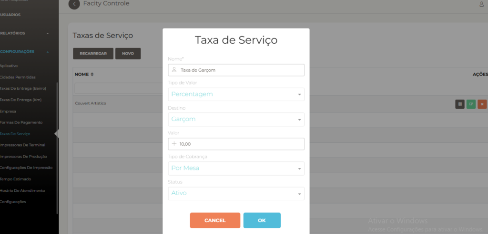

Hoje, iremos aprender como criar **Taxas de Serviço** no Facity Controle, uma funcionalidade essencial para o gerenciamento eficiente do seu negócio. Vamos seguir um passo a passo simples e explicativo. Vamos lá!

**Passo 1:** Acesse o Facity Controle

Para começar, acesse o **Facity Controle** em seu computador e faça login usando suas credenciais. Certifique-se de que o nome da empresa, login e senha estejam em _letras minúsculas_ para evitar problemas de acesso.

**Passo 2:** Acesse as Configurações e selecione **"Taxas de Serviço"**

Após fazer login, você estará na área administrativa do Facity Controle. Agora, clique na opção **"Configurações"** no menu. Em seguida, procure pela opção **"Taxas de Serviço"** e clique nela.

**Passo 3:** Adicione uma nova taxa

Ao acessar a seção de **"Taxas de Serviço"**, você verá a opção **"Novo"**. Clique nesse botão para criar uma nova taxa.

**Passo 4:** Preencha os detalhes da taxa de serviço

Agora, é o momento de preencher os detalhes da sua nova taxa de serviço. Comece inserindo o nome da taxa que você deseja adicionar.

**Tipos de valor:** Você pode escolher entre dois tipos de variações para a taxa - **porcentagem** ou **valor fixo**. Selecione o que melhor se adequa às suas necessidades.

**Destino da taxa de serviço:** Nesta etapa, escolha entre as opções **"Caixa"**, **"Garçom"** ou **"Cover"** (Couvert Artístico) como destino da taxa.

**Tipo de cobrança:** Escolha o tipo de cobrança que melhor se aplica à sua taxa. As opções disponíveis podem variar, mas normalmente incluem **"Por Mesa"** ou **"Por Pessoa"**.

**Passo 5:** Exemplos de Taxas de Serviço

Aqui estão alguns exemplos de como preencher os campos da taxa de serviço:

_Exemplo de Taxa de Serviço de Couvert Artístico:_

_Exemplo de Taxa de Serviço Garçom:_

**Passo 6:** Status da taxa

No campo "Status", você pode optar por deixar a taxa **"Ativa"** ou **"Inativa"** de acordo com a necessidade. Quando estiver tudo configurado, clique em **"OK"** para salvar as informações da taxa de serviço.

Parabéns! Agora você criou com sucesso uma nova taxa de serviço no **Facity Controle**. Essa configuração ajudará na organização financeira do seu negócio.

Espero que este tutorial tenha sido útil e que você possa aproveitar ao máximo essa funcionalidade. Se tiver alguma dúvida, não hesite em deixar seu comentário abaixo. Boa gestão e até a próxima!
