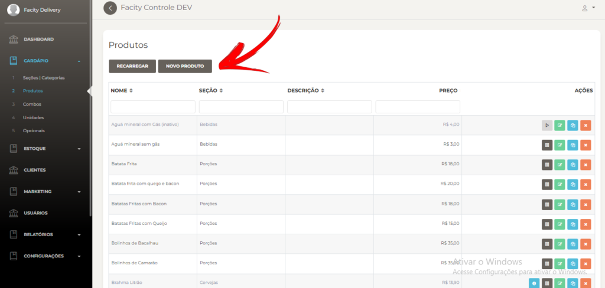
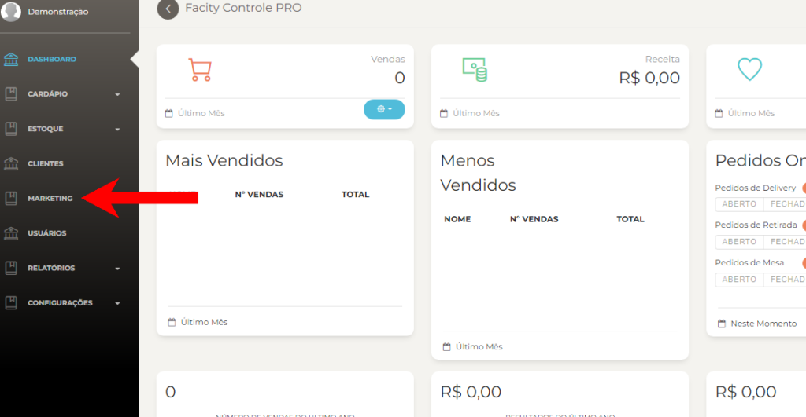
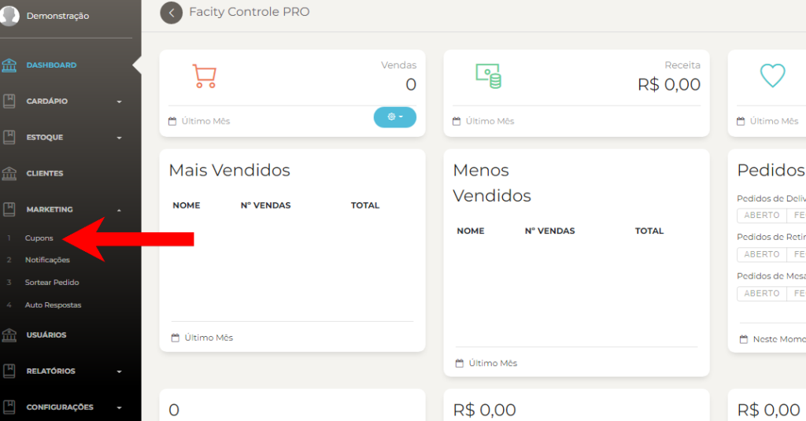
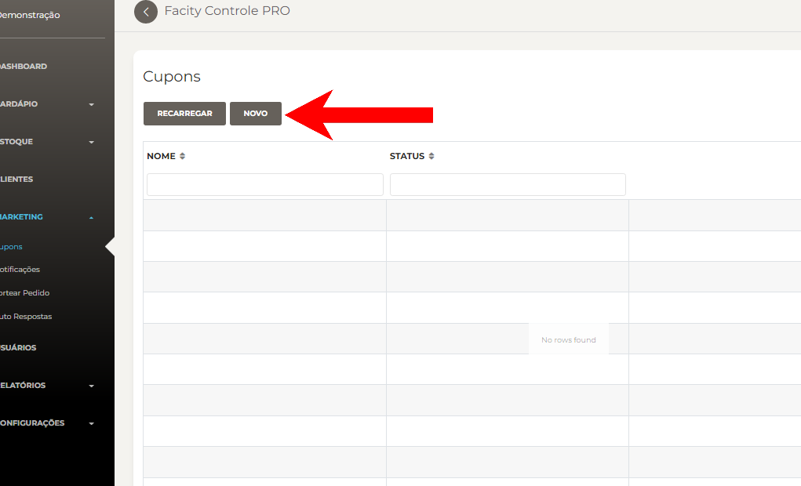
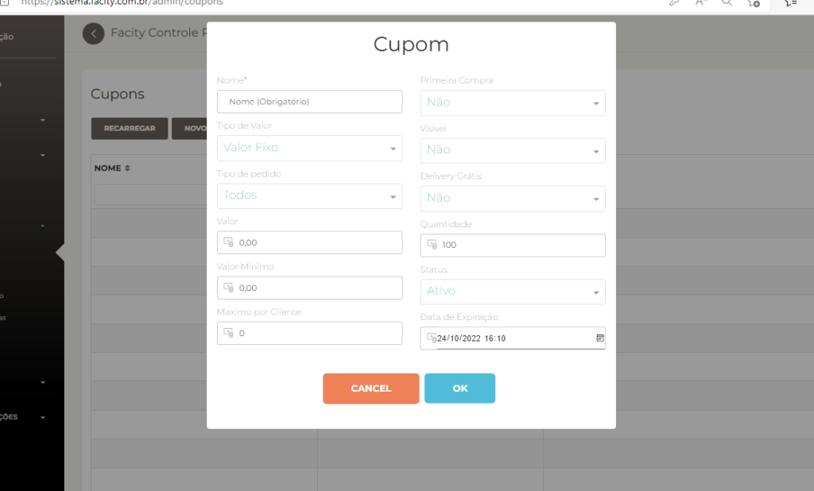
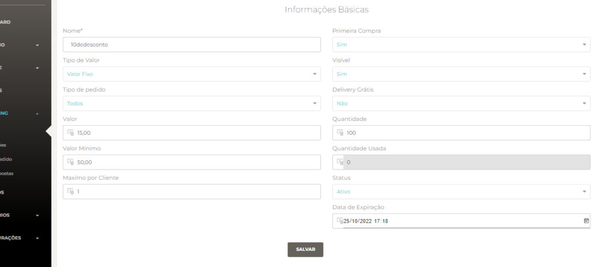
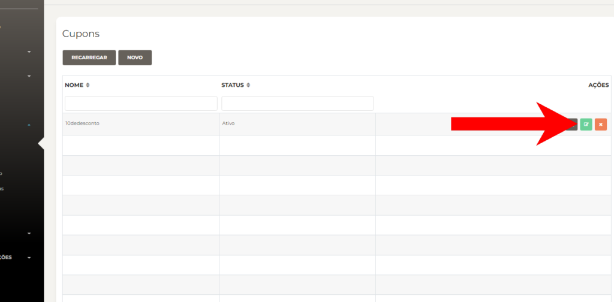

**Passo 1:** Acesse o **Facity Controle**

Para começar, acesse o **Facity Controle** em seu computador e faça login usando suas credenciais. Certifique-se de que o **nome da empresa**, **login** e **senha** estejam em _letras minúsculas_.

**Passo 2:** Acesse o menu **"Marketing"**

No menu lateral esquerdo do **Facity Controle**, clique em **"Marketing"**.

**Passo 3:** Selecione **"Cupons"**

Dentro do menu **"Marketing"**, selecione **"Cupons"**.

**Passo 4:** Crie um novo cupom

Clique no botão **"Novo"** para começar a criar um novo cupom.

**Passo 5:** Insira as informações do cupom

Preencha as informações do **cupom** incluindo o **nome**, tipo de **valor** (**fixo ou percentual**), tipo de **pedido** (**delivery, mesa, retirada**), valor do **cupom**, valor **mínimo da compra** para que o cupom fique **disponível**, **máximo** por cliente, **primeira** compra (**sim ou não**), visibilidade (**sim ou não**), frete grátis (**sim ou não**), quantidade de cupons disponíveis, status (**ativo ou inativo**) e **data** de expiração.  
  
No campo "**Nome**", é aconselhável inserir algo simples, pois este também funciona como identificador do cupom; por exemplo, "**#10reais**" ou "**primeiracompra**". O campo "**Primeira Compra**" restringe o uso do cupom apenas àqueles que nunca realizaram pedidos pelo aplicativo. O "**Campo Tipo de Valor**" determina se o campo "**Valor**" se refere a **reais** ou a **percentual**. Por exemplo, se estiver configurado como "**Percentual**", o campo "**Valor**" deverá ser interpretado como o percentual de desconto na compra. O campo "**Visível**" determina se o cupom criado aparecerá na lista de cupons dentro do app de pedidos; se marcado como "**Não**", apenas os clientes que souberem o **código (Nome)** do cupom poderão utilizá-lo. O campo "**Delivery Grátis**" estabelece se o cupom, além de oferecer o desconto especificado, também eliminará a **taxa de entrega** do pedido.

O campo "**Valor**", conforme definido anteriormente, será um percentual de desconto ou um valor em reais, conforme estabelecido pelo campo "**Tipo de Valor**". O campo "**Quantidade**" limita o número total de usos de um cupom. "**Valor Mínimo**" restringe a utilização do cupom a compras que atingirem o valor mínimo estipulado. "**Mínimo por Cliente**" determina quantas vezes um mesmo cupom pode ser usado por cada cliente; por exemplo, um cupom que **não é exclusivo** para a "**Primeira Compra**" e está com "**Máximo por Cliente**" igual a **3**, poderá ser utilizado até três vezes pelo mesmo cliente. "**Data de Expiração**" especifica a data e hora em que o cupom deixará de ser válido, esse campo é importante, para que o cupom funcione corretamente ele deve estar selecionado com um **data futura**.

**Passo 6:** Salve o cupom

Quando terminar de preencher todas as informações do cupom, clique em **"Salvar"** para salvá-lo.

- Exemplo de um cupom de 15 reais de desconto:

Mudando **tipo de valor** você pode deixar esse cupom com 15% de desconto no valor da compra e o **valor mínimo** torna esse cupom disponível para uso só para compras acima de 50,00 reais.

**Passo 7:** Edite o cupom, se necessário

Se precisar editar o cupom mais tarde, volte à página **"Cupons"** e clique no ícone verde ao lado do cupom que deseja editar.

Com estes passos simples, você pode criar e gerenciar cupons de desconto para sua empresa.
