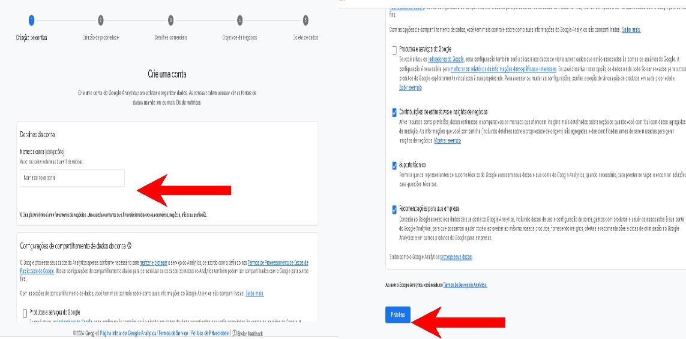

## **Receba pagamentos PIX com mais segurança e praticidade pelo Mercado Pago!**

Temos o prazer de anunciar uma **novidade incrível** para facilitar ainda mais a vida de nossos clientes: a **integração do pagamento PIX com o Mercado Pago** em nosso sistema!

**Com essa integração, você desfruta de:**

- **Segurança reforçada:** seus pagamentos PIX serão processados pelo Mercado Pago, plataforma reconhecida por sua confiabilidade e tecnologia avançada de proteção contra fraudes.
- **Praticidade incomparável:** os pedidos só serão processados após a confirmação do pagamento, eliminando transtornos e otimizando seu fluxo de trabalho.
- **Conciliação automática:** as transações PIX serão automaticamente conciliadas com o Mercado Pago, facilitando o acompanhamento do seu histórico financeiro e a gestão do seu negócio.

**Além disso, oferecemos:**

- **Taxa competitiva:** Para cada transação PIX realizada pelo Mercado Pago, você paga apenas **1,5%**, uma das taxas mais baixas do mercado.
- **Suporte dedicado:** nossa equipe de especialistas está à disposição para te auxiliar na ativação da integração e te orientar em qualquer dúvida que você tenha.

**Para habilitar essa funcionalidade em sua conta, basta entrar em contato conosco!**

Como criar uma conta no **Mercado Pago** como Pessoa Física:

- **Baixe o app:**

**Android:** Play Store: [Clique aqui](https://play.google.com/store/apps/details?id=com.mercadopago.wallet) 👈

**iOS:** App Store: [Clique aqui](https://apps.apple.com/br/app/mercado-pago-cuenta-digital/id925436649?l=en-GB) 👈

Após baixar o **app** comece a criar sua conta seguindo esses passos abaixo 

1. **Abra o app e toque em "Criar uma conta".**
2. **Selecione "Brasil" e "Criar conta pessoal".**
3. **Aceite os termos e condições.**
4. **Valide seu e-mail e digite seu CPF.**
5. **Tire uma selfie e faça upload de um documento com foto.**
6. **Siga as instruções para confirmar seu celular.**
7. **Insira seu endereço e renda mensal.**
8. **Responda se você é PEP (Pessoa Exposta Politicamente).**

**Pronto! Sua conta está criada!**

**Com o Mercado Pago, você tem tudo que precisa para gerenciar suas finanças com segurança e praticidade.**

## Criando uma conta no Mercado Pago como Pessoa Jurídica:

**Criar sua conta é rápido e fácil:**

1. **Baixe o app:**
    - **Android:** Play Store: [Clique aqui](https://play.google.com/store/apps/details?id=com.mercadopago.wallet) 👈
    - **iOS:** App Store: [Clique aqui](https://apps.apple.com/br/app/mercado-pago-cuenta-digital/id925436649?l=en-GB) 👈

Após baixar o **app** comece a criar sua conta seguindo esses passos abaixo 👇

1. **Abra o app e toque em "Criar conta".**
2. **Selecione "Brasil" e "Criar conta empresa".**
3. **Aceite os termos e condições.**
4. **Preencha os dados da sua empresa, incluindo CNPJ.**
5. **Informe a renda mensal da empresa.**
6. **Responda se há beneficiários finais com no mínimo 25% de participação.**
7. **Confirme as informações e selecione sua função na empresa.**
8. **Tire uma selfie e faça upload de um documento com foto.**
9. **Siga as instruções para confirmar seu celular.**
10. **Crie sua senha e chave Pix.**

**Pronto! Sua conta PJ está pronta para usar!**
