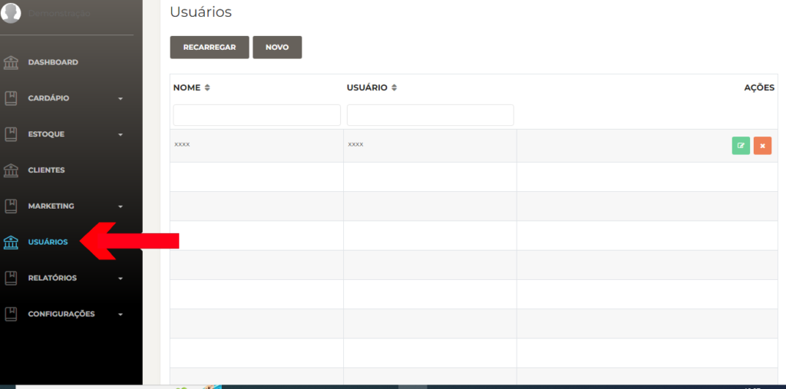
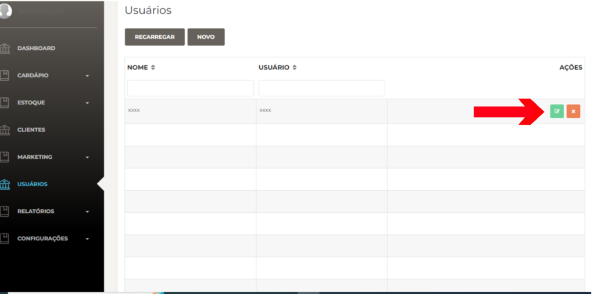
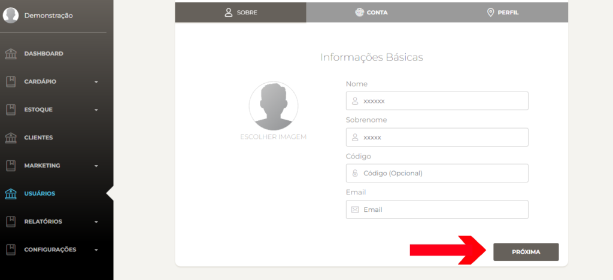
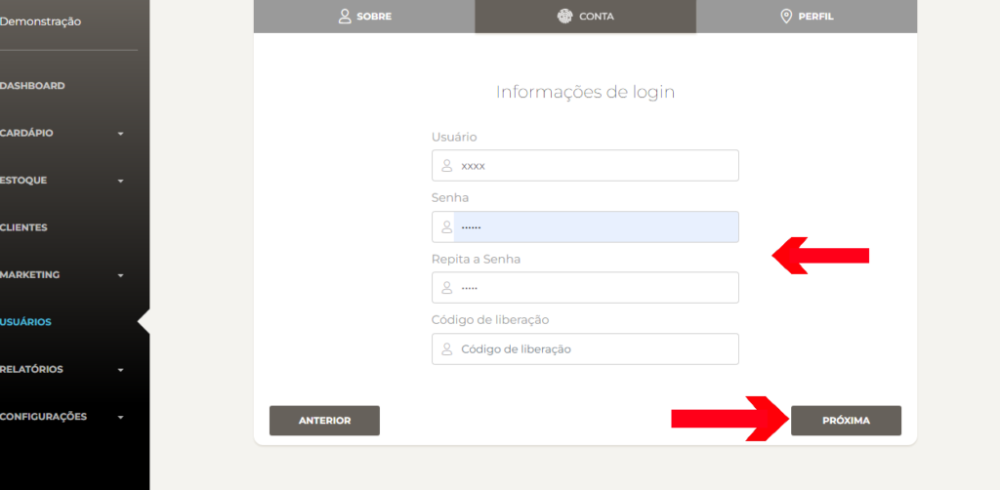
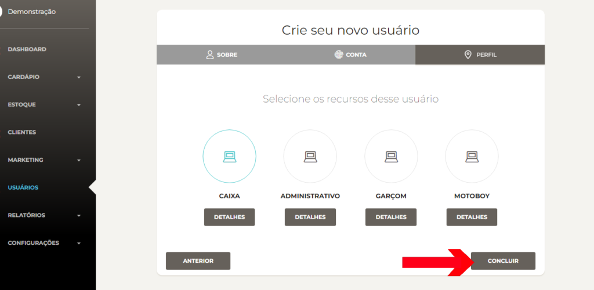

Passo a passo para editar um usuário no **Facity Controle**:

**Passo 1:** Abra o **Facity Controle** em seu computador

- Abra o aplicativo **Facity Controle** no seu computador
- Insira o **nome da empresa**, **login** e **senha** (**lembrando que tudo deve ser inserido em letras minúsculas**)

**Passo 2:** Acesse a opção de usuários

- No menu lateral à esquerda, clique na opção **"Usuários"**

**Passo 3:** Selecione o usuário que deseja editar

- Na lista de usuários, clique no ícone verde localizado ao lado do nome do usuário que deseja editar

- Clique em **PRÓXIMA**

**Passo 4:** Insira uma nova senha (_opcional_)

- Caso deseje alterar a senha do usuário, insira a nova senha nos dois campos onde está escrito **"Senha"** e **"Repita a senha"**

**Passo 5:** Clique em **"Próxima"**

- Depois de inserir as informações necessárias, clique em **"Próxima"**

**Passo 6:** Edite as permissões do usuário (**opcional**)

- Se desejar editar as permissões do usuário, clique em **"Detalhes"**
- Altere as permissões conforme necessário e clique em **"Salvar"** quando terminar

**Passo 7:** Clique em **"Concluir"**

- Depois de editar as informações necessárias, clique em **"Concluir"**

Pronto! O usuário foi editado com sucesso. Com esses simples passos, você pode editar um usuário no **Facity Controle** de forma fácil e rápida, garantindo que as informações estejam sempre atualizadas.
