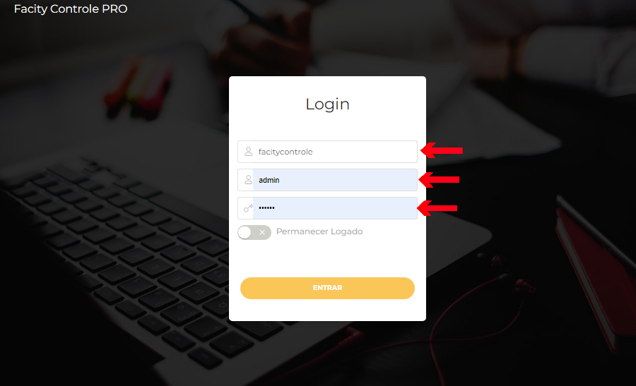
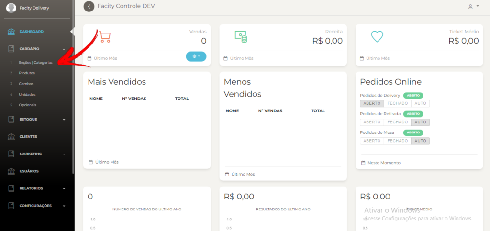
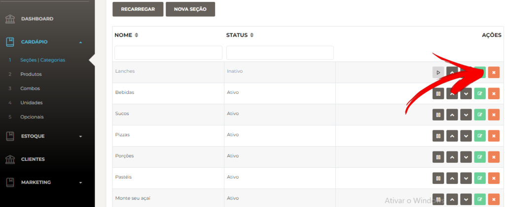
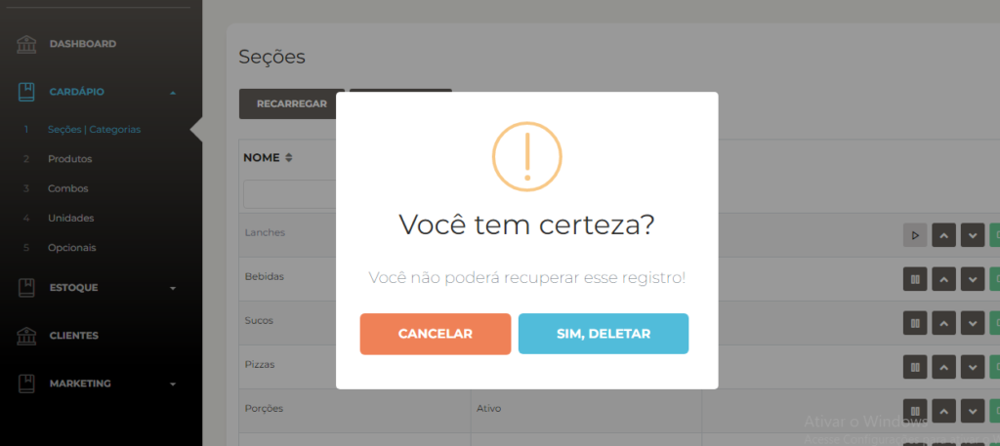
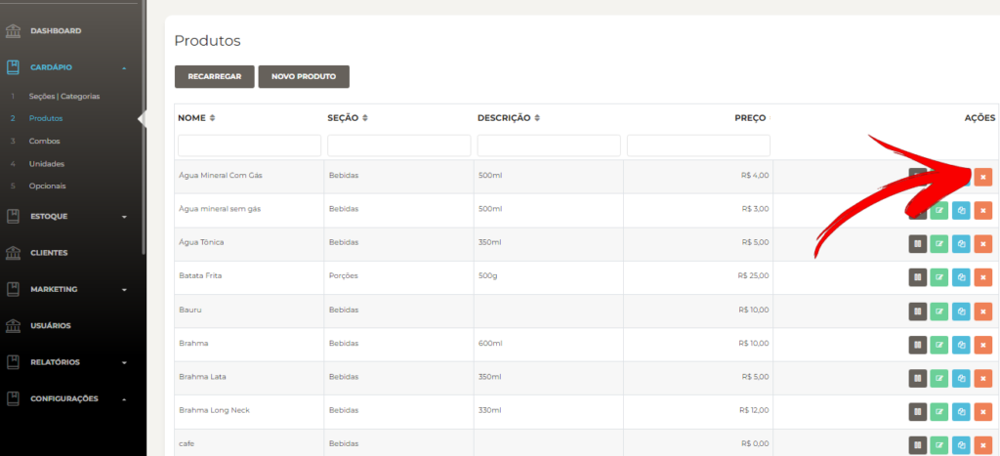
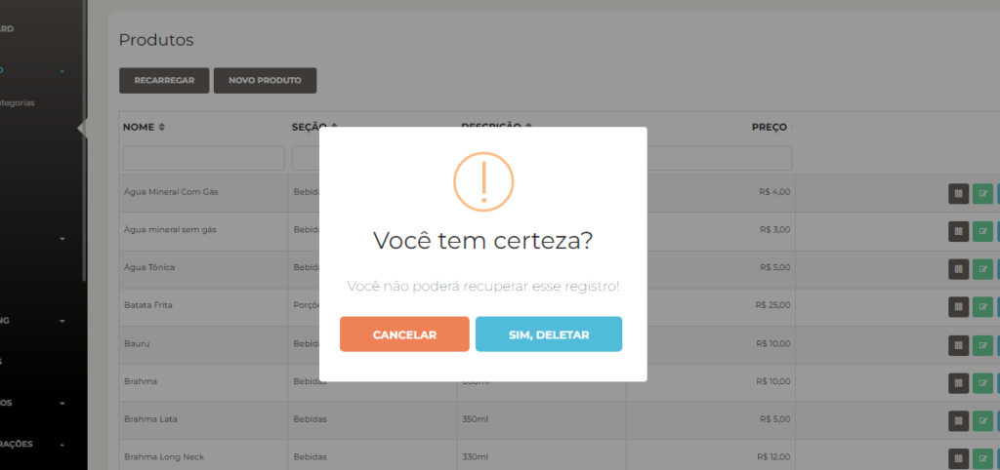

Passo a passo para excluir **seções/categorias** e produtos no **Facity Controle**:

**1** - Abra o **Facity Controle** no seu computador

**2** \- Insira o nome da **empresa, login e senha** (_tudo em letras minúsculas_)

**3 -** Clique em **"Cardápio"**

**4** \- Clique em **"Seções/Categorias"**

**5** - Escolha a **seção/categoria** que deseja excluir

**6 -** Clique no **"X"** em vermelho para deletar

**7** \- Confirme clicando em **"Sim, deletar"**

Para excluir um produto:

- Clique em **"Cardápio"**

- Clique em **"Produtos"**

- Escolha o produto que deseja excluir

- Clique no **"X"** em vermelho para deletar

**8** \- Confirme clicando em **"Sim, deletar"**

Imediatamente! Seguindo esses passos você pode excluir **seções/categorias** e produtos no **Facity Controle.**
