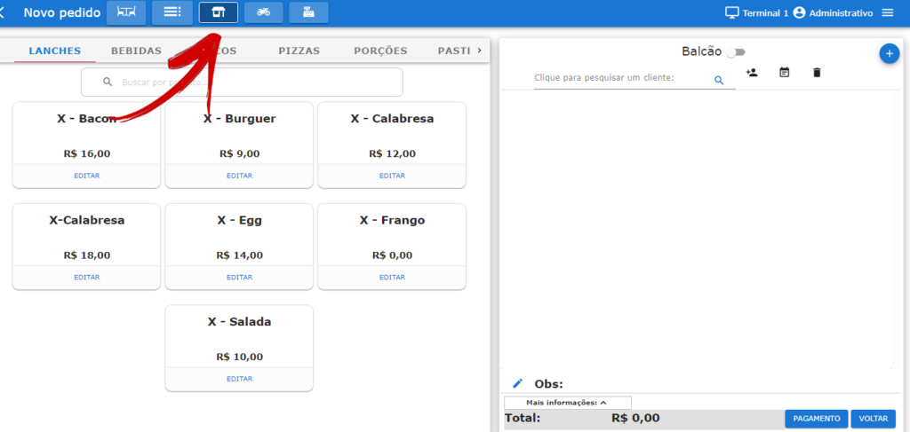
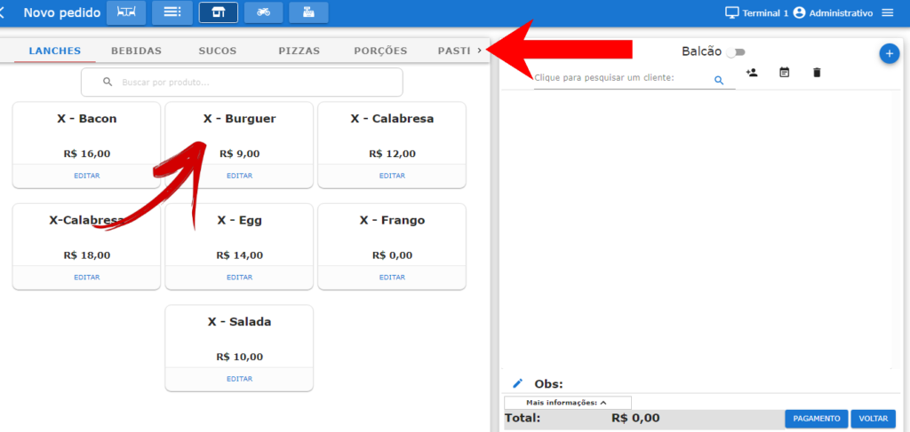
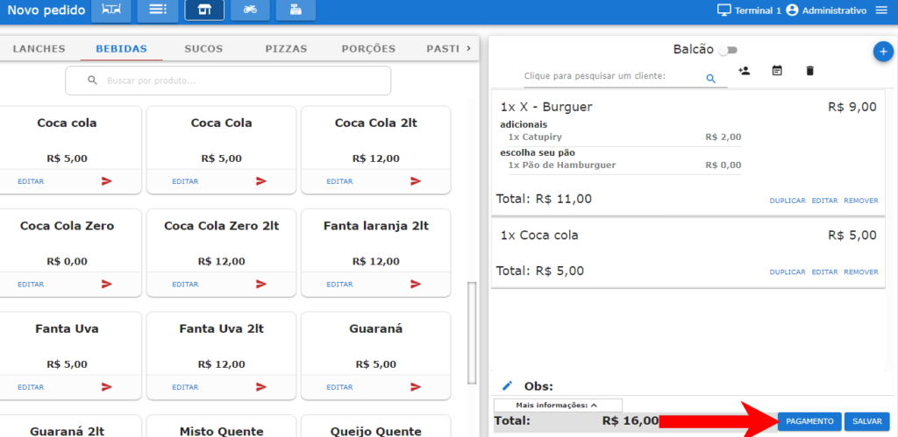
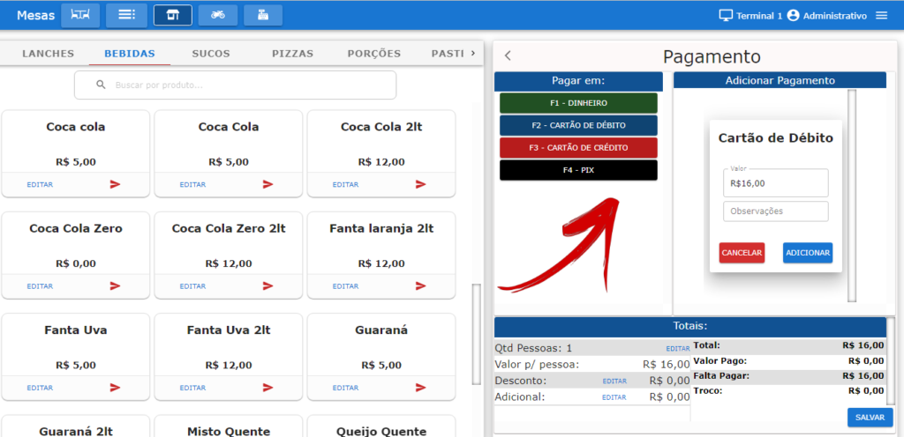
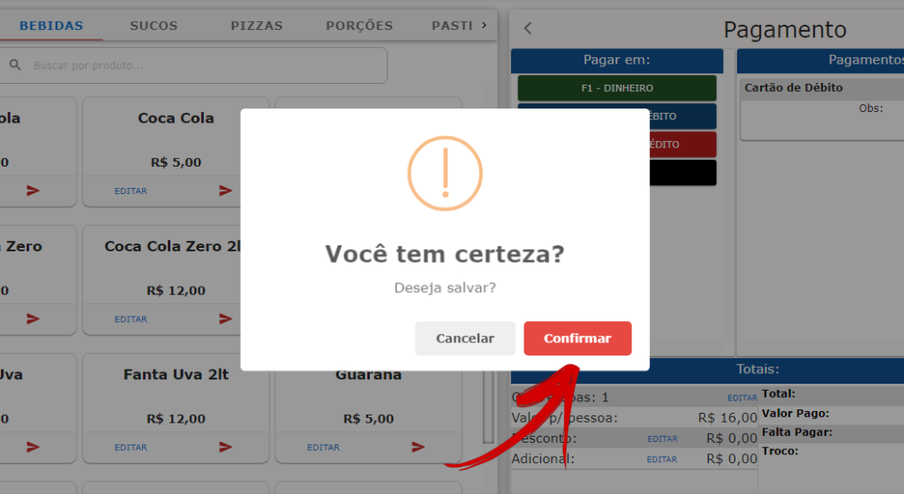
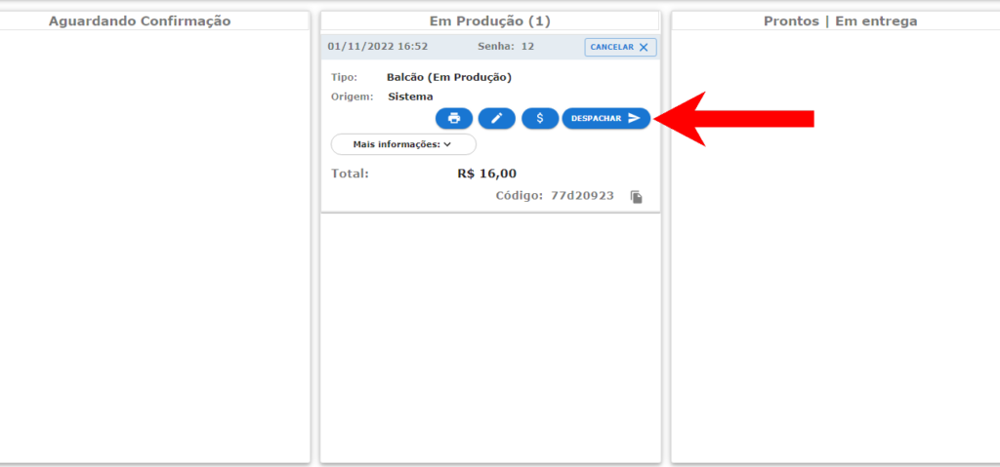
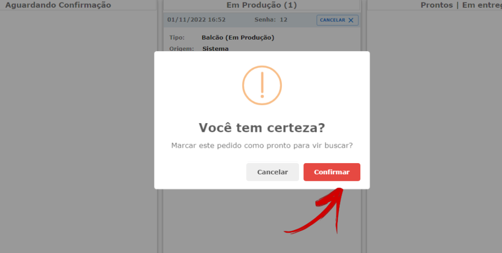
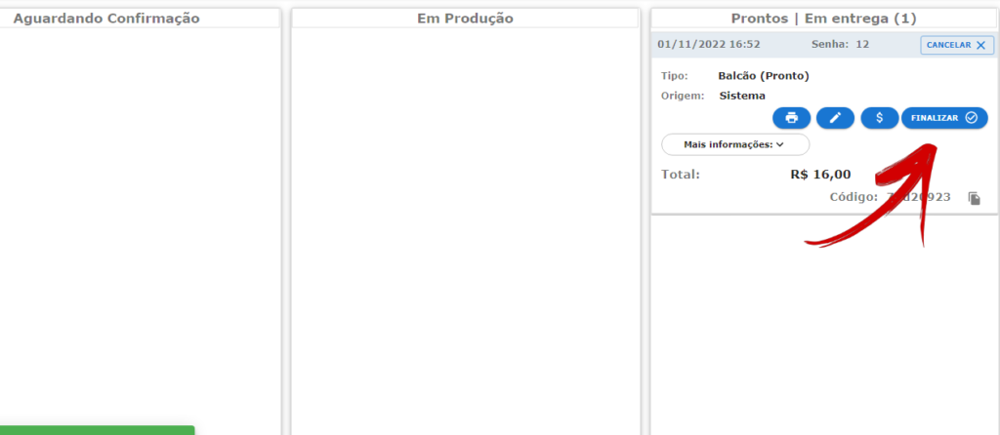

Tutorial passo a passo simples sobre como fazer um novo pedido balcão no **Facity POS**:

**Passo 1:** Abra o **Facity POS** no seu computador.

**Passo 2:** Faça **login** com o **nome da empresa**, **login** e **senha**, lembrando-se de usar apenas _letras minúsculas_.

**Passo 3:** Clique em **"Novo Pedido Balcão"**.

**Passo 4:** Adicione os produtos que o cliente deseja, clicando em cima do produto ou buscando na barra de pesquisa. Você também pode buscar o cliente pela barra de pesquisa ou cadastrar um novo (opcional nesse tipo de venda).

**Passo 5:** Selecione a forma de pagamento que o cliente utilizará.

**Passo 6:** Clique em **"Adicionar"** e em seguida em **"Salvar**".

**Passo 7:** Clique em **"Confirmar"**.

**Passo 8:** Quando o produto estiver pronto para ser entregue ao cliente, clique em **"Despachar"**. Também é possível imprimir uma segunda via do pedido, editar o pedido ou mudar a forma de pagamento clicando nos ícones em azul.

**Passo 9:** Marque em **"Confirmar"** se o produto já estiver pronto para o cliente retirar.

**Passo 10:** Clique em **"Finalizar"** depois de confirmar o pagamento.

Se tiver alguma dúvida, entre em contato com o suporte da **Facity POS**.
