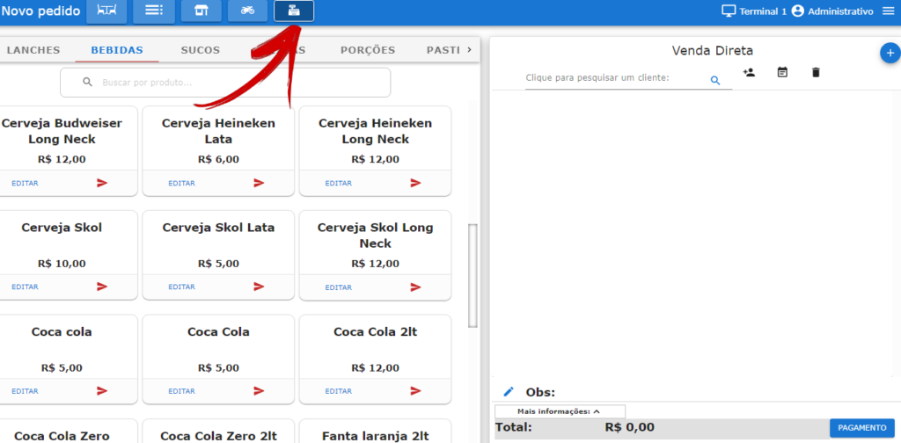
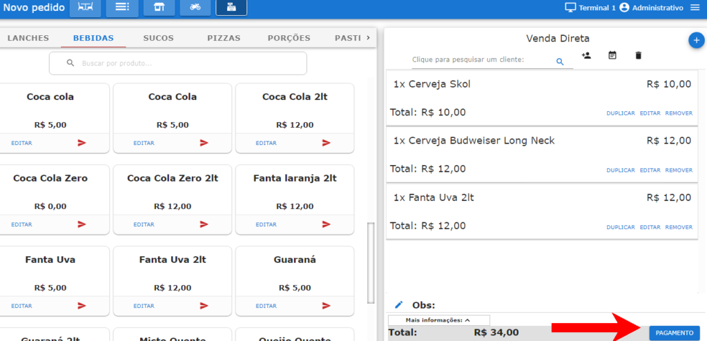
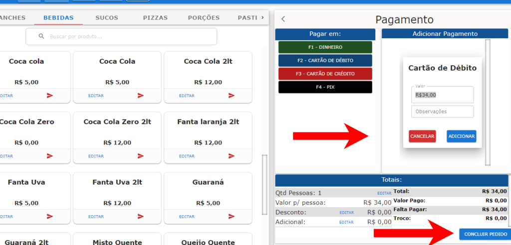
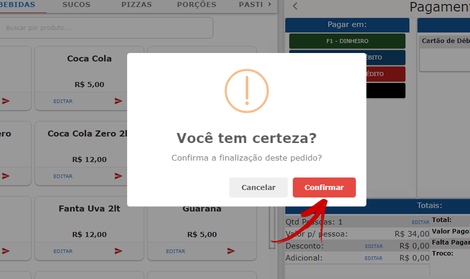

Tutorial passo a passo simples sobre como fazer uma nova venda direta no **Facity POS**:

**Passo 1:** Abra o **Facity POS** no seu computador.

**Passo 2:** Faça **login** com o **nome da empresa**, **login** e **senha**. Coloque tudo em letras _minúsculas_.

**Passo 3:** Clique em **"Nova Venda Direta"**.

**Passo 4:** Adicione os produtos que deseja vender, clicando em cima do produto ou buscando na barra de pesquisa. Você também pode buscar o cliente pela barra de pesquisa ou cadastrar um novo (opcional nesse tipo de venda).

**Passo 5:** Selecione a forma de pagamento que o cliente utilizará.

**Passo 6:** Clique em **"Adicionar"** e em seguida em **"Concluir Pedido"**.

**Passo 7:** Clique em **"Confirmar"** para finalizar a venda.

E é isso! Com esses simples passos, você pode fazer uma nova venda direta no **Facity POS**. Caso precise de ajuda adicional, não hesite em entrar em contato com o suporte da **Facity POS**.
