Neste tutorial, vou mostrar passo a passo como funciona um novo pedido (delivery) no **Facity POS**. É um processo simples e fácil, então vamos lá!

**Passo 1:** Abra o **Facity POS** em seu computador e faça **login** com o **nome da empresa**, **login** e **senha**, lembrando que tudo tem que ser em _letras minúsculas_.

**Passo 2:** No menu principal, clique em **DELIVERY**, onde a seta indica para começar a notar o pedido.

**Passo 3:** Selecione o pedido clicando em cima ou buscando pelo nome.

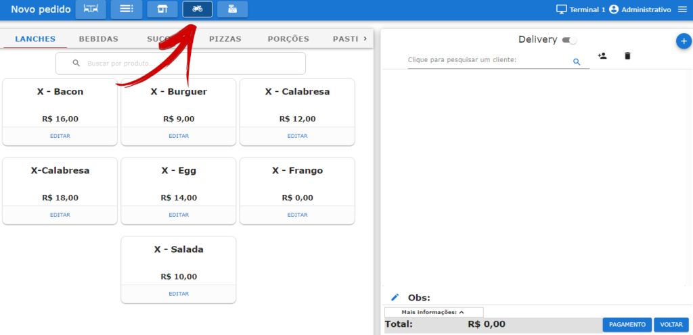

**Passo 4:** Adicione os produtos e clique em **"SALVAR"**.

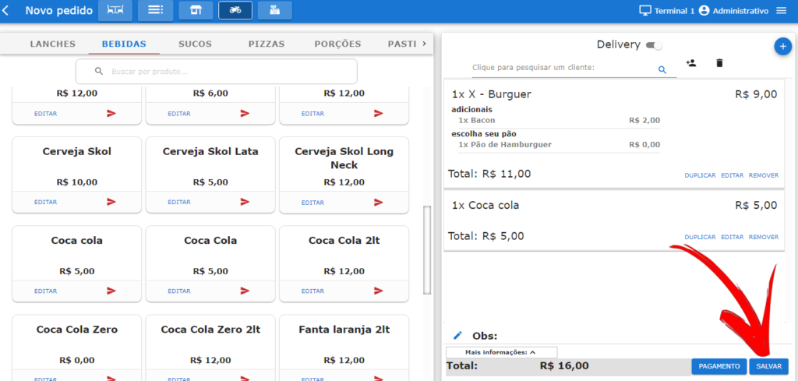

**Passo 5:** O sistema vai pedir para adicionar um cliente para a entrega. Se você já tem o cliente cadastrado, basta buscar pelo nome no campo de pesquisa. Caso contrário, clique onde a seta está indicando para cadastrar agora. Coloque todas as informações e clique em **SALVAR**.

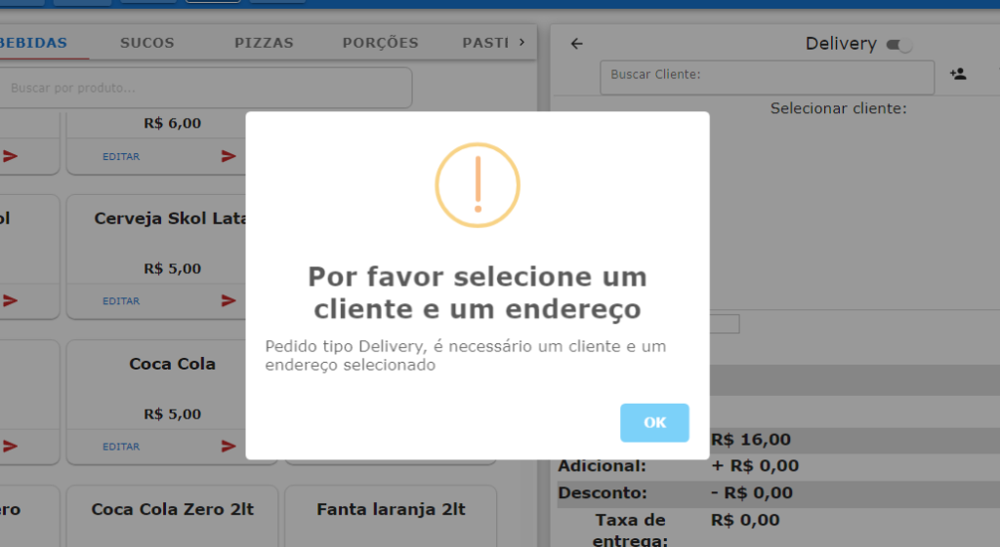

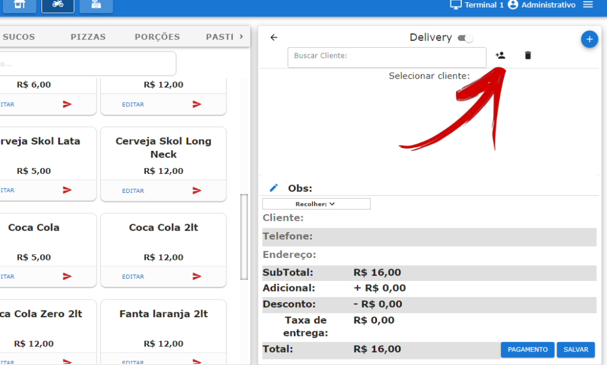

**Passo 6:** Clique em **SALVAR** para enviar o pedido para produção e em seguida em **CONFIRMAR**.

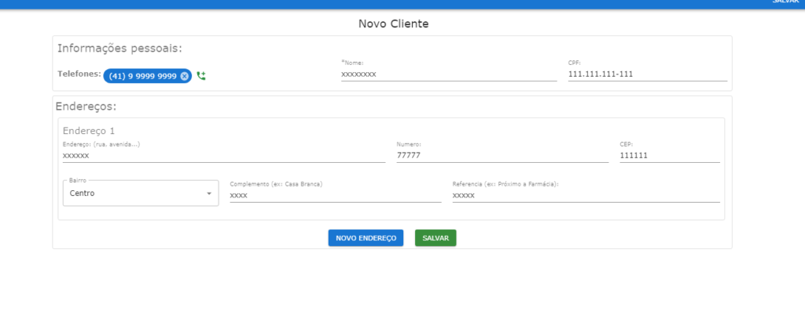

- Clique em **SALVAR** para enviar para produção
- Clique em **CONFIRMAR**

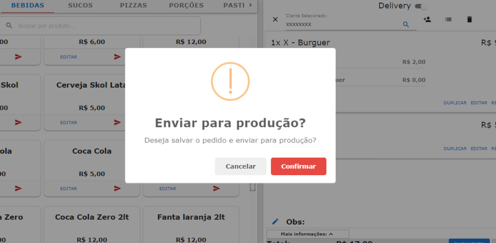

**Passo 7:** Clicando nos ícones em azul, você pode imprimir uma segunda via, editar produtos, mudar a forma de pagamento, mudar o motoboy e configurar a impressão automática.

**Passo 8:** Para escolher uma forma de pagamento, clique no ícone em azul com símbolo de cifrão (**$**), adicione e depois clique em **SALVAR**.

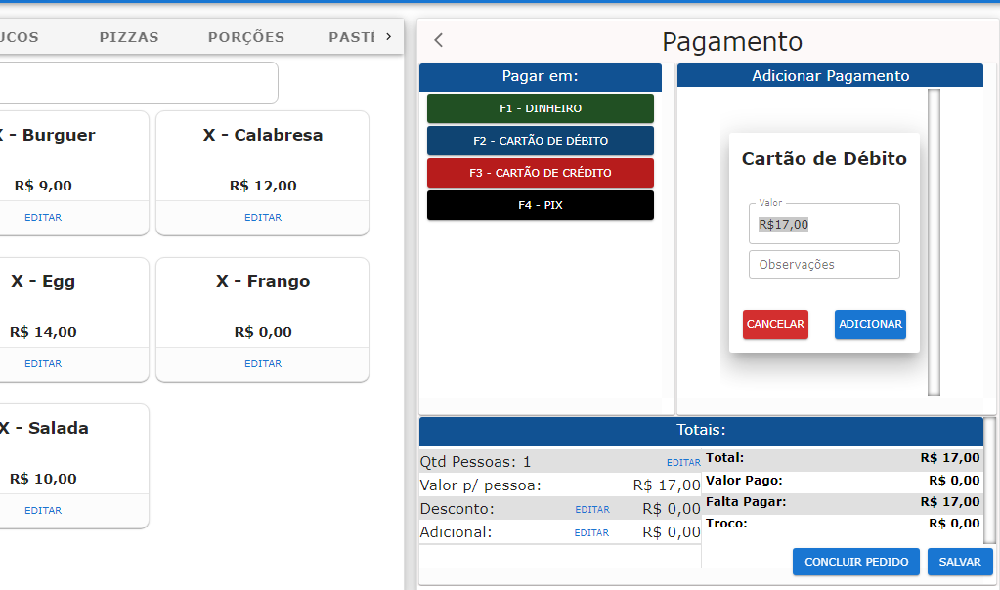

- Clique em **ADICIONAR** e depois **SALVAR**

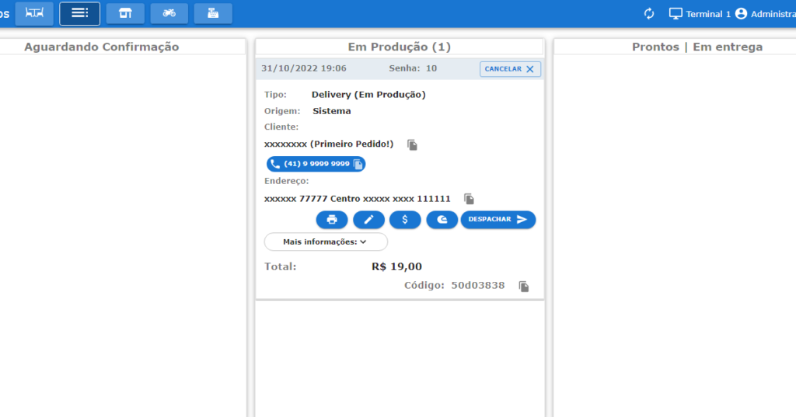

**Passo 9:** Após despachar o pedido, confirme se deseja informar um entregador. Selecione o entregador clicando no **\+** em azul.

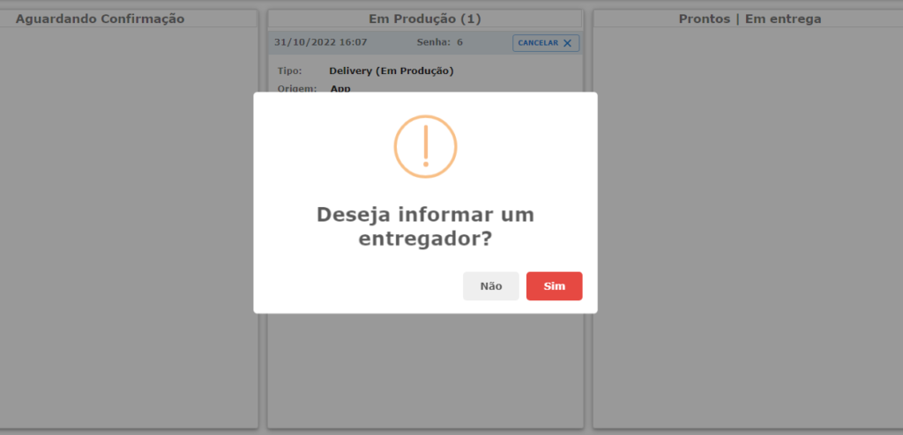

- Selecione o **Entregador** clicando no **\+** em azul

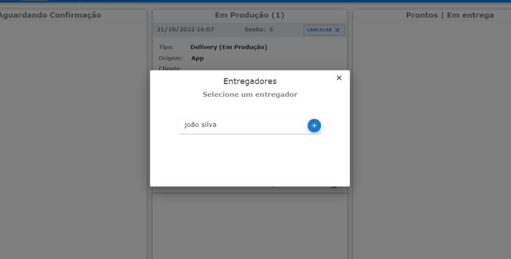

**Passo 10:** Após a confirmação do pagamento, clique em **FINALIZAR** o pedido.

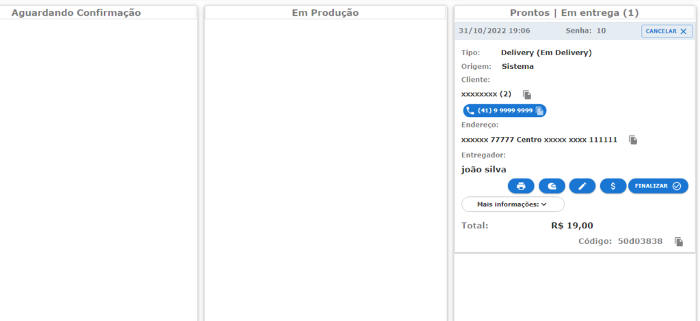

E pronto! Com estes passos simples, você pode realizar um novo pedido de delivery no **Facity POS**. Espero que este tutorial tenha sido útil.
