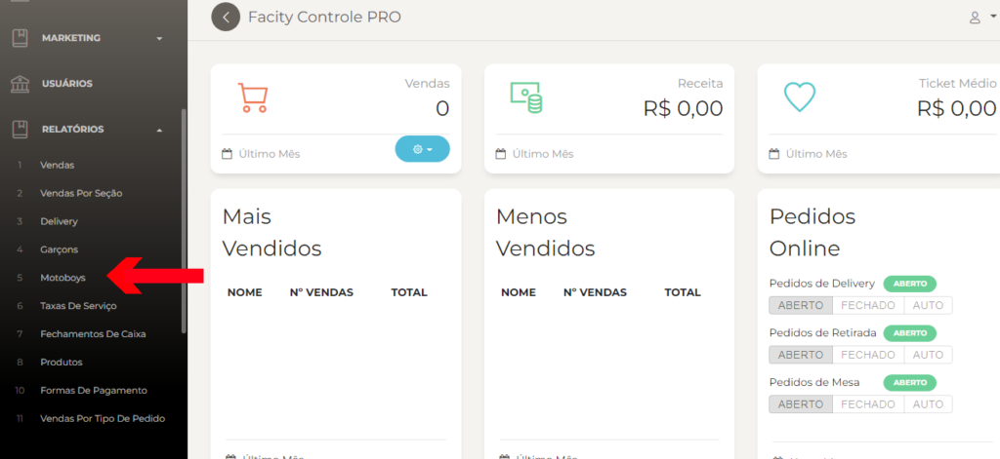
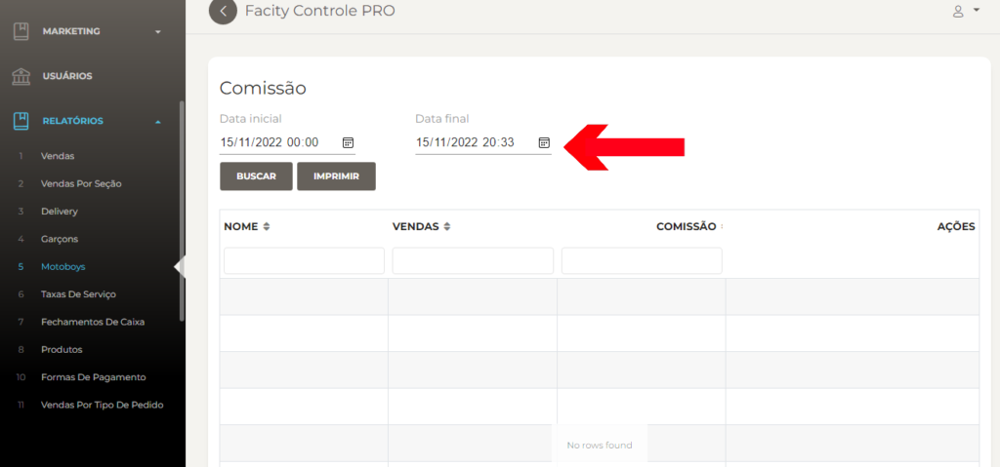

Passo a passo para gerar um relatório de comissão/motoboy no **Facity Controle**:

**Passo 1:** Abra o **Facity Controle** em seu computador

- Abra o aplicativo **Facity Controle** no seu computador
- Insira o **nome da empresa**, **login** e **senha** (_lembrando que tudo deve ser inserido em letras minúsculas_)

**Passo 2:** Acesse a opção de relatórios

- No menu lateral à esquerda, clique na opção **"Relatórios"**

**Passo 3:** Selecione a opção **"Motoboys"**

- Na lista de opções de relatórios, selecione **"Motoboys"**

**Passo 4:** Defina o período de tempo

- Escolha a data inicial e final do período que você deseja analisar
- Caso queira buscar por um motoboy específico, utilize a barra de pesquisa para encontrá-lo

**Passo 5:** Clique em **"Buscar"** para gerar o relatório

- Depois de inserir todas as informações necessárias, clique em **"Buscar**
- Após a geração do relatório, você poderá visualizar todas as informações referentes à comissão dos motoboys no período selecionado

E é isso! Com esses simples passos, você poderá gerar um relatório de **comissão/motoboy** no **Facity Controle** de forma rápida e eficiente.
